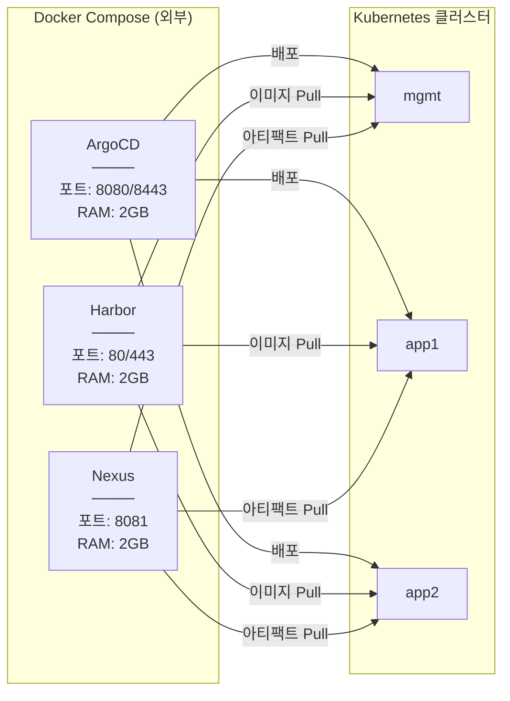

# Kubernetes 멀티클러스터 아키텍처

> **버전**: 1.2.0
> **Kubernetes**: v1.35 (Timbernetes)
> **최종 수정일**: 2026-02-05
> **변경 사항**: SPOF 완화 구현 규칙 추가, 2-Phase PKI 전환 체크리스트 추가

---

## 목차

1. [개요](#1-개요)
2. [아키텍처 결정 기록 (ADR)](#2-아키텍처-결정-기록-adr)
3. [시스템 요구사항](#3-시스템-요구사항)
4. [아키텍처 개요](#4-아키텍처-개요)
5. [장애 도메인 및 복원력](#5-장애-도메인-및-복원력)
6. [클러스터 구성](#6-클러스터-구성)
7. [네트워크 설계](#7-네트워크-설계)
   - 7.5 [스토리지 아키텍처](#75-스토리지-아키텍처)
8. [외부 서비스](#8-외부-서비스)
9. [Add-on 컴포넌트](#9-add-on-컴포넌트)
10. [설치 순서 및 의존성](#10-설치-순서-및-의존성)
11. [인증서 관리 (Vault + cert-manager)](#11-인증서-관리-vault--cert-manager)
12. [관찰성 스택](#12-관찰성-스택)
13. [보안 아키텍처](#13-보안-아키텍처)
14. [AI/AIOps 통합](#14-aiaiops-통합)
15. [백업 및 재해 복구](#15-백업-및-재해-복구)
16. [리소스 계획](#16-리소스-계획)
17. [디렉토리 구조](#17-디렉토리-구조)
18. [빠른 시작](#18-빠른-시작)

---

## 1. 개요

### 1.1 프로젝트 목적

macOS(Apple Silicon) 환경에서 **Terraform과 Shell Script만을 사용**하여 프로덕션급 Kubernetes 멀티클러스터 환경을 구축합니다.

#### 대상 환경 및 워크로드

| 항목 | 값 |
|-----|-----|
| **환경 유형** | 개발/학습/시연 (로컬) |
| **워크로드 유형** | Stateless (주), Stateful (보조) |
| **테넌시** | 단일 (개인 개발 환경) |

#### SLO (Service Level Objectives)

| 지표 | 목표 | 비고 |
|-----|------|------|
| **가용성** | 99% (월 ~7시간 다운타임 허용) | 로컬 환경 특성 |
| **RTO (복구 목표 시간)** | 1시간 | 클러스터 재생성 기준 |
| **RPO (복구 시점 목표)** | 24시간 | 일일 백업 기준 |
| **API 응답 시간** | P99 < 500ms | 내부 서비스 기준 |

> **참고**: 로컬 개발 환경이므로 프로덕션 수준의 SLA는 적용하지 않습니다. 호스트 머신 재부팅, Multipass 업데이트 등으로 인한 다운타임이 발생할 수 있습니다.

### 1.2 핵심 원칙

| 원칙 | 설명 |
|-----|------|
| **IaC (Infrastructure as Code)** | Terraform으로 모든 인프라 정의 |
| **멱등성 스크립트** | 멱등성 보장 Shell 스크립트 |
| **GitOps** | ArgoCD 기반 선언적 배포 |
| **제로 트러스트 보안** | PSA(경계) + Kyverno(정책) 2-layer 보안 |
| **관찰 가능성** | Metrics + Logs + Traces 통합 |
| **AI 기반 운영** | k8sgpt + 외부 LLM API 연동 |
| **장애 격리 (Failure Isolation)** | mgmt 장애 시에도 app 클러스터 독립 운영 |
| **우아한 성능 저하 (Graceful Degradation)** | 의존 서비스 장애 시 제한된 기능으로 계속 동작 |

### 1.3 기술 스택

```
┌─────────────────────────────────────────────────────────────┐
│                       기술 스택                              │
├─────────────────────────────────────────────────────────────┤
│  인프라           │ Multipass, Terraform, cloud-init        │
│  컨테이너 런타임   │ containerd                              │
│  쿠버네티스       │ kubeadm v1.35                           │
│  CNI             │ Cilium + Hubble                         │
│  서비스 메시      │ Istio (선택사항)                         │
│  GitOps          │ ArgoCD (외부)                           │
│  시크릿          │ Vault + External Secrets Operator        │
│  PKI             │ Vault PKI + cert-manager                │
│  레지스트리       │ Harbor (외부)                           │
│  아티팩트        │ Nexus (외부)                            │
│  관찰성          │ Prometheus + Thanos + Loki + Grafana    │
│  보안            │ PSA + Kyverno + Falco + Trivy           │
│  AI/AIOps        │ k8sgpt + OpenAI/Gemini API              │
│  백업            │ Velero + MinIO                          │
└─────────────────────────────────────────────────────────────┘
```

### 1.4 제약 조건

- **Ansible 미사용**: Shell Script로 대체
- **Helmfile 미사용**: Helm CLI 직접 사용
- **로컬 환경**: macOS + Multipass VM

---

## 2. 아키텍처 결정 기록 (ADR)

> 이 섹션은 프로젝트의 주요 아키텍처 결정과 그 배경을 기록합니다.

### ADR-001: mgmt 클러스터 중심의 플랫폼 서비스 집중

| 항목 | 내용 |
|-----|------|
| **상태** | Accepted |
| **컨텍스트** | 로컬 리소스 제약(64GB RAM) 하에서 효율적인 플랫폼 운영 필요 |
| **결정** | Vault, 관찰성, 백업 등 플랫폼 서비스를 mgmt 클러스터에 집중 배치 |
| **결과** | 리소스 효율성 확보, 단 mgmt가 SPOF가 되므로 장애 도메인 명확화 필요 |
| **완화책** | app 클러스터는 로컬 수집 에이전트로 독립 동작, 5장 장애 도메인 참조 |

### ADR-002: Kubernetes Feature-gate 선택적 활성화

| 항목 | 내용 |
|-----|------|
| **상태** | Accepted |
| **컨텍스트** | K8s 1.35의 InPlacePodVerticalScaling 등 실험적 기능 활용 여부 |
| **결정** | Feature-gate는 **옵션**으로 분리, 기본 아키텍처는 VPA만으로 동작 |
| **대안** | Feature-gate 없이도 VPA + 재시작 방식으로 리소스 조정 가능 |
| **결과** | 업그레이드 호환성 확보, 실험 기능은 별도 프로파일로 제공 |

### ADR-003: PSA + Kyverno 2-Layer 보안 모델

| 항목 | 내용 |
|-----|------|
| **상태** | Accepted |
| **컨텍스트** | PSA 예외가 늘어나면 보안 정책이 무력화되는 패턴 방지 필요 |
| **결정** | PSA는 기본 경계(baseline), Kyverno는 워크로드별 세부 정책 담당 |
| **역할 분담** | PSA: 네임스페이스 레벨 강제, Kyverno: 이미지/리소스/라벨 정책 |
| **예외 관리** | 예외 추가 시 라벨 + 승인 + 만료일 필수 (13장 보안 아키텍처 참조) |

**Kyverno 배치 범위**:
| 클러스터 | Kyverno | 이유 |
|---------|---------|------|
| **mgmt** | ❌ 미설치 | 플랫폼/운영자 영역, PSA baseline만 적용 (유연성 확보) |
| **app1/app2** | ✅ 설치 | 개발팀 워크로드 영역, 엄격한 정책 enforce |

> mgmt는 Vault, Prometheus 등 특수 권한이 필요한 플랫폼 컴포넌트가 많아 Kyverno enforce 시 운영 복잡도 증가

### ADR-004: 2-Phase PKI 부트스트랩

| 항목 | 내용 |
|-----|------|
| **상태** | Accepted |
| **컨텍스트** | cert-manager ↔ Vault 간 순환 의존성 (닭-달걀 문제) |
| **결정** | Phase 1: Self-signed Issuer로 부트스트랩, Phase 2: Vault Issuer로 전환 |
| **결과** | 설치 순서 명확화, 운영 중 인증서 자동 갱신 보장 |

### ADR-005: Cilium Tunneling(VXLAN) 모드 선택

| 항목 | 내용 |
|-----|------|
| **상태** | Accepted |
| **컨텍스트** | Multipass 브리지 네트워크에서 Native Routing 복잡도 높음 |
| **결정** | Cilium Tunneling(VXLAN) 모드로 네트워크 추상화 |
| **장점** | 로컬 환경 복잡도 감소, 클러스터 메시 안정성 향상 |
| **트레이드오프** | 약간의 오버헤드 (로컬 환경에서는 무시 가능) |

### ADR-006: 관찰성 에이전트 모드 아키텍처

| 항목 | 내용 |
|-----|------|
| **상태** | Accepted |
| **컨텍스트** | 각 클러스터에 전체 Prometheus 스택 배치 시 I/O 병목 |
| **결정** | app 클러스터는 Prometheus Agent Mode + Promtail, mgmt가 중앙 집계 |
| **결과** | 로컬 디스크 사용량 최소화, mgmt 장애 시에도 로컬 수집 지속 |

---

## 3. 시스템 요구사항

### 3.1 호스트 머신 스펙

| 리소스 | 최소 | 권장 | 현재 |
|-------|------|------|------|
| **CPU** | 8코어 | 10코어 이상 | Apple M1 Max (10코어) |
| **RAM** | 32GB | 64GB | 64GB |
| **디스크** | 256GB SSD | 512GB 이상 SSD | 540GB 가용 |
| **OS** | macOS 13 이상 | macOS 14 이상 | macOS (Darwin 25.2.0) |

### 3.2 소프트웨어 사전 요구사항

```bash
# 필수
brew install terraform        # >= 1.11.3
brew install multipass       # >= 1.15.1
brew install kubectl         # >= 1.35.0
brew install helm            # >= 3.14.0

# 선택
brew install cilium-cli      # Cilium 관리
brew install istioctl        # Istio 관리 (선택)
brew install k9s             # K8s TUI
brew install k8sgpt          # AI 기반 분석
```

### 3.3 리소스 할당 요약


---

## 4. 아키텍처 개요

### 4.1 상위 레벨 아키텍처


### 4.2 클러스터 역할 및 책임


---

## 5. 장애 도메인 및 복원력

> **핵심 원칙**: mgmt 클러스터 장애 시에도 app 클러스터는 독립적으로 워크로드 실행을 지속해야 한다.

### 5.1 장애 도메인 매트릭스

```
┌─────────────────────────────────────────────────────────────────────────────┐
│                        장애 영향 범위 매트릭스                                │
├─────────────────┬───────────────────────────────────────────────────────────┤
│  장애 컴포넌트   │  영향 범위                                                │
├─────────────────┼───────────────────────────────────────────────────────────┤
│ mgmt 클러스터   │ ❌ 시크릿 갱신 불가 (기존 시크릿은 캐시로 동작)           │
│ 전체 다운      │ ❌ 중앙 메트릭/로그 조회 불가 (로컬 수집은 지속)           │
│                │ ❌ 새 인증서 발급 불가 (기존 인증서로 동작)                │
│                │ ✅ app1/app2 워크로드 정상 실행                            │
│                │ ✅ app1/app2 로컬 Prometheus Agent 수집 지속               │
├─────────────────┼───────────────────────────────────────────────────────────┤
│ Vault 다운     │ ❌ 새 시크릿 발급/갱신 불가                                │
│                │ ✅ External Secrets 캐시된 시크릿으로 동작 (refreshInterval)│
│                │ ✅ 기존 TLS 인증서 유효 기간 내 동작                       │
├─────────────────┼───────────────────────────────────────────────────────────┤
│ Thanos/Loki    │ ❌ 중앙 집계 메트릭/로그 조회 불가                         │
│ 다운          │ ✅ 각 클러스터 로컬 Prometheus Agent 버퍼링                 │
│                │ ✅ 복구 후 버퍼 데이터 재전송                              │
├─────────────────┼───────────────────────────────────────────────────────────┤
│ ArgoCD (외부)  │ ❌ GitOps 배포/동기화 중단                                 │
│ 다운          │ ✅ 기존 배포된 워크로드 정상 실행                           │
│                │ ✅ kubectl 직접 배포는 가능                                │
├─────────────────┼───────────────────────────────────────────────────────────┤
│ Harbor (외부)  │ ❌ 새 이미지 Pull 불가                                     │
│ 다운          │ ✅ 노드에 캐시된 이미지로 Pod 실행                          │
│                │ ⚠️  imagePullPolicy: Always인 경우 신규 Pod 생성 실패       │
├─────────────────┼───────────────────────────────────────────────────────────┤
│ Cluster Mesh   │ ❌ 크로스 클러스터 서비스 디스커버리 불가                   │
│ 연결 끊김     │ ✅ 각 클러스터 내부 서비스는 정상                           │
│                │ ✅ 로컬 DNS/서비스 해석 정상                               │
└─────────────────┴───────────────────────────────────────────────────────────┘
```

### 5.2 Graceful Degradation 설계


### 5.3 SPOF 완화 구현 규칙

> mgmt 장애 시 app 클러스터가 Degraded Mode로 동작하기 위한 구체적인 설정값

```yaml
# External Secrets Operator - 시크릿 캐시 유지 설정
apiVersion: external-secrets.io/v1beta1
kind: ExternalSecret
metadata:
  name: app-secrets
spec:
  refreshInterval: 1h           # Vault 장애 시 최대 1시간 캐시 유효
  secretStoreRef:
    name: vault-backend
    kind: ClusterSecretStore
  target:
    deletionPolicy: Retain      # mgmt 장애 시에도 Secret 유지
---
# Prometheus Agent - 원격 전송 버퍼 설정
# app 클러스터의 values.yaml
prometheus:
  prometheusSpec:
    remoteWrite:
      - url: http://thanos-receive.mgmt.svc:19291/api/v1/receive
        queueConfig:
          capacity: 10000       # 버퍼 용량 (샘플 수)
          maxShards: 50         # 병렬 전송 수
          maxSamplesPerSend: 2000
          batchSendDeadline: 30s
          minBackoff: 1s
          maxBackoff: 5m        # mgmt 장애 시 최대 5분 간격 재시도
        writeRelabelConfigs:
          - sourceLabels: [__name__]
            regex: "up|container_.*|kube_pod_.*"
            action: keep        # 필수 메트릭만 전송하여 버퍼 절약
```

| 컴포넌트 | 설정 | 값 | Degraded 지속 시간 |
|---------|------|-----|-------------------|
| **External Secrets** | `refreshInterval` | 1h | 최대 1시간 |
| **External Secrets** | `deletionPolicy` | Retain | 무제한 (수동 삭제 전까지) |
| **Prometheus Agent** | `maxBackoff` | 5m | 재시도 무제한 |
| **Prometheus Agent** | `capacity` | 10000 | ~2.7시간 (메트릭 1개/초 기준) |
| **Promtail** | `positions.sync_period` | 10s | 버퍼 + 디스크 지속 |

### 5.4 복구 우선순위

| 우선순위 | 컴포넌트 | 이유 | 복구 목표 시간 |
|---------|---------|------|--------------|
| **P0** | ArgoCD | GitOps 파이프라인 복구 | 15분 |
| **P0** | Harbor | 이미지 Pull 복구 | 15분 |
| **P1** | Vault | 시크릿 갱신 재개 | 30분 |
| **P1** | mgmt Control Plane | 플랫폼 서비스 복구 | 30분 |
| **P2** | Thanos/Loki | 관찰성 조회 복구 | 1시간 |
| **P2** | Grafana | 대시보드 접근 | 1시간 |
| **P3** | Keycloak | SSO 복구 | 2시간 |

### 5.5 Cluster Mesh 장애 격리

```yaml
# Cilium Cluster Mesh 운영 체크리스트

장애 시 점검 순서:
  1. cilium clustermesh status  # 메시 연결 상태 확인
  2. cilium connectivity test   # 기본 연결성 테스트
  3. kubectl get ciliumendpoints -A  # 엔드포인트 동기화 확인

클러스터 추가 (app3) 절차:
  1. 새 클러스터에 Cilium 설치 (동일 cluster.id 범위)
  2. cilium clustermesh enable --service-type LoadBalancer
  3. cilium clustermesh connect --destination-context app3
  4. 기존 클러스터에서 연결 확인

장애 복구:
  - 메시 연결 끊김 시 각 클러스터는 독립 동작
  - cilium clustermesh disconnect / connect로 재연결
  - 서비스 디스커버리는 자동 복구
```

---

## 6. 클러스터 구성

### 6.1 클러스터 스펙

| 클러스터 | 역할 | Control Plane | Workers | 총 RAM | 총 CPU |
|---------|------|---------------|---------|--------|--------|
| **mgmt** | 플랫폼 서비스 | 1 (4GB/2C) | 1 (6GB/2C) | 10GB | 4 vCPU |
| **app1** | 애플리케이션 워크로드 | 1 (3GB/2C) | 1 (4GB/2C) | 7GB | 4 vCPU |
| **app2** | 애플리케이션 워크로드 | 1 (3GB/2C) | 1 (4GB/2C) | 7GB | 4 vCPU |

### 6.2 노드 토폴로지


### 6.3 Kubernetes 1.35 구성

> **ADR-002 참조**: Feature-gate는 옵션으로, 비활성화해도 VPA 기반 리소스 조정이 가능합니다.

```yaml
# kubeadm-config.yaml (mgmt 클러스터 예시)
apiVersion: kubeadm.k8s.io/v1beta4
kind: ClusterConfiguration
kubernetesVersion: v1.35.0
clusterName: mgmt
controlPlaneEndpoint: "mgmt-cp:6443"
networking:
  podSubnet: "10.100.0.0/16"
  serviceSubnet: "10.96.0.0/12"
  dnsDomain: "cluster.local"
apiServer:
  extraArgs:
    # PSA 구성 (필수)
    admission-control-config-file: /etc/kubernetes/psa/admission-config.yaml
    # Feature-gate (선택 - 실험적 기능)
    # feature-gates: "InPlacePodVerticalScaling=true,HPAConfigurableTolerance=true"
controllerManager:
  extraArgs:
    bind-address: "0.0.0.0"
    # feature-gates: "InPlacePodVerticalScaling=true"  # 선택
scheduler:
  extraArgs: {}
    # feature-gates: "InPlacePodVerticalScaling=true"  # 선택
---
apiVersion: kubeadm.k8s.io/v1beta4
kind: InitConfiguration
nodeRegistration:
  criSocket: unix:///var/run/containerd/containerd.sock
  # kubeletExtraArgs:
  #   feature-gates: "InPlacePodVerticalScaling=true"  # 선택
```

#### Feature-gate 옵션 설명

| Feature-gate | 상태 | 설명 | 대안 |
|-------------|------|------|------|
| `InPlacePodVerticalScaling` | Beta (1.35) | Pod 재시작 없이 리소스 조정 | VPA + Pod 재시작 |
| `HPAConfigurableTolerance` | Alpha | HPA 허용 오차 설정 | 기본 HPA 사용 |

**프로파일별 구성**:
- **Minimal**: Feature-gate 비활성화, VPA만 사용
- **Full**: 모든 Feature-gate 활성화 (실험적)

### 6.4 Pod Security Admission (PSA) 구성

> **ADR-003 참조**: PSA는 기본 경계, Kyverno는 세부 정책을 담당하는 2-layer 보안 모델

```yaml
# /etc/kubernetes/psa/admission-config.yaml
apiVersion: apiserver.config.k8s.io/v1
kind: AdmissionConfiguration
plugins:
  - name: PodSecurity
    configuration:
      apiVersion: pod-security.admission.config.k8s.io/v1
      kind: PodSecurityConfiguration
      defaults:
        enforce: "baseline"
        enforce-version: "latest"
        audit: "restricted"
        audit-version: "latest"
        warn: "restricted"
        warn-version: "latest"
      exemptions:
        usernames: []
        runtimeClasses: []
        namespaces:
          - kube-system
          - cilium-system
          - monitoring
          - vault
```

#### PSA 예외 관리 원칙

| 네임스페이스 | 예외 사유 | 축소 방향 | 검토 주기 |
|------------|----------|----------|----------|
| `kube-system` | 시스템 컴포넌트 권한 필요 | 축소 불가 | - |
| `cilium-system` | CNI 네트워크 권한 필요 | 축소 불가 | - |
| `monitoring` | 호스트 네트워크/볼륨 접근 | Node Exporter만 예외로 축소 | 분기별 |
| `vault` | IPC 잠금 메모리 필요 | 향후 baseline 가능 검토 | 분기별 |

**예외 추가 절차**:
```
1. 예외 필요성 문서화 (어떤 권한이 왜 필요한지)
2. 라벨 추가: pod-security.kubernetes.io/exempt=true
3. 승인자 기록 및 만료일 설정 (최대 6개월)
4. 분기별 예외 목록 검토 및 갱신
```

---

## 7. 네트워크 설계

### 7.1 네트워크 토폴로지


### 7.2 네트워크 CIDR 할당

| 클러스터 | 노드 네트워크 | Pod CIDR | Service CIDR | MetalLB 풀 |
|---------|-------------|----------|--------------|-----------|
| **mgmt** | 192.168.64.10-19 | 10.100.0.0/16 | 10.96.0.0/12 | 192.168.64.200-210 |
| **app1** | 192.168.64.20-29 | 10.101.0.0/16 | 10.97.0.0/12 | 192.168.64.211-220 |
| **app2** | 192.168.64.30-39 | 10.102.0.0/16 | 10.98.0.0/12 | 192.168.64.221-230 |

> **중요**: MetalLB 풀은 Multipass 브리지 네트워크(192.168.64.0/24) 내에서 할당해야 L2 모드에서 ARP가 정상 동작합니다.

### 7.3 Cilium CNI 구성

> **ADR-005 참조**: Multipass 환경에서는 Tunneling(VXLAN) 모드를 사용하여 네트워크 복잡도를 추상화합니다.

```yaml
# Cilium Helm values
cluster:
  name: mgmt  # 또는 app1, app2
  id: 1       # 클러스터별 고유 ID (1, 2, 3)

ipam:
  mode: kubernetes

# 터널링 모드 (ADR-005)
tunnel: vxlan  # Multipass 환경에서 안정적
# tunnel: disabled  # Native Routing (복잡한 환경에서만)

hubble:
  enabled: true
  relay:
    enabled: true
  ui:
    enabled: true

clustermesh:
  useAPIServer: true
  apiserver:
    service:
      type: LoadBalancer

# Gateway API (Ingress NGINX 대체)
gatewayAPI:
  enabled: true

# 네트워크 정책
policyEnforcementMode: "default"
```

#### 터널링 모드 vs Native Routing

| 모드 | 장점 | 단점 | 권장 환경 |
|-----|------|------|----------|
| **VXLAN (선택)** | 설정 단순, 네트워크 추상화 | 약간의 오버헤드 | 로컬/개발 |
| **Native Routing** | 최적 성능 | 라우팅 설정 복잡 | 프로덕션 |

### 7.4 Gateway API 구성 (Ingress 대체)

> **네임스페이스 표준**: Gateway는 `gateway-system`, TLS Secret은 동일 네임스페이스에 배치

```yaml
# Gateway API - Cilium 기반
apiVersion: gateway.networking.k8s.io/v1
kind: GatewayClass
metadata:
  name: cilium
spec:
  controllerName: io.cilium/gateway-controller
---
apiVersion: gateway.networking.k8s.io/v1
kind: Gateway
metadata:
  name: main-gateway
  namespace: gateway-system  # 표준 네임스페이스
spec:
  gatewayClassName: cilium
  listeners:
    - name: http
      port: 80
      protocol: HTTP
      allowedRoutes:
        namespaces:
          from: All
    - name: https
      port: 443
      protocol: HTTPS
      tls:
        mode: Terminate
        certificateRefs:
          - name: wildcard-tls
            namespace: gateway-system  # TLS Secret 동일 NS
      allowedRoutes:
        namespaces:
          from: All
```

#### Gateway/TLS 배치 규칙

| 리소스 | 네임스페이스 | 규칙 |
|-------|------------|------|
| GatewayClass | 클러스터 스코프 | - |
| Gateway | `gateway-system` | 클러스터당 1개 표준 |
| TLS Secret | `gateway-system` | Gateway와 동일 NS |
| HTTPRoute | 각 앱 네임스페이스 | 앱별 라우팅 정의 |

### 7.5 스토리지 아키텍처

> Multipass 로컬 환경에서의 스토리지 전략

#### 스토리지 계층 구조

```
┌─────────────────────────────────────────────────────────────────────────────┐
│                        스토리지 계층 아키텍처                                 │
├─────────────────────────────────────────────────────────────────────────────┤
│                                                                             │
│  Layer 1: 임시 스토리지 (Ephemeral)                                         │
│  ├── 유형: emptyDir                                                        │
│  ├── 용도: 캐시, 임시 파일, 사이드카 공유                                    │
│  └── 생명주기: Pod와 동일                                                   │
│                                                                             │
│  Layer 2: 로컬 스토리지 (Node-Local)                                        │
│  ├── 유형: local-path (Rancher Local Path Provisioner)                     │
│  ├── 용도: 단일 노드 워크로드 (Prometheus, Loki)                            │
│  ├── 경로: /var/lib/rancher/local-path                                     │
│  └── 제약: 노드 장애 시 데이터 손실                                         │
│                                                                             │
│  Layer 3: 공유 스토리지 (Shared)                                            │
│  ├── 유형: NFS (외부) 또는 MinIO (오브젝트)                                  │
│  ├── 용도: 다중 Pod 공유, 백업 저장소                                        │
│  └── 제약: 네트워크 의존, 성능 제한                                         │
│                                                                             │
└─────────────────────────────────────────────────────────────────────────────┘
```

#### StorageClass 정의

```yaml
# manifests/common/storage/local-path-storageclass.yaml
apiVersion: storage.k8s.io/v1
kind: StorageClass
metadata:
  name: local-path
  annotations:
    storageclass.kubernetes.io/is-default-class: "true"
provisioner: rancher.io/local-path
volumeBindingMode: WaitForFirstConsumer  # 노드 선택 후 바인딩
reclaimPolicy: Delete
---
# 보존이 필요한 데이터용
apiVersion: storage.k8s.io/v1
kind: StorageClass
metadata:
  name: local-path-retain
provisioner: rancher.io/local-path
volumeBindingMode: WaitForFirstConsumer
reclaimPolicy: Retain  # PVC 삭제 시에도 데이터 보존
```

#### 워크로드별 스토리지 매핑

| 워크로드 | StorageClass | 크기 | ReclaimPolicy | 비고 |
|---------|-------------|------|---------------|------|
| **Prometheus** | local-path | 20Gi | Delete | TSDB, 15일 보존 |
| **Loki** | local-path | 30Gi | Delete | 로그, 7일 보존 |
| **Vault** | local-path-retain | 10Gi | Retain | 시크릿 데이터 |
| **MinIO** | local-path-retain | 50Gi | Retain | 백업, 아티팩트 |
| **Harbor (외부)** | Docker Volume | 50Gi | - | 이미지 저장소 |

#### CSI 드라이버 설치

```bash
# Local Path Provisioner 설치
kubectl apply -f https://raw.githubusercontent.com/rancher/local-path-provisioner/v0.0.26/deploy/local-path-storage.yaml

# 기본 StorageClass 설정
kubectl patch storageclass local-path -p '{"metadata": {"annotations":{"storageclass.kubernetes.io/is-default-class":"true"}}}'

# 확인
kubectl get storageclass
```

#### 볼륨 스냅샷 (선택적)

```yaml
# CSI Snapshotter가 설치된 경우
apiVersion: snapshot.storage.k8s.io/v1
kind: VolumeSnapshotClass
metadata:
  name: local-path-snapshot
driver: rancher.io/local-path
deletionPolicy: Delete
---
apiVersion: snapshot.storage.k8s.io/v1
kind: VolumeSnapshot
metadata:
  name: vault-data-snapshot
  namespace: vault
spec:
  volumeSnapshotClassName: local-path-snapshot
  source:
    persistentVolumeClaimName: vault-data
```

> **⚠️ 로컬 환경 제약**: local-path는 노드 로컬 디스크를 사용하므로 노드 장애 시 데이터 복구가 불가능합니다. 중요 데이터는 MinIO 또는 외부 스토리지로 백업해야 합니다.

#### 스토리지 용량 모니터링

```yaml
# Prometheus 알림 규칙
groups:
  - name: storage
    rules:
      - alert: PVCNearlyFull
        expr: |
          (kubelet_volume_stats_used_bytes / kubelet_volume_stats_capacity_bytes) > 0.85
        for: 5m
        labels:
          severity: warning
        annotations:
          summary: "PVC {{ $labels.persistentvolumeclaim }} 용량 85% 초과"

      - alert: PVCCriticallyFull
        expr: |
          (kubelet_volume_stats_used_bytes / kubelet_volume_stats_capacity_bytes) > 0.95
        for: 1m
        labels:
          severity: critical
        annotations:
          summary: "PVC {{ $labels.persistentvolumeclaim }} 용량 95% 초과 - 즉시 조치 필요"
```

---

## 8. 외부 서비스

### 8.1 외부 서비스 개요



### 8.2 Docker Compose 구성

```yaml
# docker-compose.external.yaml
version: '3.8'

services:
  # ─────────────────────────────────────────
  # ArgoCD - GitOps 컨트롤러
  # ─────────────────────────────────────────
  argocd-server:
    image: quay.io/argoproj/argocd:v2.13.0
    container_name: argocd
    ports:
      - "8080:8080"
      - "8443:8443"
    environment:
      - ARGOCD_SERVER_INSECURE=true
    volumes:
      - argocd-data:/home/argocd
      - ./kubeconfigs:/root/.kube:ro
    deploy:
      resources:
        limits:
          memory: 2G
          cpus: '1'
    networks:
      - k8s-external

  # ─────────────────────────────────────────
  # Harbor - 컨테이너 레지스트리
  # ─────────────────────────────────────────
  harbor-core:
    image: goharbor/harbor-core:v2.12.0
    container_name: harbor
    ports:
      - "80:8080"
      - "443:8443"
    volumes:
      - harbor-data:/data
      - harbor-config:/etc/harbor
    environment:
      - HARBOR_ADMIN_PASSWORD=Harbor12345
    deploy:
      resources:
        limits:
          memory: 2G
          cpus: '1'
    networks:
      - k8s-external

  # ─────────────────────────────────────────
  # Nexus - 아티팩트 저장소
  # ─────────────────────────────────────────
  nexus:
    image: sonatype/nexus3:latest
    container_name: nexus
    ports:
      - "8081:8081"
    volumes:
      - nexus-data:/nexus-data
    environment:
      - INSTALL4J_ADD_VM_PARAMS=-Xms512m -Xmx1536m
    deploy:
      resources:
        limits:
          memory: 2G
          cpus: '1'
    networks:
      - k8s-external

networks:
  k8s-external:
    driver: bridge
    ipam:
      config:
        - subnet: 172.20.0.0/16

volumes:
  argocd-data:
  harbor-data:
  harbor-config:
  nexus-data:
```

### 8.3 ArgoCD 멀티클러스터 구성

```yaml
# ArgoCD 클러스터 등록
apiVersion: v1
kind: Secret
metadata:
  name: mgmt-cluster
  namespace: argocd
  labels:
    argocd.argoproj.io/secret-type: cluster
type: Opaque
stringData:
  name: mgmt
  server: https://192.168.64.10:6443
  config: |
    {
      "tlsClientConfig": {
        "insecure": false,
        "caData": "<base64-ca>",
        "certData": "<base64-cert>",
        "keyData": "<base64-key>"
      }
    }
---
# app1, app2 클러스터도 동일하게 등록
```

---

## 9. Add-on 컴포넌트

### 9.1 컴포넌트 매트릭스

| 컴포넌트 | mgmt | app1 | app2 | 카테고리 | 버전 |
|---------|:----:|:----:|:----:|---------|------|
| **인프라** |
| Cilium | ✅ | ✅ | ✅ | CNI | 1.16.x |
| Hubble | ✅ | ✅ | ✅ | 네트워크 관찰성 | 1.16.x |
| MetalLB | ✅ | ✅ | ✅ | LoadBalancer | 0.14.x |
| Gateway API | ✅ | ✅ | ✅ | Ingress | 1.1.x |
| Local Path Provisioner | ✅ | ✅ | ✅ | 스토리지 | 0.0.26 |
| **플랫폼 (mgmt만)** |
| MinIO | ✅ | - | - | 오브젝트 스토리지 | latest |
| cert-manager | ✅ | - | - | 인증서 | 1.14.x |
| Vault | ✅ | - | - | 시크릿/PKI | 1.15.x |
| Keycloak | ✅ | - | - | ID/SSO | 24.x |
| **관찰성** |
| Prometheus | ✅ | Agent | Agent | 메트릭 | 2.50.x |
| Grafana | ✅ | - | - | 대시보드 | 10.x |
| Thanos | ✅ | Sidecar | Sidecar | 멀티클러스터 메트릭 | 0.34.x |
| Loki | ✅ | - | - | 로그 집계 | 2.9.x |
| Promtail | ✅ | ✅ | ✅ | 로그 수집 | 2.9.x |
| Tempo | ✅ | - | - | 트레이싱 | 2.4.x |
| OpenTelemetry | ✅ | ✅ | ✅ | 텔레메트리 | 0.96.x |
| **보안** |
| PSA | ✅ | ✅ | ✅ | Pod 보안 | 내장 |
| Kyverno | - | ✅ | ✅ | 정책 엔진 | 1.11.x |
| Falco | ✅ | ✅ | ✅ | 런타임 보안 | 0.37.x |
| Trivy Operator | ✅ | ✅ | ✅ | 취약점 스캔 | 0.19.x |
| External Secrets | ✅ | ✅ | ✅ | 시크릿 동기화 | 0.9.x |
| **AI/AIOps** |
| k8sgpt | ✅ | - | - | AI 분석 | 0.4.x |
| Robusta | ✅ | - | - | 자동 트러블슈팅 | 0.16.x |
| Goldilocks | ✅ | ✅ | ✅ | 리소스 추천 | 8.x |
| **백업** |
| Velero | ✅ | ✅ | ✅ | 백업/복구 | 1.13.x |
| **스케일링** |
| VPA | ✅ | ✅ | ✅ | 수직 스케일링 | 1.0.x |
| Metrics Server | ✅ | ✅ | ✅ | 리소스 메트릭 | 0.7.x |
| KEDA | - | ✅ | ✅ | 이벤트 기반 스케일링 | 2.13.x |

### 9.2 네임스페이스 구성


---

## 10. 설치 순서 및 의존성

### 10.1 의존성 그래프


### 10.2 설치 순서표

| 순서 | 컴포넌트 | 클러스터 | 의존성 | 스크립트 |
|-----|---------|---------|--------|---------|
| 1.1 | kubeadm + PSA | all | - | `01-cluster/init-cluster.sh` |
| 1.2 | Cilium + Hubble | all | kubeadm | `02-cni/install-cilium.sh` |
| 1.3 | Metrics Server | all | Cilium | `03-metrics/install-metrics-server.sh` |
| 1.4 | StorageClass | all | Cilium | `04-storage/install-local-path.sh` |
| 1.5 | MetalLB | all | Cilium | `05-metallb/install-metallb.sh` |
| 1.6 | Gateway API | all | MetalLB | `06-gateway/install-gateway-api.sh` |
| 2.1 | MinIO | mgmt | StorageClass | `07-minio/install-minio.sh` |
| 2.2 | cert-manager | mgmt | MinIO | `08-cert-manager/install-cert-manager.sh` |
| 2.3 | Vault | mgmt | cert-manager | `09-vault/install-vault.sh` |
| 2.4 | External Secrets | all | Vault | `10-external-secrets/install-eso.sh` |
| 3.1 | Keycloak | mgmt | Vault | `11-keycloak/install-keycloak.sh` |
| 4.1 | Prometheus | all | StorageClass | `12-monitoring/install-prometheus.sh` |
| 4.2 | Thanos | all | Prometheus, MinIO | `12-monitoring/install-thanos.sh` |
| 4.3 | Loki | mgmt | StorageClass | `13-logging/install-loki.sh` |
| 4.4 | Promtail | all | Loki | `13-logging/install-promtail.sh` |
| 4.5 | Tempo | mgmt | StorageClass | `14-tracing/install-tempo.sh` |
| 4.6 | Grafana | mgmt | Prometheus, Loki | `15-grafana/install-grafana.sh` |
| 4.7 | OTel Collector | all | Tempo | `16-otel/install-otel.sh` |
| 5.1 | VPA | all | Metrics Server | `17-scaling/install-vpa.sh` |
| 5.2 | Goldilocks | all | VPA | `17-scaling/install-goldilocks.sh` |
| 5.3 | KEDA | app1, app2 | Metrics Server | `17-scaling/install-keda.sh` |
| 5.4 | k8sgpt | mgmt | - | `18-ai/install-k8sgpt.sh` |
| 5.5 | Robusta | mgmt | Prometheus | `18-ai/install-robusta.sh` |
| 6.1 | Velero | all | MinIO | `19-backup/install-velero.sh` |
| 6.2 | Trivy Operator | all | - | `20-security/install-trivy.sh` |
| 6.3 | Kyverno | app1, app2 | - | `20-security/install-kyverno.sh` |
| 6.4 | Falco | all | - | `20-security/install-falco.sh` |

---

## 11. 인증서 관리 (Vault + cert-manager)

> **ADR-004 참조**: 2-Phase PKI 부트스트랩으로 순환 의존성 해결

### 11.0 2-Phase PKI 부트스트랩


| Phase | Issuer | 용도 | 상태 |
|-------|--------|------|------|
| **Phase 1** | `selfsigned-issuer` | Vault 설치 전 부트스트랩 | 임시 |
| **Phase 2** | `vault-issuer` | 프로덕션 인증서 발급 | 활성 |

```yaml
# Phase 1: Self-signed Issuer (부트스트랩용)
apiVersion: cert-manager.io/v1
kind: ClusterIssuer
metadata:
  name: selfsigned-bootstrap
spec:
  selfSigned: {}
---
# Phase 2 전환 후 비활성화
# kubectl delete clusterissuer selfsigned-bootstrap
```

#### Phase 2 전환 완료 체크리스트

> Phase 1 → Phase 2 전환이 완료되었는지 확인하는 기준

```bash
# 전환 완료 검증 스크립트
#!/bin/bash

echo "=== Phase 2 PKI 전환 완료 체크 ==="

# 1. Vault Issuer 상태 확인
echo "[1/4] Vault ClusterIssuer 상태..."
kubectl get clusterissuer vault-issuer -o jsonpath='{.status.conditions[0].status}' | grep -q "True" \
  && echo "✅ vault-issuer Ready" || echo "❌ vault-issuer Not Ready"

# 2. Self-signed Issuer 제거 확인
echo "[2/4] Bootstrap Issuer 제거 확인..."
kubectl get clusterissuer selfsigned-bootstrap 2>/dev/null \
  && echo "⚠️  selfsigned-bootstrap 아직 존재 (제거 필요)" \
  || echo "✅ selfsigned-bootstrap 제거 완료"

# 3. 모든 Certificate가 vault-issuer 사용 확인
echo "[3/4] Certificate Issuer 확인..."
SELF_SIGNED_CERTS=$(kubectl get certificates -A -o jsonpath='{range .items[*]}{.spec.issuerRef.name}{"\n"}{end}' | grep -c "selfsigned" || true)
if [ "$SELF_SIGNED_CERTS" -eq 0 ]; then
  echo "✅ 모든 Certificate가 vault-issuer 사용"
else
  echo "❌ $SELF_SIGNED_CERTS 개의 Certificate가 아직 selfsigned 사용"
fi

# 4. 인증서 갱신 테스트
echo "[4/4] 인증서 갱신 테스트..."
kubectl delete secret test-cert-check --ignore-not-found
kubectl apply -f - <<EOF
apiVersion: cert-manager.io/v1
kind: Certificate
metadata:
  name: test-cert-check
spec:
  secretName: test-cert-check
  issuerRef:
    name: vault-issuer
    kind: ClusterIssuer
  dnsNames:
    - test.local
EOF
sleep 10
kubectl get certificate test-cert-check -o jsonpath='{.status.conditions[0].status}' | grep -q "True" \
  && echo "✅ Vault 인증서 발급 성공" || echo "❌ Vault 인증서 발급 실패"
kubectl delete certificate test-cert-check --ignore-not-found

echo "=== 체크 완료 ==="
```

| 완료 조건 | 검증 명령어 | 예상 결과 |
|----------|------------|----------|
| Vault Issuer Ready | `kubectl get clusterissuer vault-issuer` | `Ready: True` |
| Bootstrap Issuer 제거 | `kubectl get clusterissuer selfsigned-bootstrap` | `NotFound` |
| 모든 Cert가 Vault 사용 | `kubectl get cert -A -o yaml \| grep issuerRef` | `vault-issuer`만 존재 |
| 인증서 자동 갱신 동작 | `kubectl get cert -A` | 모든 인증서 `Ready: True` |

### 11.1 PKI 아키텍처


### 11.2 인증서 자동 갱신 흐름


### 11.3 Vault PKI 구성

```bash
#!/bin/bash
# scripts/09-vault/configure-pki.sh

# PKI 시크릿 엔진 활성화
vault secrets enable pki
vault secrets tune -max-lease-ttl=87600h pki  # 10년

# 루트 CA 생성
vault write -field=certificate pki/root/generate/internal \
    common_name="K8s 플랫폼 루트 CA" \
    issuer_name="root-2026" \
    ttl=87600h > /tmp/root_ca.crt

# 중간 PKI 활성화
vault secrets enable -path=pki_int pki
vault secrets tune -max-lease-ttl=43800h pki_int  # 5년

# 중간 CA CSR 생성
vault write -format=json pki_int/intermediate/generate/internal \
    common_name="K8s 플랫폼 중간 CA" \
    issuer_name="intermediate-2026" \
    | jq -r '.data.csr' > /tmp/pki_int.csr

# 루트로 중간 CA 서명
vault write -format=json pki/root/sign-intermediate \
    issuer_ref="root-2026" \
    csr=@/tmp/pki_int.csr \
    format=pem_bundle \
    ttl=43800h \
    | jq -r '.data.certificate' > /tmp/intermediate.cert.pem

# 서명된 중간 CA 가져오기
vault write pki_int/intermediate/set-signed \
    certificate=@/tmp/intermediate.cert.pem

# Kubernetes용 PKI 역할 생성
vault write pki_int/roles/k8s-certs \
    allowed_domains="local.dev,mgmt.local,app.local,svc.cluster.local" \
    allow_subdomains=true \
    allow_bare_domains=true \
    max_ttl=720h \
    ttl=168h

# Kubernetes 인증 구성
vault auth enable kubernetes
vault write auth/kubernetes/config \
    kubernetes_host="https://$KUBERNETES_SERVICE_HOST:$KUBERNETES_SERVICE_PORT"

# cert-manager용 정책
vault policy write cert-manager - <<EOF
path "pki_int/sign/k8s-certs" {
  capabilities = ["create", "update"]
}
path "pki_int/issue/k8s-certs" {
  capabilities = ["create"]
}
EOF

# cert-manager ServiceAccount용 역할
vault write auth/kubernetes/role/cert-manager \
    bound_service_account_names=cert-manager \
    bound_service_account_namespaces=cert-manager \
    policies=cert-manager \
    ttl=1h
```

### 11.4 cert-manager Vault Issuer

```yaml
# manifests/mgmt/cert-manager/cluster-issuer.yaml
apiVersion: cert-manager.io/v1
kind: ClusterIssuer
metadata:
  name: vault-issuer
spec:
  vault:
    path: pki_int/sign/k8s-certs
    server: http://vault.vault.svc:8200
    auth:
      kubernetes:
        role: cert-manager
        mountPath: /v1/auth/kubernetes
        serviceAccountRef:
          name: cert-manager
          namespace: cert-manager
---
# 자동 갱신 와일드카드 인증서
apiVersion: cert-manager.io/v1
kind: Certificate
metadata:
  name: wildcard-local-dev
  namespace: istio-system
spec:
  secretName: wildcard-local-dev-tls
  issuerRef:
    name: vault-issuer
    kind: ClusterIssuer
  commonName: "*.local.dev"
  dnsNames:
    - "*.local.dev"
    - "local.dev"
    - "*.mgmt.local.dev"
    - "*.app1.local.dev"
    - "*.app2.local.dev"
  duration: 720h        # 30일
  renewBefore: 360h     # 만료 15일 전 갱신
  privateKey:
    algorithm: ECDSA
    size: 256
```

---

## 12. 관찰성 스택

> **ADR-006 참조**: app 클러스터는 Agent Mode로 동작하여 로컬 리소스 최소화, mgmt가 중앙 집계 담당

### 12.0 관찰성 데이터 경로 최적화

```
┌─────────────────────────────────────────────────────────────────────────────┐
│                     관찰성 데이터 흐름 (최적화)                               │
├─────────────────────────────────────────────────────────────────────────────┤
│                                                                             │
│  app1/app2 클러스터 (경량)          mgmt 클러스터 (중앙)                    │
│  ┌─────────────────────┐           ┌─────────────────────────────────────┐ │
│  │ Prometheus Agent    │ ────────► │ Thanos Receive                      │ │
│  │ (로컬 저장 없음)    │   메트릭  │ ↓                                   │ │
│  │                     │           │ Thanos Store → MinIO                │ │
│  ├─────────────────────┤           ├─────────────────────────────────────┤ │
│  │ Promtail           │ ────────► │ Loki                                │ │
│  │ (버퍼만 유지)       │   로그    │ ↓                                   │ │
│  │                     │           │ Loki Storage → MinIO                │ │
│  ├─────────────────────┤           ├─────────────────────────────────────┤ │
│  │ OTel Collector     │ ────────► │ Tempo                               │ │
│  │ (Batch 전송)        │  트레이스 │ ↓                                   │ │
│  │                     │           │ Tempo Storage → MinIO               │ │
│  └─────────────────────┘           └─────────────────────────────────────┘ │
│                                                                             │
│  장점: 로컬 디스크 I/O 최소화, mgmt 장애 시 버퍼링 후 재전송                │
└─────────────────────────────────────────────────────────────────────────────┘
```

| 클러스터 | Prometheus 모드 | 로컬 저장 | 역할 |
|---------|----------------|----------|------|
| mgmt | Full (Server) | ✅ 30일 | 중앙 집계, 장기 저장 |
| app1/app2 | Agent | ❌ (버퍼만) | 수집 후 원격 전송 |

### 12.1 관찰성 아키텍처


### 12.2 Grafana 데이터 소스

```yaml
# Grafana 데이터소스 구성
apiVersion: 1
datasources:
  # 메트릭 - Thanos Query
  - name: Thanos
    type: prometheus
    url: http://thanos-query.monitoring.svc:9090
    access: proxy
    isDefault: true
    jsonData:
      timeInterval: "15s"

  # 로그 - Loki
  - name: Loki
    type: loki
    url: http://loki.logging.svc:3100
    access: proxy
    jsonData:
      derivedFields:
        - datasourceUid: tempo
          matcherRegex: "traceID=(\\w+)"
          name: TraceID
          url: "$${__value.raw}"

  # 트레이스 - Tempo
  - name: Tempo
    type: tempo
    url: http://tempo.tracing.svc:3200
    access: proxy
    jsonData:
      tracesToLogs:
        datasourceUid: loki
        tags: ['job', 'namespace', 'pod']
      serviceMap:
        datasourceUid: Thanos
```

### 12.3 Thanos를 통한 멀티클러스터 메트릭

```yaml
# Thanos Query 구성
apiVersion: v1
kind: ConfigMap
metadata:
  name: thanos-query-config
  namespace: monitoring
data:
  stores.yaml: |
    - targets:
        - thanos-sidecar.monitoring.svc:10901     # mgmt
        - app1-thanos-sidecar.monitoring.svc:10901 # app1 (클러스터 메시 통해)
        - app2-thanos-sidecar.monitoring.svc:10901 # app2 (클러스터 메시 통해)
      labels:
        source: sidecar
    - targets:
        - thanos-store.monitoring.svc:10901
      labels:
        source: store
```

---

## 13. 보안 아키텍처

> **ADR-003 참조**: PSA(기본 경계) + Kyverno(세부 정책) 2-Layer 보안 모델

### 13.0 2-Layer 보안 모델 역할 분담

```
┌─────────────────────────────────────────────────────────────────────────────┐
│                      2-Layer 보안 모델                                       │
├─────────────────────────────────────────────────────────────────────────────┤
│                                                                             │
│  Layer 1: PSA (Pod Security Admission)                                     │
│  ├── 역할: 네임스페이스 레벨 기본 보안 경계                                  │
│  ├── 적용: 모든 클러스터, 모든 네임스페이스                                  │
│  ├── 정책: baseline (enforce) / restricted (audit, warn)                   │
│  └── 예외: 최소화, 승인 절차 필수                                           │
│                                                                             │
│  Layer 2: Kyverno (정책 엔진)                                               │
│  ├── 역할: 워크로드별 세부 정책                                             │
│  ├── 적용: app1, app2 클러스터 (워크로드)                                   │
│  ├── 정책: 이미지 검증, 리소스 제한, 라벨 요구사항                          │
│  └── mgmt 제외 이유: 플랫폼 컴포넌트 유연성 확보                            │
│                                                                             │
└─────────────────────────────────────────────────────────────────────────────┘
```

| 레이어 | 도구 | 적용 범위 | 정책 예시 |
|-------|------|----------|----------|
| **Layer 1** | PSA | 전체 클러스터 | 특권 컨테이너 금지, hostPath 제한 |
| **Layer 2** | Kyverno | app1/app2 | 신뢰 레지스트리만, 리소스 제한 필수 |

### 13.1 보안 레이어


### 13.2 Kyverno 정책 (app1/app2)

```yaml
# 리소스 제한 필수
apiVersion: kyverno.io/v1
kind: ClusterPolicy
metadata:
  name: require-resource-limits
spec:
  validationFailureAction: Enforce
  background: true
  rules:
    - name: check-container-resources
      match:
        any:
          - resources:
              kinds:
                - Pod
      validate:
        message: "CPU와 메모리 제한이 필요합니다"
        pattern:
          spec:
            containers:
              - resources:
                  limits:
                    memory: "?*"
                    cpu: "?*"
---
# 신뢰할 수 있는 이미지 레지스트리 필수
apiVersion: kyverno.io/v1
kind: ClusterPolicy
metadata:
  name: require-trusted-registry
spec:
  validationFailureAction: Enforce
  background: true
  rules:
    - name: check-image-registry
      match:
        any:
          - resources:
              kinds:
                - Pod
      validate:
        message: "이미지는 신뢰할 수 있는 레지스트리에서 가져와야 합니다"
        pattern:
          spec:
            containers:
              - image: "harbor.local.dev/* | gcr.io/* | docker.io/library/*"
---
# 특권 컨테이너 금지
apiVersion: kyverno.io/v1
kind: ClusterPolicy
metadata:
  name: disallow-privileged
spec:
  validationFailureAction: Enforce
  background: true
  rules:
    - name: check-privileged
      match:
        any:
          - resources:
              kinds:
                - Pod
      validate:
        message: "특권 컨테이너는 허용되지 않습니다"
        pattern:
          spec:
            containers:
              - securityContext:
                  privileged: "false"
```

### 13.3 Falco 규칙

```yaml
# 커스텀 Falco 규칙
- rule: 암호화폐 채굴 탐지
  desc: 암호화폐 채굴 프로세스 탐지
  condition: >
    spawned_process and
    (proc.name in (xmrig, minerd, cpuminer) or
     proc.cmdline contains "stratum+tcp")
  output: >
    암호화폐 채굴 탐지됨
    (사용자=%user.name 명령=%proc.cmdline 컨테이너=%container.name)
  priority: CRITICAL
  tags: [crypto, mining]

- rule: 컨테이너 드리프트 탐지
  desc: 원본 이미지에 없는 새 실행 파일
  condition: >
    spawned_process and
    container and
    not proc.is_exe_from_memfd and
    not known_binary
  output: >
    컨테이너 드리프트 탐지됨
    (사용자=%user.name 명령=%proc.cmdline 컨테이너=%container.name 이미지=%container.image.repository)
  priority: WARNING
  tags: [drift, container]
```

---

## 14. AI/AIOps 통합

### 14.1 AI 아키텍처


### 14.2 k8sgpt 구성

```yaml
# k8sgpt ConfigMap
apiVersion: v1
kind: ConfigMap
metadata:
  name: k8sgpt-config
  namespace: k8sgpt
data:
  config.yaml: |
    # 기본 백엔드: Gemini (무료 티어)
    ai:
      default-backend: google
      backends:
        - name: google
          model: gemini-1.5-flash
          temperature: 0.7
        - name: openai
          model: gpt-4o-mini
          temperature: 0.7

    # 실행할 분석기
    analyzers:
      - Pod
      - Deployment
      - ReplicaSet
      - Service
      - Ingress
      - StatefulSet
      - CronJob
      - Node
      - NetworkPolicy
      - PersistentVolumeClaim

    # 필터
    filters:
      - namespace: kube-system
      - namespace: cilium-system
---
# Vault에서 k8sgpt API 키 가져오기
apiVersion: external-secrets.io/v1beta1
kind: ExternalSecret
metadata:
  name: k8sgpt-api-keys
  namespace: k8sgpt
spec:
  secretStoreRef:
    name: vault-backend
    kind: ClusterSecretStore
  target:
    name: k8sgpt-api-keys
  data:
    - secretKey: google-api-key
      remoteRef:
        key: secret/k8sgpt
        property: google-api-key
    - secretKey: openai-api-key
      remoteRef:
        key: secret/k8sgpt
        property: openai-api-key
```

### 14.3 멀티 백엔드 전략

```bash
#!/bin/bash
# scripts/18-ai/k8sgpt-analyze.sh

source ./scripts/lib/common.sh

# 기본: Gemini (무료, 빠름)
analyze_routine() {
    k8sgpt analyze --explain --backend google --output json
}

# 복잡한 문제: OpenAI (더 정확)
analyze_deep() {
    k8sgpt analyze --explain --backend openai --output json
}

# 대화형: Claude via MCP
analyze_interactive() {
    k8sgpt serve --mcp &
    log_info "k8sgpt MCP 서버 시작됨. Claude Desktop으로 연결하세요."
}

# 예약 분석 (cron)
# 0 */6 * * * /path/to/k8sgpt-analyze.sh routine >> /var/log/k8sgpt.log

case "${1:-routine}" in
    routine)    analyze_routine ;;
    deep)       analyze_deep ;;
    interactive) analyze_interactive ;;
    *)          log_error "사용법: $0 {routine|deep|interactive}" ;;
esac
```

### 14.4 Robusta 연동

```yaml
# Robusta values
globalConfig:
  signing_key: "{{ vault_secret('robusta/signing-key') }}"
  account_id: "{{ vault_secret('robusta/account-id') }}"

sinksConfig:
  - slack_sink:
      name: main_slack
      slack_channel: "#k8s-alerts"
      api_key: "{{ vault_secret('robusta/slack-api-key') }}"

  - robusta_sink:
      name: robusta_ui
      token: "{{ vault_secret('robusta/ui-token') }}"

enablePlatformPlaybooks: true

customPlaybooks:
  - triggers:
      - on_pod_crash_loop:
          restart_reason: "OOMKilled"
    actions:
      - resource_babysitter:
          increase_memory_percent: 25
          max_memory: "2Gi"
      - create_finding:
          title: "OOMKilled Pod - 메모리 증가됨"
          aggregation_key: "oom_auto_increase"

  - triggers:
      - on_prometheus_alert:
          alert_name: "HighCPUUsage"
    actions:
      - ai_analysis:
          llm_backend: "openai"
      - slack_notification:
          channel: "#k8s-alerts"
```

---

## 15. 백업 및 재해 복구

### 15.0 상태 계층 아키텍처

> 복구 전략은 상태의 계층에 따라 다르게 적용됩니다.

```
┌─────────────────────────────────────────────────────────────────────────────┐
│                        상태 계층 및 복구 전략                                │
├─────────────────────────────────────────────────────────────────────────────┤
│                                                                             │
│  Layer 1: 클러스터 상태 (etcd)                                              │
│  ├── 내용: 클러스터 구성, 리소스 정의                                        │
│  ├── 백업: kubeadm etcd 스냅샷                                              │
│  ├── 복구: etcd 복원 또는 클러스터 재생성                                    │
│  └── 주기: 매일 + 변경 시                                                   │
│                                                                             │
│  Layer 2: 워크로드 상태 (PersistentVolume)                                  │
│  ├── 내용: 애플리케이션 데이터                                               │
│  ├── 백업: Velero + Restic                                                  │
│  ├── 복구: Velero restore                                                   │
│  └── 주기: 매일                                                             │
│                                                                             │
│  Layer 3: 플랫폼 상태 (MinIO 내 데이터)                                     │
│  ├── 내용: 메트릭, 로그, 백업 본                                             │
│  ├── 백업: MinIO 버전관리 또는 외부 복제                                     │
│  ├── 복구: MinIO 복원                                                       │
│  └── 주기: 실시간 (버전관리)                                                │
│                                                                             │
│  Layer 4: 설정 상태 (Git)                                                   │
│  ├── 내용: 매니페스트, Helm values                                          │
│  ├── 백업: Git 원격 저장소                                                  │
│  ├── 복구: ArgoCD 동기화                                                    │
│  └── 주기: 커밋 시                                                          │
│                                                                             │
└─────────────────────────────────────────────────────────────────────────────┘
```

#### etcd 스냅샷 스크립트

```bash
#!/bin/bash
# scripts/backup/etcd-snapshot.sh

SNAPSHOT_DIR="/var/backups/etcd"
SNAPSHOT_NAME="etcd-snapshot-$(date +%Y%m%d-%H%M%S).db"

# etcd 스냅샷 생성
ETCDCTL_API=3 etcdctl snapshot save "${SNAPSHOT_DIR}/${SNAPSHOT_NAME}" \
  --endpoints=https://127.0.0.1:2379 \
  --cacert=/etc/kubernetes/pki/etcd/ca.crt \
  --cert=/etc/kubernetes/pki/etcd/server.crt \
  --key=/etc/kubernetes/pki/etcd/server.key

# 7일 이상 된 스냅샷 삭제
find ${SNAPSHOT_DIR} -name "etcd-snapshot-*.db" -mtime +7 -delete

echo "etcd 스냅샷 완료: ${SNAPSHOT_NAME}"
```

#### etcd 복구 런북

> ⚠️ **주의**: etcd 복구는 클러스터 전체에 영향을 미칩니다. 반드시 테스트 환경에서 먼저 검증하세요.

**사전 조건 체크리스트**:
- [ ] 백업 스냅샷 파일 존재 확인
- [ ] 백업 스냅샷 무결성 검증
- [ ] 복구 시점 결정 (어떤 스냅샷으로 복구할 것인가)
- [ ] 다른 관리자에게 복구 작업 통보

```bash
#!/bin/bash
# scripts/backup/etcd-restore.sh
# etcd 복구 런북 (Control Plane 노드에서 실행)

set -e

SNAPSHOT_FILE="${1:-}"
ETCD_DATA_DIR="/var/lib/etcd"
ETCD_BACKUP_DIR="/var/lib/etcd-backup-$(date +%Y%m%d-%H%M%S)"

if [ -z "$SNAPSHOT_FILE" ]; then
  echo "Usage: $0 <snapshot-file>"
  echo "Example: $0 /var/backups/etcd/etcd-snapshot-20260205-020000.db"
  exit 1
fi

echo "=== etcd 복구 시작 ==="
echo "스냅샷 파일: $SNAPSHOT_FILE"

# 1. 스냅샷 무결성 검증
echo "[1/6] 스냅샷 무결성 검증..."
ETCDCTL_API=3 etcdctl snapshot status "$SNAPSHOT_FILE" --write-out=table
if [ $? -ne 0 ]; then
  echo "❌ 스냅샷 파일이 손상되었습니다."
  exit 1
fi
echo "✅ 스냅샷 무결성 확인 완료"

# 2. API 서버 중지
echo "[2/6] kube-apiserver 중지..."
sudo mv /etc/kubernetes/manifests/kube-apiserver.yaml /tmp/
sleep 10

# 3. 기존 etcd 데이터 백업
echo "[3/6] 기존 etcd 데이터 백업..."
sudo mv $ETCD_DATA_DIR $ETCD_BACKUP_DIR
echo "기존 데이터 백업 위치: $ETCD_BACKUP_DIR"

# 4. etcd 스냅샷 복원
echo "[4/6] etcd 스냅샷 복원..."
ETCDCTL_API=3 etcdctl snapshot restore "$SNAPSHOT_FILE" \
  --data-dir=$ETCD_DATA_DIR \
  --name=$(hostname) \
  --initial-cluster=$(hostname)=https://$(hostname):2380 \
  --initial-advertise-peer-urls=https://$(hostname):2380

# 5. etcd 데이터 디렉토리 권한 설정
echo "[5/6] 권한 설정..."
sudo chown -R etcd:etcd $ETCD_DATA_DIR

# 6. API 서버 재시작
echo "[6/6] kube-apiserver 재시작..."
sudo mv /tmp/kube-apiserver.yaml /etc/kubernetes/manifests/

echo "=== 복구 완료 ==="
echo ""
echo "다음 명령어로 클러스터 상태를 확인하세요:"
echo "  kubectl get nodes"
echo "  kubectl get pods -A"
echo ""
echo "문제 발생 시 롤백:"
echo "  sudo rm -rf $ETCD_DATA_DIR"
echo "  sudo mv $ETCD_BACKUP_DIR $ETCD_DATA_DIR"
```

#### etcd 복구 검증

```bash
# 복구 후 검증 스크립트
#!/bin/bash

echo "=== etcd 복구 검증 ==="

# 1. etcd 클러스터 상태
echo "[1/4] etcd 클러스터 상태..."
ETCDCTL_API=3 etcdctl endpoint health \
  --endpoints=https://127.0.0.1:2379 \
  --cacert=/etc/kubernetes/pki/etcd/ca.crt \
  --cert=/etc/kubernetes/pki/etcd/server.crt \
  --key=/etc/kubernetes/pki/etcd/server.key

# 2. 노드 상태
echo "[2/4] 노드 상태..."
kubectl get nodes

# 3. 시스템 Pod 상태
echo "[3/4] 시스템 Pod 상태..."
kubectl get pods -n kube-system

# 4. 주요 리소스 확인
echo "[4/4] 주요 리소스 확인..."
kubectl get deployments -A | head -10
kubectl get services -A | head -10

echo "=== 검증 완료 ==="
```

#### 복구 시나리오별 가이드

| 시나리오 | 복구 방법 | 예상 시간 |
|---------|----------|----------|
| **etcd 데이터 손상** | 스냅샷 복원 | 15-30분 |
| **Control Plane 노드 장애** | 노드 재생성 + etcd 복원 | 1시간 |
| **전체 클러스터 장애** | Terraform 재배포 + etcd 복원 + Velero 복원 | 2시간 |
| **특정 리소스 삭제** | kubectl apply (GitOps 동기화) | 5분 |

### 15.1 백업 아키텍처


### 15.2 백업 스케줄

```yaml
# Velero 백업 스케줄
apiVersion: velero.io/v1
kind: Schedule
metadata:
  name: daily-full-backup
  namespace: velero
spec:
  schedule: "0 2 * * *"  # 매일 오전 2시
  template:
    includedNamespaces:
      - "*"
    excludedNamespaces:
      - kube-system
      - velero
    includedResources:
      - "*"
    excludedResources:
      - events
      - events.events.k8s.io
    includeClusterResources: true
    storageLocation: default
    volumeSnapshotLocations:
      - default
    ttl: 720h  # 30일 보관
---
apiVersion: velero.io/v1
kind: Schedule
metadata:
  name: hourly-critical-backup
  namespace: velero
spec:
  schedule: "0 * * * *"  # 매시간
  template:
    includedNamespaces:
      - vault
      - keycloak
      - monitoring
    ttl: 168h  # 7일 보관
```

### 15.3 재해 복구 절차


---

## 16. 리소스 계획

### 16.1 리소스 할당 요약


### 16.2 상세 리소스 할당

| 컴포넌트 | RAM | vCPU | 디스크 | 비고 |
|---------|-----|------|-------|------|
| **외부 서비스** |
| ArgoCD | 2GB | 1 | 10GB | Docker |
| Harbor | 2GB | 1 | 80GB | Docker |
| Nexus | 2GB | 1 | 80GB | Docker |
| **mgmt 클러스터** |
| mgmt-cp | 4GB | 2 | 40GB | Control Plane |
| mgmt-worker | 6GB | 2 | 50GB | 플랫폼 워크로드 |
| **app1 클러스터** |
| app1-cp | 3GB | 2 | 30GB | Control Plane |
| app1-worker | 4GB | 2 | 40GB | 앱 워크로드 |
| **app2 클러스터** |
| app2-cp | 3GB | 2 | 30GB | Control Plane |
| app2-worker | 4GB | 2 | 40GB | 앱 워크로드 |
| **AI 스택** |
| k8sgpt + Robusta | 2GB | 1 | 5GB | mgmt 클러스터 내 |
| **총 사용량** | **32GB** | **16C** | **405GB** | |
| **남은 용량** | **24GB** | **-** | **135GB** | 버퍼 |

### 16.3 Pod 리소스 권장사항

```yaml
# 컴포넌트별 리소스 권장사항
resources:
  # 플랫폼 컴포넌트 (mgmt)
  vault:
    requests: { cpu: 250m, memory: 256Mi }
    limits:   { cpu: 1000m, memory: 1Gi }

  keycloak:
    requests: { cpu: 500m, memory: 512Mi }
    limits:   { cpu: 2000m, memory: 2Gi }

  prometheus:
    requests: { cpu: 250m, memory: 512Mi }
    limits:   { cpu: 1000m, memory: 2Gi }

  grafana:
    requests: { cpu: 100m, memory: 128Mi }
    limits:   { cpu: 500m, memory: 512Mi }

  loki:
    requests: { cpu: 250m, memory: 256Mi }
    limits:   { cpu: 1000m, memory: 1Gi }

  # 보안 컴포넌트 (모든 클러스터)
  falco:
    requests: { cpu: 100m, memory: 256Mi }
    limits:   { cpu: 500m, memory: 512Mi }

  kyverno:
    requests: { cpu: 100m, memory: 128Mi }
    limits:   { cpu: 500m, memory: 384Mi }

  trivy-operator:
    requests: { cpu: 100m, memory: 128Mi }
    limits:   { cpu: 500m, memory: 512Mi }
```

---

## 17. 디렉토리 구조

### 17.1 프로젝트 레이아웃

```
mac-k8s-multipass-terraform/
├── docs/
│   ├── ARCHITECTURE.md              # 이 문서
│   ├── installation/
│   │   ├── 01-prerequisites.md
│   │   ├── 02-cluster-setup.md
│   │   ├── 03-addon-installation.md
│   │   └── 04-verification.md
│   └── operations/
│       ├── certificate-management.md
│       ├── backup-restore.md
│       └── troubleshooting.md
│
├── terraform/
│   ├── modules/
│   │   ├── cluster/                 # 클러스터 VM 프로비저닝
│   │   │   ├── main.tf
│   │   │   ├── variables.tf
│   │   │   └── outputs.tf
│   │   └── network/                 # 네트워크 구성
│   │       └── main.tf
│   ├── environments/
│   │   ├── mgmt/
│   │   │   ├── main.tf
│   │   │   ├── variables.tf
│   │   │   └── terraform.tfvars
│   │   ├── app1/
│   │   └── app2/
│   ├── main.tf                      # 루트 오케스트레이션
│   ├── variables.tf
│   └── outputs.tf
│
├── scripts/
│   ├── lib/                         # 공유 라이브러리
│   │   ├── common.sh                # 로깅, 유틸리티
│   │   ├── idempotent.sh            # 멱등성 헬퍼
│   │   └── wait-for.sh              # 리소스 대기
│   │
│   ├── 00-prereqs/
│   │   └── check-prereqs.sh
│   ├── 01-cluster/
│   │   ├── init-cluster.sh
│   │   ├── join-workers.sh
│   │   └── configure-psa.sh
│   ├── 02-cni/
│   │   └── install-cilium.sh
│   ├── 03-metrics/
│   │   └── install-metrics-server.sh
│   ├── 04-storage/
│   │   └── install-local-path.sh
│   ├── 05-metallb/
│   │   └── install-metallb.sh
│   ├── 06-gateway/
│   │   └── install-gateway-api.sh
│   ├── 07-minio/
│   │   └── install-minio.sh
│   ├── 08-cert-manager/
│   │   └── install-cert-manager.sh
│   ├── 09-vault/
│   │   ├── install-vault.sh
│   │   └── configure-pki.sh
│   ├── 10-external-secrets/
│   │   └── install-eso.sh
│   ├── 11-keycloak/
│   │   └── install-keycloak.sh
│   ├── 12-monitoring/
│   │   ├── install-prometheus.sh
│   │   └── install-thanos.sh
│   ├── 13-logging/
│   │   ├── install-loki.sh
│   │   └── install-promtail.sh
│   ├── 14-tracing/
│   │   └── install-tempo.sh
│   ├── 15-grafana/
│   │   └── install-grafana.sh
│   ├── 16-otel/
│   │   └── install-otel.sh
│   ├── 17-scaling/
│   │   ├── install-vpa.sh
│   │   ├── install-goldilocks.sh
│   │   └── install-keda.sh
│   ├── 18-ai/
│   │   ├── install-k8sgpt.sh
│   │   └── install-robusta.sh
│   ├── 19-backup/
│   │   └── install-velero.sh
│   ├── 20-security/
│   │   ├── install-trivy.sh
│   │   ├── install-kyverno.sh
│   │   └── install-falco.sh
│   │
│   └── orchestrate.sh               # 메인 오케스트레이터
│
├── manifests/
│   ├── base/                        # 공유 매니페스트
│   │   ├── namespaces.yaml
│   │   └── rbac.yaml
│   ├── mgmt/                        # mgmt 전용
│   │   ├── cert-manager/
│   │   ├── vault/
│   │   ├── monitoring/
│   │   └── ai/
│   └── app/                         # app1/app2 공유
│       ├── security/
│       └── monitoring/
│
├── configs/
│   ├── kubeadm/
│   │   ├── mgmt-config.yaml
│   │   ├── app1-config.yaml
│   │   └── app2-config.yaml
│   ├── psa/
│   │   └── admission-config.yaml
│   ├── cilium/
│   │   └── values.yaml
│   ├── metallb/
│   │   ├── mgmt-pool.yaml
│   │   ├── app1-pool.yaml
│   │   └── app2-pool.yaml
│   └── helm-values/
│       ├── prometheus-values.yaml
│       ├── grafana-values.yaml
│       ├── loki-values.yaml
│       └── ...
│
├── cloud-init/
│   ├── base.yaml                    # 공통 cloud-init
│   ├── mgmt.yaml
│   ├── app1.yaml
│   └── app2.yaml
│
├── kubeconfigs/                     # 생성된 kubeconfig
│   ├── mgmt.conf
│   ├── app1.conf
│   └── app2.conf
│
├── docker/
│   └── docker-compose.external.yaml # 외부 서비스
│
├── .env.example                     # 환경 변수 템플릿
├── .gitignore
└── README.md
```

### 17.2 스크립트 라이브러리 (lib/)

```bash
# scripts/lib/common.sh
#!/bin/bash
set -euo pipefail

# 색상
RED='\033[0;31m'
GREEN='\033[0;32m'
YELLOW='\033[1;33m'
BLUE='\033[0;34m'
NC='\033[0m'

# 로깅
log_info()    { echo -e "${BLUE}[정보]${NC} $*"; }
log_success() { echo -e "${GREEN}[성공]${NC} $*"; }
log_warn()    { echo -e "${YELLOW}[경고]${NC} $*"; }
log_error()   { echo -e "${RED}[오류]${NC} $*" >&2; }

# 클러스터 컨텍스트
set_context() {
    local cluster="$1"
    export KUBECONFIG="${PROJECT_ROOT}/kubeconfigs/${cluster}.conf"
    log_info "클러스터 전환: $cluster"
}

# 리소스 대기
wait_for_pods() {
    local namespace="$1"
    local timeout="${2:-300}"

    log_info "$namespace의 Pod가 준비될 때까지 대기 중..."
    kubectl wait --for=condition=Ready pods --all \
        -n "$namespace" --timeout="${timeout}s"
}
```

```bash
# scripts/lib/idempotent.sh
#!/bin/bash

STATE_DIR="${STATE_DIR:-${PROJECT_ROOT}/.state}"

mark_completed() {
    local step="$1"
    mkdir -p "$STATE_DIR"
    date -Iseconds > "$STATE_DIR/${step}.done"
}

is_completed() {
    local step="$1"
    [[ -f "$STATE_DIR/${step}.done" ]]
}

run_once() {
    local step="$1"
    shift

    if is_completed "$step"; then
        log_info "[$step] 이미 완료됨, 건너뜀"
        return 0
    fi

    log_info "[$step] 시작..."
    if "$@"; then
        mark_completed "$step"
        log_success "[$step] 완료"
        return 0
    else
        log_error "[$step] 실패"
        return 1
    fi
}

# 멱등성 Helm 설치
helm_install() {
    local release="$1"
    local chart="$2"
    local namespace="$3"
    local values="${4:-}"

    local args=(
        "$release" "$chart"
        --namespace "$namespace"
        --create-namespace
        --wait
        --timeout 10m
    )

    [[ -n "$values" ]] && args+=(-f "$values")

    if helm status "$release" -n "$namespace" &>/dev/null; then
        log_info "Helm 릴리스 업그레이드: $release"
        helm upgrade "${args[@]}"
    else
        log_info "Helm 릴리스 설치: $release"
        helm install "${args[@]}"
    fi
}
```

---

## 18. 빠른 시작

### 18.1 사전 요구사항 확인

```bash
# 모든 사전 요구사항 확인
./scripts/00-prereqs/check-prereqs.sh
```

### 18.2 전체 배포

```bash
# 1. Terraform 초기화
cd terraform
terraform init
terraform plan
terraform apply -auto-approve

# 2. 외부 서비스 시작
cd ../docker
docker-compose -f docker-compose.external.yaml up -d

# 3. 오케스트레이터 실행
cd ..
./scripts/orchestrate.sh --all

# 4. 배포 검증
./scripts/verify.sh
```

### 18.3 클러스터 접근

```bash
# mgmt 클러스터
export KUBECONFIG=./kubeconfigs/mgmt.conf
kubectl get nodes

# app1 클러스터
export KUBECONFIG=./kubeconfigs/app1.conf
kubectl get nodes

# app2 클러스터
export KUBECONFIG=./kubeconfigs/app2.conf
kubectl get nodes
```

### 18.4 서비스 URL

| 서비스 | URL | 자격 증명 |
|-------|-----|----------|
| ArgoCD | http://localhost:8080 | admin / (자동 생성) |
| Harbor | https://localhost:443 | admin / Harbor12345 |
| Nexus | http://localhost:8081 | admin / (최초 실행 시) |
| Grafana | http://grafana.local.dev | admin / (Vault에서) |
| Vault | http://vault.local.dev | 루트 토큰 |
| Keycloak | http://keycloak.local.dev | admin / (Vault에서) |
| Hubble UI | http://hubble.local.dev | - |

### 18.5 AI 분석

```bash
# Gemini로 빠른 분석 (무료)
k8sgpt analyze --explain

# OpenAI로 심층 분석
k8sgpt analyze --explain --backend openai

# Claude와 대화형 분석
k8sgpt serve --mcp
# 그 다음 Claude Desktop으로 연결
```

---

## 19. 네트워크 현실 점검

### 19.1 Multipass 네트워크 특성

```
┌─────────────────────────────────────────────────────────────────┐
│                      Mac Host (192.168.64.1)                     │
├─────────────────────────────────────────────────────────────────┤
│  Multipass Bridge Network: 192.168.64.0/24                      │
│  ├── DHCP 범위: 192.168.64.2-199 (VM 자동 할당)                 │
│  ├── MetalLB 예약: 192.168.64.200-230 (수동 관리)               │
│  └── 게이트웨이: 192.168.64.1 (Mac Host)                        │
├─────────────────────────────────────────────────────────────────┤
│  ⚠️  중요: L2 모드는 동일 서브넷 필수                            │
│      - Node IP와 MetalLB Pool이 같은 192.168.64.x 대역          │
│      - ARP 응답이 정상 동작하려면 L2 세그먼트 공유 필요          │
└─────────────────────────────────────────────────────────────────┘
```

### 19.2 MetalLB L2 모드 설정

```yaml
# metallb-config.yaml
apiVersion: metallb.io/v1beta1
kind: IPAddressPool
metadata:
  name: mgmt-pool
  namespace: metallb-system
spec:
  addresses:
  - 192.168.64.200-192.168.64.210  # mgmt 클러스터용
---
apiVersion: metallb.io/v1beta1
kind: IPAddressPool
metadata:
  name: app1-pool
  namespace: metallb-system
spec:
  addresses:
  - 192.168.64.211-192.168.64.220  # app1 클러스터용
---
apiVersion: metallb.io/v1beta1
kind: IPAddressPool
metadata:
  name: app2-pool
  namespace: metallb-system
spec:
  addresses:
  - 192.168.64.221-192.168.64.230  # app2 클러스터용
---
apiVersion: metallb.io/v1beta1
kind: L2Advertisement
metadata:
  name: l2-advertisement
  namespace: metallb-system
spec:
  ipAddressPools:
  - mgmt-pool
  - app1-pool
  - app2-pool
```

### 19.3 DNS 구성 전략

로컬 환경에서 DNS 해결을 위한 다단계 접근:

```bash
# 옵션 1: /etc/hosts 직접 수정 (가장 단순)
cat >> /etc/hosts << 'EOF'
# Kubernetes Services
192.168.64.200  vault.local.dev grafana.local.dev argocd.local.dev
192.168.64.201  keycloak.local.dev hubble.local.dev
192.168.64.211  app1.local.dev api1.local.dev
192.168.64.221  app2.local.dev api2.local.dev
EOF

# 옵션 2: dnsmasq 사용 (자동화 가능)
brew install dnsmasq
echo "address=/.local.dev/192.168.64.200" >> /opt/homebrew/etc/dnsmasq.conf
sudo brew services start dnsmasq
sudo mkdir -p /etc/resolver
echo "nameserver 127.0.0.1" | sudo tee /etc/resolver/local.dev

# 옵션 3: CoreDNS 내부 구성 (클러스터 내부용)
# 각 클러스터의 CoreDNS ConfigMap에 stub domain 추가
```

### 19.4 클러스터 간 통신 검증

```bash
#!/bin/bash
# scripts/network/verify-connectivity.sh

echo "=== 클러스터 간 연결 테스트 ==="

# 1. 노드 간 ping 테스트
for src in mgmt app1 app2; do
  for dst in mgmt app1 app2; do
    if [ "$src" != "$dst" ]; then
      SRC_IP=$(multipass info ${src}-master-0 --format json | jq -r '.info["'${src}'-master-0"].ipv4[0]')
      DST_IP=$(multipass info ${dst}-master-0 --format json | jq -r '.info["'${dst}'-master-0"].ipv4[0]')
      echo -n "[$src -> $dst] "
      multipass exec ${src}-master-0 -- ping -c 1 -W 2 $DST_IP > /dev/null 2>&1 && echo "✅ OK" || echo "❌ FAIL"
    fi
  done
done

# 2. MetalLB IP 응답 테스트
echo ""
echo "=== MetalLB VIP 테스트 ==="
for vip in 192.168.64.200 192.168.64.211 192.168.64.221; do
  echo -n "[$vip] ARP: "
  arp -n $vip 2>/dev/null | grep -q ":" && echo "✅ 등록됨" || echo "⚠️  미등록"
done

# 3. Cilium Cluster Mesh 상태
echo ""
echo "=== Cilium Cluster Mesh 상태 ==="
for cluster in mgmt app1 app2; do
  KUBECONFIG=./kubeconfigs/${cluster}.conf cilium clustermesh status 2>/dev/null || echo "[$cluster] Cluster Mesh 미설정"
done
```

---

## 20. SLO/용량 계획

### 20.1 리소스 할당 매트릭스

```
┌──────────────────────────────────────────────────────────────────────────┐
│                    Mac Studio M1 Max 리소스 할당                          │
├──────────────────────────────────────────────────────────────────────────┤
│  총 리소스: 64GB RAM / 10 CPU / 540GB Disk                               │
├──────────────────────────────────────────────────────────────────────────┤
│                                                                          │
│  ┌─────────────────┬─────────────────┬─────────────────┐                │
│  │   mgmt 클러스터  │   app1 클러스터  │   app2 클러스터  │                │
│  ├─────────────────┼─────────────────┼─────────────────┤                │
│  │ Master x1       │ Master x1       │ Master x1       │                │
│  │ 4GB/2CPU/40GB   │ 4GB/2CPU/40GB   │ 4GB/2CPU/40GB   │                │
│  ├─────────────────┼─────────────────┼─────────────────┤                │
│  │ Worker x2       │ Worker x2       │ Worker x2       │                │
│  │ 4GB/2CPU/50GB   │ 4GB/2CPU/50GB   │ 4GB/2CPU/50GB   │                │
│  │ (각 노드)       │ (각 노드)       │ (각 노드)       │                │
│  └─────────────────┴─────────────────┴─────────────────┘                │
│                                                                          │
│  클러스터 합계: (4+8)*3 = 36GB RAM / (2+4)*3 = 18 vCPU                   │
│  외부 서비스 (Docker): 4GB RAM / 2 CPU                                   │
│  호스트 예약: 8GB RAM                                                    │
│  ─────────────────────────────────────────                              │
│  총 필요: 48GB RAM (여유: 16GB)                                          │
│                                                                          │
└──────────────────────────────────────────────────────────────────────────┘
```

### 20.2 서비스별 SLO 목표

| 서비스 | 가용성 목표 | RTO | RPO | 비고 |
|--------|-----------|-----|-----|------|
| **Vault** | 99.9% | 5분 | 0 (동기) | PKI/시크릿 핵심 |
| **ArgoCD** | 99.5% | 15분 | 5분 | GitOps 컨트롤러 |
| **Harbor** | 99.5% | 30분 | 1시간 | 이미지 레지스트리 |
| **Prometheus** | 99% | 15분 | - | 메트릭 수집 |
| **Grafana** | 99% | 10분 | 1시간 | 대시보드 |
| **etcd** | 99.9% | 5분 | 0 | K8s 상태 저장소 |

### 20.3 리소스 버스트 대응

```yaml
# 리소스 제한 정책 (LimitRange)
apiVersion: v1
kind: LimitRange
metadata:
  name: default-limits
  namespace: default
spec:
  limits:
  - default:
      cpu: "500m"
      memory: "512Mi"
    defaultRequest:
      cpu: "100m"
      memory: "128Mi"
    max:
      cpu: "2"
      memory: "2Gi"
    type: Container
---
# ResourceQuota (네임스페이스별)
apiVersion: v1
kind: ResourceQuota
metadata:
  name: compute-quota
  namespace: default
spec:
  hard:
    requests.cpu: "4"
    requests.memory: "8Gi"
    limits.cpu: "8"
    limits.memory: "16Gi"
    pods: "20"
```

### 18.4 용량 임계치 알림

```yaml
# Prometheus 알림 규칙
apiVersion: monitoring.coreos.com/v1
kind: PrometheusRule
metadata:
  name: capacity-alerts
spec:
  groups:
  - name: capacity
    rules:
    - alert: NodeMemoryPressure
      expr: (1 - node_memory_MemAvailable_bytes / node_memory_MemTotal_bytes) > 0.85
      for: 5m
      labels:
        severity: warning
      annotations:
        summary: "노드 메모리 사용률 85% 초과"

    - alert: NodeDiskPressure
      expr: (1 - node_filesystem_avail_bytes{mountpoint="/"} / node_filesystem_size_bytes{mountpoint="/"}) > 0.80
      for: 5m
      labels:
        severity: warning
      annotations:
        summary: "노드 디스크 사용률 80% 초과"

    - alert: PodResourceQuotaExhausted
      expr: kube_resourcequota{type="used"} / kube_resourcequota{type="hard"} > 0.90
      for: 1m
      labels:
        severity: critical
      annotations:
        summary: "네임스페이스 리소스 쿼터 90% 소진"
```

---

## 19. 보안 정책 매트릭스

### 19.1 Pod Security Standards 적용

```yaml
# 네임스페이스별 PSA 레벨
apiVersion: v1
kind: Namespace
metadata:
  name: production
  labels:
    pod-security.kubernetes.io/enforce: restricted
    pod-security.kubernetes.io/audit: restricted
    pod-security.kubernetes.io/warn: restricted
---
apiVersion: v1
kind: Namespace
metadata:
  name: monitoring
  labels:
    pod-security.kubernetes.io/enforce: baseline
    pod-security.kubernetes.io/audit: restricted
    pod-security.kubernetes.io/warn: restricted
---
apiVersion: v1
kind: Namespace
metadata:
  name: kube-system
  labels:
    pod-security.kubernetes.io/enforce: privileged  # 시스템 컴포넌트 허용
```

### 19.2 Kyverno 정책 세트

```yaml
# 이미지 레지스트리 제한
apiVersion: kyverno.io/v1
kind: ClusterPolicy
metadata:
  name: restrict-image-registries
spec:
  validationFailureAction: Enforce
  rules:
  - name: validate-registries
    match:
      any:
      - resources:
          kinds:
          - Pod
    validate:
      message: "허용된 레지스트리만 사용 가능: harbor.local.dev, gcr.io"
      pattern:
        spec:
          containers:
          - image: "harbor.local.dev/* | gcr.io/distroless/*"
---
# 리소스 제한 필수
apiVersion: kyverno.io/v1
kind: ClusterPolicy
metadata:
  name: require-resource-limits
spec:
  validationFailureAction: Enforce
  rules:
  - name: validate-resources
    match:
      any:
      - resources:
          kinds:
          - Pod
    validate:
      message: "모든 컨테이너에 리소스 limits 필수"
      pattern:
        spec:
          containers:
          - resources:
              limits:
                memory: "?*"
                cpu: "?*"
---
# 루트 실행 금지
apiVersion: kyverno.io/v1
kind: ClusterPolicy
metadata:
  name: disallow-root-user
spec:
  validationFailureAction: Enforce
  rules:
  - name: validate-runAsNonRoot
    match:
      any:
      - resources:
          kinds:
          - Pod
    exclude:
      any:
      - resources:
          namespaces:
          - kube-system
          - metallb-system
    validate:
      message: "루트 사용자 실행 금지"
      pattern:
        spec:
          securityContext:
            runAsNonRoot: true
```

### 19.3 Falco 런타임 탐지 규칙

```yaml
# 커스텀 Falco 규칙
customRules:
  rules-custom.yaml: |-
    - rule: Kubernetes Client Tool Execution in Container
      desc: 컨테이너 내 kubectl/helm 실행 탐지
      condition: >
        spawned_process and container and
        (proc.name in (kubectl, helm, k9s))
      output: >
        K8s 도구 실행 탐지 (user=%user.name container=%container.name command=%proc.cmdline)
      priority: WARNING

    - rule: Sensitive Mount Detected
      desc: 민감한 경로 마운트 탐지
      condition: >
        container and
        (fd.name startswith /etc/kubernetes or
         fd.name startswith /var/run/secrets)
      output: >
        민감 경로 접근 (container=%container.name path=%fd.name)
      priority: CRITICAL

    - rule: Outbound Connection to Unknown IP
      desc: 알 수 없는 외부 IP 연결 탐지
      condition: >
        outbound and container and
        not (fd.sip in (10.0.0.0/8, 172.16.0.0/12, 192.168.0.0/16))
      output: >
        외부 연결 탐지 (container=%container.name ip=%fd.sip port=%fd.sport)
      priority: NOTICE
```

### 19.4 네트워크 정책

```yaml
# 기본 거부 정책
apiVersion: networking.k8s.io/v1
kind: NetworkPolicy
metadata:
  name: default-deny-all
  namespace: production
spec:
  podSelector: {}
  policyTypes:
  - Ingress
  - Egress
---
# 특정 서비스 허용
apiVersion: networking.k8s.io/v1
kind: NetworkPolicy
metadata:
  name: allow-api-ingress
  namespace: production
spec:
  podSelector:
    matchLabels:
      app: api-server
  policyTypes:
  - Ingress
  ingress:
  - from:
    - namespaceSelector:
        matchLabels:
          name: istio-system
    - podSelector:
        matchLabels:
          app: istio-ingressgateway
    ports:
    - protocol: TCP
      port: 8080
---
# DNS 및 모니터링 허용 (Egress)
apiVersion: networking.k8s.io/v1
kind: NetworkPolicy
metadata:
  name: allow-essential-egress
  namespace: production
spec:
  podSelector: {}
  policyTypes:
  - Egress
  egress:
  - to:
    - namespaceSelector:
        matchLabels:
          name: kube-system
    ports:
    - protocol: UDP
      port: 53  # DNS
  - to:
    - namespaceSelector:
        matchLabels:
          name: monitoring
    ports:
    - protocol: TCP
      port: 9090  # Prometheus
```

---

## 20. 업그레이드 전략

### 20.1 Kubernetes 버전 업그레이드 절차

```
┌────────────────────────────────────────────────────────────────────┐
│                    K8s 버전 업그레이드 플로우                        │
├────────────────────────────────────────────────────────────────────┤
│                                                                    │
│  [사전 점검]                                                        │
│      │                                                             │
│      ▼                                                             │
│  ┌────────────┐    ┌────────────┐    ┌────────────┐              │
│  │ API 폐기   │ -> │ Add-on     │ -> │ 백업       │              │
│  │ 항목 확인  │    │ 호환성     │    │ 생성       │              │
│  └────────────┘    └────────────┘    └────────────┘              │
│                                                                    │
│  [Control Plane 업그레이드]                                         │
│      │                                                             │
│      ▼                                                             │
│  ┌────────────┐    ┌────────────┐    ┌────────────┐              │
│  │ Master-0   │ -> │ Master-1   │ -> │ Master-2   │              │
│  │ 업그레이드 │    │ 업그레이드 │    │ 업그레이드 │              │
│  └────────────┘    └────────────┘    └────────────┘              │
│       │                 │                 │                       │
│       └─────── 각 노드 완료 후 검증 ───────┘                       │
│                                                                    │
│  [Worker 업그레이드 - Rolling]                                      │
│      │                                                             │
│      ▼                                                             │
│  ┌────────────┐    ┌────────────┐    ┌────────────┐              │
│  │ Drain      │ -> │ 업그레이드 │ -> │ Uncordon   │              │
│  │ Worker-N   │    │ kubelet    │    │ Worker-N   │              │
│  └────────────┘    └────────────┘    └────────────┘              │
│       │                                                           │
│       └──────────── 모든 Worker 반복 ─────────────                │
│                                                                    │
│  [사후 검증]                                                        │
│      │                                                             │
│      ▼                                                             │
│  ┌────────────┐    ┌────────────┐    ┌────────────┐              │
│  │ 노드 상태  │ -> │ Pod 상태   │ -> │ Add-on     │              │
│  │ 확인       │    │ 확인       │    │ 정상화     │              │
│  └────────────┘    └────────────┘    └────────────┘              │
│                                                                    │
└────────────────────────────────────────────────────────────────────┘
```

### 20.2 업그레이드 스크립트

```bash
#!/bin/bash
# scripts/upgrade/upgrade-cluster.sh

CLUSTER=$1
TARGET_VERSION=$2

if [ -z "$CLUSTER" ] || [ -z "$TARGET_VERSION" ]; then
  echo "사용법: $0 <cluster-name> <target-version>"
  echo "예시: $0 mgmt 1.36.0"
  exit 1
fi

echo "=== $CLUSTER 클러스터 업그레이드 시작: v$TARGET_VERSION ==="

# 1. 사전 점검
echo "[1/6] 사전 점검..."
kubectl get nodes -o wide
kubeadm upgrade plan

# 2. etcd 백업
echo "[2/6] etcd 백업 생성..."
./scripts/backup/etcd-backup.sh $CLUSTER

# 3. Control Plane 업그레이드
echo "[3/6] Control Plane 업그레이드..."
for master in $(multipass list --format json | jq -r ".list[] | select(.name | startswith(\"${CLUSTER}-master\")) | .name"); do
  echo "  업그레이드: $master"
  multipass exec $master -- sudo apt-get update
  multipass exec $master -- sudo apt-get install -y kubeadm=${TARGET_VERSION}-*
  multipass exec $master -- sudo kubeadm upgrade apply v${TARGET_VERSION} --yes
  multipass exec $master -- sudo apt-get install -y kubelet=${TARGET_VERSION}-* kubectl=${TARGET_VERSION}-*
  multipass exec $master -- sudo systemctl daemon-reload
  multipass exec $master -- sudo systemctl restart kubelet

  echo "  검증 중..."
  sleep 30
  kubectl get nodes | grep $master
done

# 4. Worker 업그레이드 (Rolling)
echo "[4/6] Worker 노드 업그레이드..."
for worker in $(multipass list --format json | jq -r ".list[] | select(.name | startswith(\"${CLUSTER}-worker\")) | .name"); do
  echo "  Drain: $worker"
  kubectl drain $worker --ignore-daemonsets --delete-emptydir-data

  echo "  업그레이드: $worker"
  multipass exec $worker -- sudo apt-get update
  multipass exec $worker -- sudo apt-get install -y kubeadm=${TARGET_VERSION}-*
  multipass exec $worker -- sudo kubeadm upgrade node
  multipass exec $worker -- sudo apt-get install -y kubelet=${TARGET_VERSION}-* kubectl=${TARGET_VERSION}-*
  multipass exec $worker -- sudo systemctl daemon-reload
  multipass exec $worker -- sudo systemctl restart kubelet

  echo "  Uncordon: $worker"
  kubectl uncordon $worker

  sleep 30
  kubectl get nodes | grep $worker
done

# 5. Add-on 호환성 검증
echo "[5/6] Add-on 검증..."
kubectl get pods -A | grep -v Running | grep -v Completed

# 6. 최종 확인
echo "[6/6] 업그레이드 완료 확인..."
kubectl get nodes
kubectl version

echo "=== 업그레이드 완료 ==="
```

### 20.3 롤백 절차

```bash
#!/bin/bash
# scripts/upgrade/rollback-cluster.sh

CLUSTER=$1
BACKUP_FILE=$2

if [ -z "$CLUSTER" ] || [ -z "$BACKUP_FILE" ]; then
  echo "사용법: $0 <cluster-name> <backup-file>"
  exit 1
fi

echo "⚠️  경고: etcd 롤백은 클러스터 상태를 백업 시점으로 되돌립니다."
read -p "계속하시겠습니까? (yes/no): " confirm
[ "$confirm" != "yes" ] && exit 0

# 1. 모든 API 서버 중지
echo "[1/4] API 서버 중지..."
for master in $(multipass list --format json | jq -r ".list[] | select(.name | startswith(\"${CLUSTER}-master\")) | .name"); do
  multipass exec $master -- sudo mv /etc/kubernetes/manifests/kube-apiserver.yaml /tmp/
done

# 2. etcd 복원
echo "[2/4] etcd 복원..."
MASTER0="${CLUSTER}-master-0"
multipass transfer $BACKUP_FILE $MASTER0:/tmp/etcd-backup.db
multipass exec $MASTER0 -- sudo ETCDCTL_API=3 etcdctl snapshot restore /tmp/etcd-backup.db \
  --data-dir=/var/lib/etcd-restored

multipass exec $MASTER0 -- sudo rm -rf /var/lib/etcd
multipass exec $MASTER0 -- sudo mv /var/lib/etcd-restored /var/lib/etcd

# 3. API 서버 재시작
echo "[3/4] API 서버 재시작..."
for master in $(multipass list --format json | jq -r ".list[] | select(.name | startswith(\"${CLUSTER}-master\")) | .name"); do
  multipass exec $master -- sudo mv /tmp/kube-apiserver.yaml /etc/kubernetes/manifests/
done

# 4. 검증
echo "[4/4] 클러스터 상태 검증..."
sleep 60
kubectl get nodes
kubectl get pods -A

echo "=== 롤백 완료 ==="
```

### 20.4 Blue-Green 클러스터 업그레이드 (선택적)

대규모 버전 변경 시 권장:

```bash
# 1. 새 클러스터 생성 (Green)
terraform workspace new green
terraform apply -var="cluster_prefix=green" -var="k8s_version=1.36.0"

# 2. 워크로드 동기화 (ArgoCD ApplicationSet 활용)
argocd app sync --selector cluster=green

# 3. 트래픽 전환 테스트
kubectl --context=green get pods -A

# 4. DNS/로드밸런서 전환
# MetalLB IP 풀을 Green 클러스터로 이동

# 5. Blue 클러스터 제거 (검증 후)
terraform workspace select blue
terraform destroy
```

---

## 부록

### A. 문제 해결

[docs/operations/troubleshooting.md](operations/troubleshooting.md) 참조

### B. 버전 호환성 매트릭스

| 컴포넌트 | 테스트 버전 | K8s 호환성 |
|---------|-----------|-----------|
| Kubernetes | 1.35.0 | - |
| Cilium | 1.16.x | 1.29 - 1.35 |
| cert-manager | 1.14.x | 1.26 - 1.35 |
| Vault | 1.15.x | 1.25 - 1.35 |
| ArgoCD | 2.13.x | 1.28 - 1.35 |
| Prometheus | 2.50.x | 1.27 - 1.35 |
| Thanos | 0.34.x | - |
| Velero | 1.13.x | 1.27 - 1.35 |

### C. 참고 자료

- [Kubernetes 1.35 릴리스 노트](https://kubernetes.io/blog/2025/12/17/kubernetes-v1-35-release/)
- [Cilium 문서](https://docs.cilium.io/)
- [cert-manager 문서](https://cert-manager.io/docs/)
- [HashiCorp Vault 문서](https://developer.hashicorp.com/vault/docs)
- [k8sgpt 문서](https://docs.k8sgpt.ai/)
- [CNCF Landscape](https://landscape.cncf.io/)

---

> **문서 버전**: 1.0.0
> **작성자**: 인프라 팀
> **최종 수정일**: 2026-02-04
