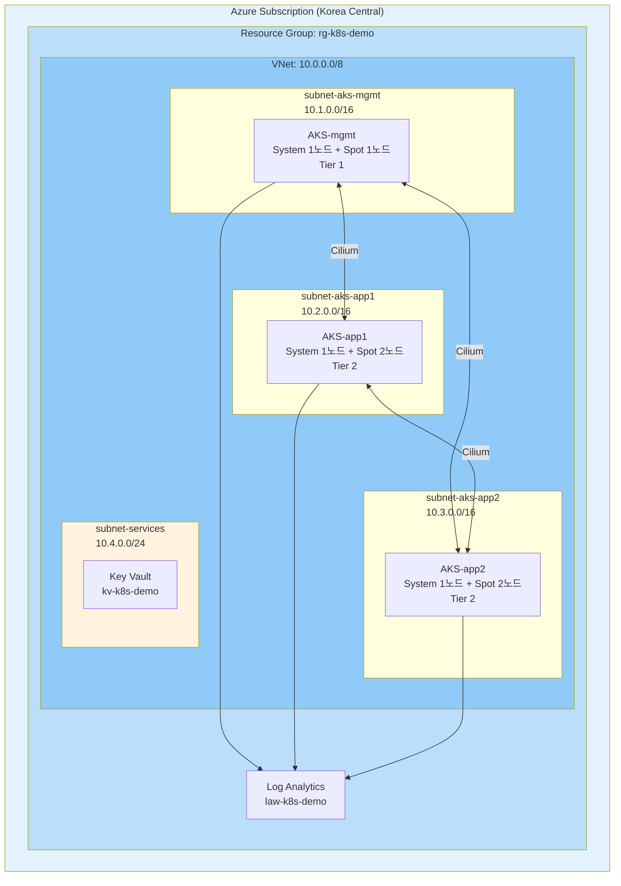
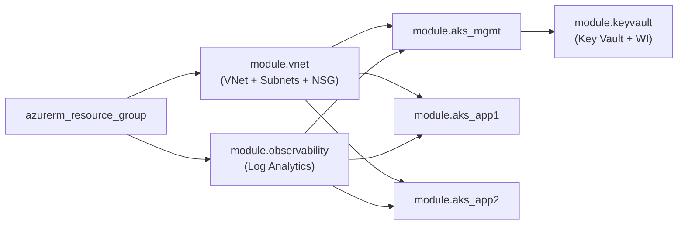
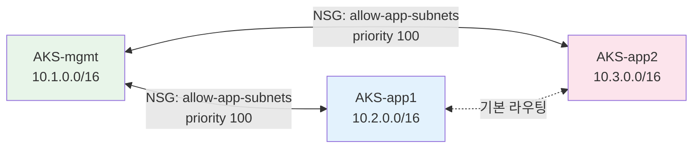
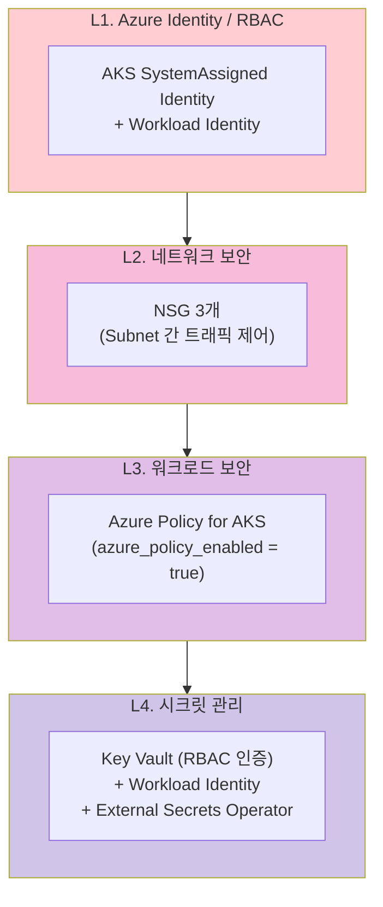
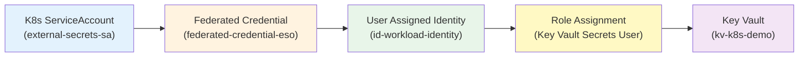
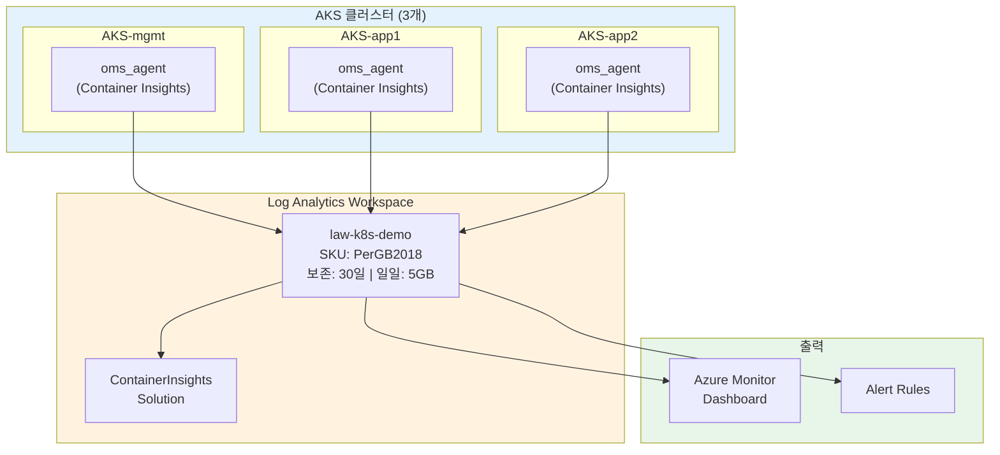

# Azure AKS 멀티클러스터 아키텍처

> **버전**: 3.0.0
> **최종 수정일**: 2026-02-14
> **IaC 소스**: 본 문서의 모든 내용은 `azure/` 디렉터리의 실제 Terraform / Helm Values / Shell Script 코드에서 도출
> **관련 문서**: [SMARTER-PROMPT.md](SMARTER-PROMPT.md) | [운영 런북](OPERATIONS-RUNBOOK.md)

---

## 목차

1. [개요](#1-개요)
2. [아키텍처 결정 기록 (ADR)](#2-아키텍처-결정-기록-adr)
3. [클러스터 토폴로지](#3-클러스터-토폴로지)
4. [네트워크 아키텍처](#4-네트워크-아키텍처)
5. [보안 아키텍처](#5-보안-아키텍처)
6. [관찰성 아키텍처](#6-관찰성-아키텍처)
7. [GitOps 및 시크릿 관리](#7-gitops-및-시크릿-관리)
8. [스토리지 아키텍처](#8-스토리지-아키텍처)
9. [장애 도메인 및 가용성](#9-장애-도메인-및-가용성)
10. [비용 최적화 전략](#10-비용-최적화-전략)
11. [백업 및 DR 전략](#11-백업-및-dr-전략)

---

## 1. 개요

### 1.1 프로젝트 목적

Azure 클라우드에서 AKS 기반 Kubernetes 멀티클러스터(3개) 환경을 **Terraform 모듈 + Helm + Shell Script**로 구축한다.
시연/개발 목적으로 Spot VM + AKS Free Tier로 월 $60-80 비용 최적화를 달성한다.

### 1.2 대상 환경 및 SLO

| 항목 | 값 | 코드 참조 |
|-----|-----|----------|
| **환경 유형** | 시연/개발/PoC | `azure/variables.tf` (`environment = "demo"`) |
| **리전** | Korea Central | `azure/variables.tf` (`location = "koreacentral"`) |
| **워크로드 유형** | Stateless (주), Stateful (보조) | |

| SLO 지표 | 시연 환경 | 프로덕션 권장 |
|---------|----------|-------------|
| **가용성** | 95% | 99.9% |
| **RTO** | 2시간 | 15분 |
| **RPO** | 24시간 | 1시간 |

### 1.3 Azure 관리형 서비스 SLA

| 서비스 | SLA | 비고 |
|-------|-----|------|
| AKS Control Plane | 99.5% (무료) / 99.95% (유료) | 시연은 무료 티어 |
| Azure Key Vault | 99.99% | |
| Azure Load Balancer | 99.99% | Standard SKU |

### 1.4 기술 스택

| 영역 | 기술 | 코드 참조 |
|-----|------|----------|
| **인프라** | Terraform (azurerm ~> 3.0), Azure Storage backend | `azure/versions.tf` |
| **컴퓨팅** | AKS + Spot VM (Standard_D2s_v3) | `azure/modules/aks/main.tf` |
| **네트워크** | VNet + 4 Subnets + 3 NSG | `azure/modules/vnet/main.tf` |
| **CNI** | Cilium BYO (`network_plugin = "none"`) | `azure/modules/aks/main.tf`, `azure/addons/install.sh` |
| **시크릿** | Azure Key Vault + Workload Identity + External Secrets Operator | `azure/modules/keyvault/main.tf` |
| **관찰성** | Azure Monitor + Container Insights (Log Analytics) | `azure/modules/observability/main.tf` |
| **GitOps** | ArgoCD (AKS-mgmt) | `azure/addons/values/argocd-values.yaml` |
| **정책** | Azure Policy for AKS | `azure/modules/aks/main.tf` (`azure_policy_enabled = true`) |

### 1.5 제약 조건

- Ansible/Helmfile 미사용 (Helm CLI + Shell Script)
- 시연 환경 전용 (Spot VM 전노드, Public API, Dev 수준 설정)
- Terraform State는 Azure Storage 원격 관리

---

## 2. 아키텍처 결정 기록 (ADR)

### ADR-A01: Spot VM 배치 전략 (Tier 기반)

| 항목 | 내용 |
|-----|------|
| **상태** | Accepted |
| **컨텍스트** | Spot VM은 최대 ~70% 저렴하나 회수(eviction) 가능 |
| **결정** | 워크로드를 Tier 0/1/2로 분류하여 배치 |
| **적용** | 시연 환경 - 비용 최소화 우선 |

**Tier 분류**:

| Tier | 워크로드 | 시연 환경 | 프로덕션 권장 |
|-----|---------|----------|-------------|
| **Tier 0** | Control Plane (AKS 관리형), CoreDNS | AKS 관리형 (Azure 보장) | AKS 관리형 |
| **Tier 1** | mgmt 클러스터 (ArgoCD, ESO) | Spot VM | On-Demand |
| **Tier 2** | app 클러스터 (애플리케이션) | Spot VM | Spot VM |

> 📎 **구현**: `azure/modules/aks/main.tf` - `azurerm_kubernetes_cluster_node_pool.spot`

```hcl
# Spot Node Pool 핵심 설정
priority        = "Spot"
eviction_policy = "Delete"
spot_max_price  = var.spot_max_price  # -1 = On-Demand 가격까지 허용
node_taints     = ["kubernetes.azure.com/scalesetpriority=spot:NoSchedule"]
```

### ADR-A02: CNI 선택 - Cilium BYO

| 항목 | 내용 |
|-----|------|
| **상태** | Accepted |
| **컨텍스트** | 멀티클러스터 서비스 디스커버리 지원과 Azure 네이티브 통합 간 트레이드오프 |
| **결정** | Cilium BYO CNI (`network_plugin = "none"`) |
| **근거** | Cluster Mesh 자유 구성, eBPF 기반 성능, 벤더 중립 |

**비교**:

| 항목 | Cilium (BYO) | Azure CNI Powered by Cilium | Azure CNI |
|-----|-------------|---------------------------|-----------|
| Cluster Mesh | 자유 구성 | 제한적 | 미지원 |
| Azure 네이티브 통합 | 제한적 | 지원 | 완전 지원 |
| eBPF 기반 성능 | 지원 | 지원 | 미지원 |

> 📎 **구현**: `azure/modules/aks/main.tf` - `network_profile { network_plugin = "none" }`
> 📎 **설치**: `azure/addons/install.sh` - `helm upgrade --install cilium cilium/cilium --set aksbyocni.enabled=true`

### ADR-A03: 시크릿 관리 - Azure Key Vault + Workload Identity

| 항목 | 내용 |
|-----|------|
| **상태** | Accepted |
| **컨텍스트** | Azure 네이티브 시크릿 관리 서비스 선택 |
| **결정** | Key Vault + Workload Identity + External Secrets Operator |
| **근거** | 캐싱 기반 장애 대응, CSI Driver 대비 운영 유연성, RBAC 인증 |

> 📎 **구현**: `azure/modules/keyvault/main.tf`

```hcl
# 핵심 리소스 체인
azurerm_key_vault.main                    # RBAC 인증 모드
  → azurerm_user_assigned_identity.workload   # Workload Identity
  → azurerm_federated_identity_credential     # AKS OIDC ↔ Key Vault 연결
  → azurerm_role_assignment                   # Key Vault Secrets User 권한
```

### ADR-A04: Public API + NSG 제한

| 항목 | 내용 |
|-----|------|
| **상태** | Accepted |
| **컨텍스트** | API Server 노출 방식 |
| **결정** | 시연: Public API + NSG 제한 / 프로덕션: Private Cluster |

> 📎 **구현**: `azure/modules/vnet/main.tf` - NSG security_rule 정의

### 아키텍처 불변 조건 (Architecture Contract)

> 아래 조건은 구현이 변경되더라도 **반드시 유지**되어야 하는 아키텍처 보장 사항입니다.

| # | 불변 조건 | 근거 ADR | 코드 참조 |
|---|----------|----------|----------|
| **C1** | AKS Control Plane은 **Azure 관리형**으로 Tier 분류 대상 아님 | ADR-A01 | - |
| **C2** | 시연 환경 User Node Pool은 **Spot VM** 사용 | ADR-A01 | `modules/aks/main.tf` |
| **C3** | 프로덕션 전환 시 Tier 1은 **On-Demand** 변경 권장 | ADR-A01 | `modules/aks/variables.tf` |
| **C4** | 시크릿은 **Key Vault + Workload Identity**로 관리 | ADR-A03 | `modules/keyvault/main.tf` |
| **C5** | 시연은 **Public API + NSG**, 프로덕션은 **Private Cluster** | ADR-A04 | `modules/vnet/main.tf` |
| **C6** | ESO 캐시로 Key Vault 장애 시 **기존 시크릿 유지** | ADR-A03 | `addons/install.sh` |

---

## 3. 클러스터 토폴로지

### 3.1 Azure 아키텍처 다이어그램

> 📎 **코드 참조**: `azure/main.tf` - 모듈 호출 구조



### 3.2 Terraform 모듈 구조

> 📎 **코드 참조**: `azure/main.tf`



### 3.3 클러스터 스펙

> 📎 **코드 참조**: `azure/modules/aks/main.tf`, `azure/variables.tf`

| 클러스터 | Terraform 모듈 | VM Size | System Pool | Spot Pool | Subnet |
|---------|---------------|---------|-------------|-----------|--------|
| **AKS-mgmt** | `module "aks_mgmt"` | Standard_D2s_v3 | 1노드 (30GB) | 1노드 (30GB) | `10.1.0.0/16` |
| **AKS-app1** | `module "aks_app1"` | Standard_D2s_v3 | 1노드 (30GB) | 2노드 (30GB) | `10.2.0.0/16` |
| **AKS-app2** | `module "aks_app2"` | Standard_D2s_v3 | 1노드 (30GB) | 2노드 (30GB) | `10.3.0.0/16` |

---

## 4. 네트워크 아키텍처

### 4.1 VNet 설계

> 📎 **코드 참조**: `azure/modules/vnet/main.tf`

| Subnet | CIDR | 용도 | NSG |
|--------|------|------|-----|
| `subnet-aks-mgmt` | `10.1.0.0/16` | AKS-mgmt 노드 | `nsg-aks-mgmt` |
| `subnet-aks-app1` | `10.2.0.0/16` | AKS-app1 노드 | `nsg-aks-app1` |
| `subnet-aks-app2` | `10.3.0.0/16` | AKS-app2 노드 | `nsg-aks-app2` |
| `subnet-services` | `10.4.0.0/24` | 관리형 서비스 (Key Vault) | - |

### 4.2 NSG 트래픽 제어

> 📎 **코드 참조**: `azure/modules/vnet/main.tf` - `azurerm_network_security_group`

단일 VNet 내 Subnet 간에는 기본 라우팅이 가능하며, NSG로 트래픽을 제어합니다:



**NSG 규칙 상세**:

| NSG | 규칙명 | 방향 | Source | Destination | 우선순위 |
|-----|--------|------|--------|-------------|---------|
| `nsg-aks-mgmt` | `allow-app-subnets` | Inbound | `10.2.0.0/16`, `10.3.0.0/16` | `10.1.0.0/16` | 100 |
| `nsg-aks-app1` | `allow-mgmt-subnet` | Inbound | `10.1.0.0/16` | `10.2.0.0/16` | 100 |
| `nsg-aks-app2` | `allow-mgmt-subnet` | Inbound | `10.1.0.0/16` | `10.3.0.0/16` | 100 |

### 4.3 CNI: Cilium BYO

> 📎 **코드 참조**: `azure/modules/aks/main.tf` (AKS 설정), `azure/addons/install.sh` (Helm 설치)

| 항목 | 설정 |
|-----|------|
| AKS `network_plugin` | `"none"` (BYO CNI 모드) |
| Helm Chart | `cilium/cilium` |
| 핵심 옵션 | `aksbyocni.enabled=true`, `nodeinit.enabled=true` |
| 설치 대상 | 3개 클러스터 모두 (`install.sh`에서 순차 설치) |

---

## 5. 보안 아키텍처

### 5.1 보안 계층 모델



### 5.2 AKS Identity

> 📎 **코드 참조**: `azure/modules/aks/main.tf`

| 설정 | 값 | 효과 |
|-----|-----|------|
| `identity.type` | `SystemAssigned` | 클러스터 자체 관리형 ID |
| `oidc_issuer_enabled` | `true` | Workload Identity OIDC 발급 |
| `workload_identity_enabled` | `true` | Pod → Azure 리소스 인증 |
| `azure_policy_enabled` | `true` | Azure Policy for AKS 활성화 |

### 5.3 Key Vault + Workload Identity

> 📎 **코드 참조**: `azure/modules/keyvault/main.tf`



**Terraform 리소스 체인**:

| 리소스 | 이름 | 역할 |
|--------|------|------|
| `azurerm_key_vault` | `kv-k8s-demo` | RBAC 인증, Standard SKU |
| `azurerm_user_assigned_identity` | `id-workload-identity` | Workload Identity |
| `azurerm_federated_identity_credential` | `federated-credential-eso` | AKS OIDC ↔ Azure AD 연결 |
| `azurerm_role_assignment` | - | Key Vault Secrets User 권한 |

### 5.4 Azure Policy 권장 정책

| 정책 | 효과 | 설명 |
|-----|------|------|
| 컨테이너 이미지 허용 목록 | Deny | ACR만 허용 |
| 권한 있는 컨테이너 금지 | Deny | privileged: true 차단 |
| 리소스 제한 필수 | Audit | requests/limits 검사 |

---

## 6. 관찰성 아키텍처

### 6.1 Azure Monitor + Container Insights

> 📎 **코드 참조**: `azure/modules/observability/main.tf`, `azure/modules/aks/main.tf` (oms_agent)



### 6.2 Terraform 리소스

> 📎 **코드 참조**: `azure/modules/observability/main.tf`

| 리소스 | 이름 | 설정 |
|--------|------|------|
| `azurerm_log_analytics_workspace` | `law-k8s-demo` | SKU: PerGB2018, retention: 30일, daily_quota: 5GB |
| `azurerm_log_analytics_solution` | `ContainerInsights` | Publisher: Microsoft, Product: OMSGallery/ContainerInsights |

### 6.3 AKS 연동

> 📎 **코드 참조**: `azure/modules/aks/main.tf` - `oms_agent` 블록

```hcl
oms_agent {
  log_analytics_workspace_id = var.log_analytics_workspace_id
}
```

3개 클러스터 모두 동일한 Log Analytics Workspace에 연결되어 중앙 관찰성을 제공합니다.

### 6.4 비용 관리

| 항목 | 설정값 | 코드 참조 |
|-----|--------|----------|
| 보존 기간 | 30일 | `azure/variables.tf` (`log_analytics_retention_days`) |
| 일일 수집 제한 | 5GB | `azure/variables.tf` (`log_analytics_daily_quota_gb`) |

---

## 7. GitOps 및 시크릿 관리

### 7.1 ArgoCD (AKS-mgmt)

> 📎 **코드 참조**: `azure/addons/values/argocd-values.yaml`, `azure/addons/install.sh`

| 설정 | 값 |
|-----|-----|
| Helm Chart | `argo/argo-cd` |
| 네임스페이스 | `argocd` |
| 서비스 타입 | LoadBalancer |
| Insecure 모드 | `server.insecure: true` (시연 환경) |
| 설치 위치 | AKS-mgmt 클러스터만 |

### 7.2 External Secrets Operator

> 📎 **코드 참조**: `azure/addons/values/external-secrets-values.yaml`, `azure/addons/install.sh`

| 설정 | 값 |
|-----|-----|
| Helm Chart | `external-secrets/external-secrets` |
| 네임스페이스 | `external-secrets` |
| ServiceAccount | `external-secrets-sa` |
| Workload Identity | `azure.workload.identity/client-id` 어노테이션 |
| CRD 자동 설치 | `installCRDs: true` |

`install.sh`에서 Workload Identity Client ID를 `az identity show`로 자동 조회하여 Helm values에 주입합니다.

---

## 8. 스토리지 아키텍처

### 8.1 Azure StorageClass (AKS 기본 제공)

| StorageClass | Disk 유형 | 성능 | 용도 |
|-------------|----------|------|------|
| **managed** (기본) | Azure Disk Standard | 500 IOPS | 일반 워크로드 |
| **managed-premium** | Azure Disk Premium | 5000+ IOPS | 고성능 워크로드 |
| **azurefile** | Azure Files | 공유 스토리지 | 멀티 Pod 동시 마운트 |

### 8.2 노드 디스크

> 📎 **코드 참조**: `azure/modules/aks/main.tf` - `os_disk_size_gb`

| Node Pool | OS Disk | 비고 |
|-----------|---------|------|
| System Pool | 30GB | AKS 필수 (각 클러스터 1노드) |
| Spot Pool | 30GB | 워크로드 실행 (mgmt: 1, app: 2) |

---

## 9. 장애 도메인 및 가용성

### 9.1 장애 영향 매트릭스

| 장애 유형 | 영향 | 완화 | 코드 참조 |
|----------|------|------|----------|
| **Spot VM 회수** | 해당 노드 Pod 재스케줄링 | PDB + node_taints로 격리 | `modules/aks/main.tf` |
| **AKS Control Plane 장애** | API Server 불가 (워크로드 계속 실행) | Azure 자동 복구 (SLA 99.5%) | - |
| **Key Vault 장애** | 새 시크릿 조회 불가 | ESO 캐시 유지 (SLA 99.99%) | `modules/keyvault/main.tf` |
| **Log Analytics 장애** | 로그/메트릭 수집 중단 | Azure 자동 복구 | `modules/observability/main.tf` |

### 9.2 Spot VM 회수 대응

> 📎 **코드 참조**: `azure/modules/aks/main.tf` - Spot Node Pool 설정

| 설정 | 값 | 효과 |
|-----|-----|------|
| `eviction_policy` | `Delete` | 회수 시 노드 삭제 → 새 노드 자동 생성 |
| `spot_max_price` | `-1` (기본값) | On-Demand 가격까지 허용 (회수 최소화) |
| `node_taints` | `spot:NoSchedule` | tolerations 없는 Pod는 Spot에 스케줄 불가 |
| `node_labels` | `scalesetpriority=spot` | nodeSelector로 명시적 배치 가능 |

**회수 시나리오**: 30초 전 알림 → Node Drain → 새 노드 자동 프로비저닝

### 9.3 복구 시나리오

| 시나리오 | 복구 방법 | 예상 RTO |
|---------|----------|---------|
| 리소스 삭제 | ArgoCD 동기화 | 5분 |
| AKS 클러스터 장애 | `terraform apply` (자동 재생성) | 30분 |
| 전체 인프라 장애 | `terraform destroy && terraform apply` + `bash install.sh` | 1시간 |
| 리전 장애 | DR 리전에 `terraform apply` (변수만 변경) | 2시간+ |

---

## 10. 비용 최적화 전략

### 10.1 예상 비용 (시연 환경)

> 📎 **코드 참조**: `azure/variables.tf` - Spot/Log Analytics 관련 변수

| 항목 | 월 비용 | 코드 참조 |
|-----|--------|----------|
| AKS Control Plane (3개) | 무료 | AKS Free Tier |
| VM: Spot 5노드 (D2s_v3) | ~$50 | `modules/aks/main.tf` (`spot_max_price`) |
| Azure Disk (System+Spot, 240GB) | ~$10 | `modules/aks/main.tf` (`os_disk_size_gb = 30`) |
| Log Analytics | ~$5 | `modules/observability/main.tf` (`daily_quota_gb = 5`) |
| Key Vault | ~$1 | `modules/keyvault/main.tf` |
| **합계** | **~$60-80/월** | |

### 10.2 비용 절감 전략

| 전략 | 절감 효과 | 코드 참조 |
|-----|----------|----------|
| Spot VM 사용 | 최대 ~70% (변동) | `modules/aks/main.tf` |
| AKS Free Tier | Control Plane 무료 | AKS 기본 |
| Log Analytics 수집 제한 | 예상치 못한 비용 방지 | `modules/observability/main.tf` |
| 비업무시간 클러스터 중지 | ~60% 추가 | `az aks stop/start` |

### 10.3 프로덕션 전환 시 추가 비용

| 변경 | 추가 비용 | 효과 |
|-----|----------|------|
| mgmt Spot → On-Demand | +$50-80/월 | 플랫폼 안정성 |
| 멀티 AZ 구성 | +$30-50/월 | 가용성 향상 |
| AKS Uptime SLA (Standard tier) | +$73/월 | 99.95% SLA |
| Private Cluster | +네트워크 비용 | 보안 강화 |

---

## 11. 백업 및 DR 전략

### 11.1 백업 방법

| 계층 | 내용 | 서비스 | 코드 참조 |
|-----|------|-------|----------|
| 인프라 설정 | AKS + VNet + Key Vault 구성 | Terraform State (Azure Storage) | `azure/versions.tf` (backend) |
| 워크로드 | Deployment, ConfigMap 등 | ArgoCD GitOps (Git 원본) | `addons/values/argocd-values.yaml` |
| 시크릿 | Key Vault 데이터 | Key Vault 자동 복제 (Azure 관리) | `modules/keyvault/main.tf` |

### 11.2 Terraform State 원격 관리

> 📎 **코드 참조**: `azure/versions.tf` - backend 블록

```hcl
backend "azurerm" {
  resource_group_name  = "rg-terraform-state"
  storage_account_name = "stterraformstate"
  container_name       = "tfstate"
  key                  = "k8s-demo.tfstate"
}
```

---

## 부록: 실행 명령어 참조

```bash
# 사전 준비
az login
az account set --subscription "<subscription-id>"

# 전체 인프라 생성
cd azure
terraform init && terraform apply

# 플랫폼 애드온 설치
bash addons/install.sh

# kubeconfig 설정
bash scripts/setup-kubeconfig.sh

# 전체 인프라 삭제
terraform destroy
# 또는 빠른 삭제: bash scripts/cleanup.sh
```

## 부록: 프로덕션 전환 시 고려사항

| 영역 | 현재 (시연) | 프로덕션 권장 |
|-----|-----------|-------------|
| **Tier 1 노드** | Spot VM | On-Demand |
| **AKS Tier** | Free (99.5%) | Standard (99.95%) |
| **API 접근** | Public + NSG | Private Cluster |
| **가용 영역** | 단일 Zone | 멀티 AZ |
| **백업** | Terraform State + GitOps만 | + Velero + Azure Blob |
| **모니터링** | Container Insights만 | + Prometheus + Grafana |
| **Key Vault** | Soft Delete 7일 | Purge Protection 활성 |
| **Log Analytics** | 5GB/일 | 제한 해제 + 장기 보존 |
