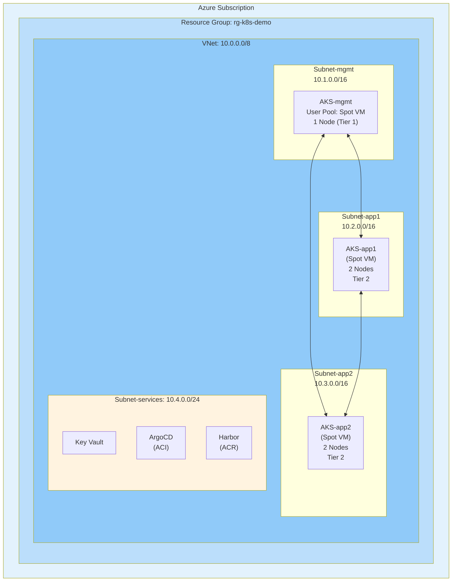
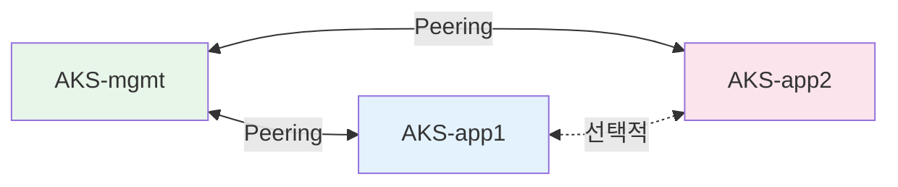
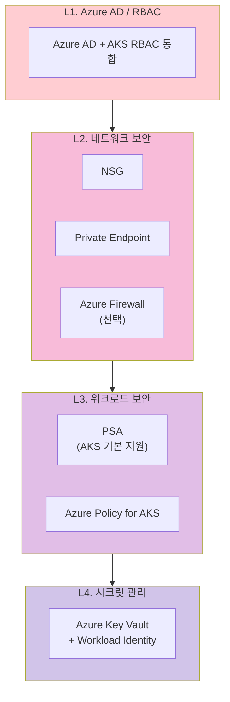
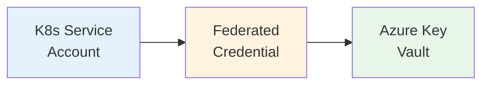
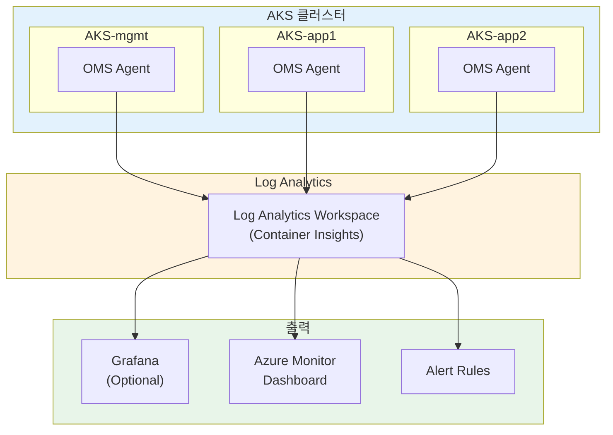
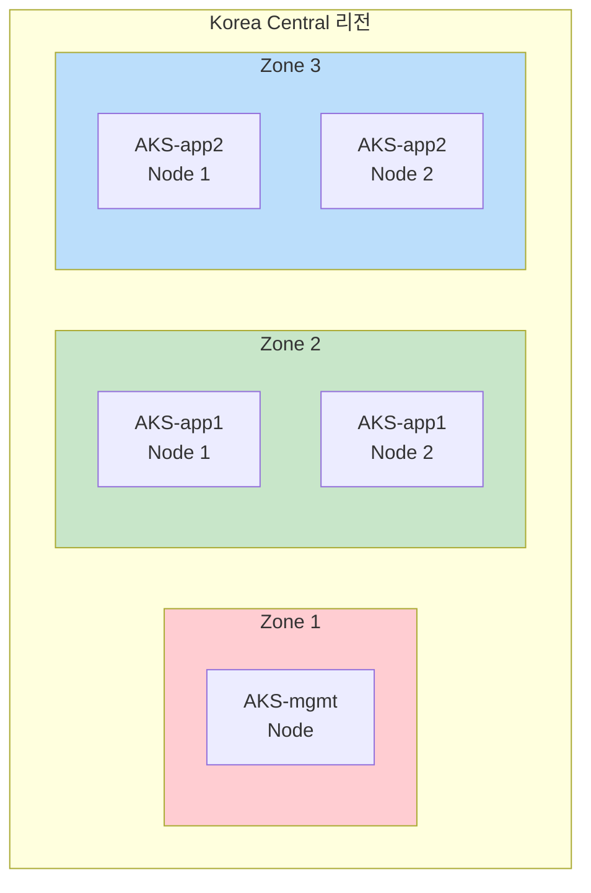

# Azure Kubernetes 멀티클러스터 아키텍처

> **버전**: 2.0.0
> **최종 수정일**: 2026-02-05
> **관련 문서**: [구현 가이드](IMPLEMENTATION-GUIDE.md) | [운영 런북](OPERATIONS-RUNBOOK.md)

---

## 목차

1. [개요](#1-개요)
2. [아키텍처 결정 기록 (ADR)](#2-아키텍처-결정-기록-adr)
3. [클러스터 토폴로지](#3-클러스터-토폴로지)
4. [네트워크 아키텍처](#4-네트워크-아키텍처)
5. [스토리지 아키텍처](#5-스토리지-아키텍처)
6. [보안 아키텍처](#6-보안-아키텍처)
7. [관찰성 아키텍처](#7-관찰성-아키텍처)
8. [장애 도메인 및 가용성](#8-장애-도메인-및-가용성)
9. [비용 최적화 전략](#9-비용-최적화-전략)
10. [백업 및 DR 전략](#10-백업-및-dr-전략)

---

## 1. 개요

### 1.1 프로젝트 목적

Azure 클라우드에서 Kubernetes 멀티클러스터 환경을 구축합니다.
시연 및 개발 목적으로 비용 최적화(Spot VM, 무료 티어)를 고려한 구성입니다.

### 1.2 대상 환경 및 SLO

| 항목 | 값 |
|-----|-----|
| **환경 유형** | 시연/개발/PoC |
| **워크로드 유형** | Stateless (주), Stateful (보조) |
| **리전** | Korea Central |

| SLO 지표 | 시연 환경 | 프로덕션 권장 |
|---------|----------|-------------|
| **가용성** | 95% | 99.9% |
| **RTO** | 2시간 | 15분 |
| **RPO** | 24시간 | 1시간 |

### 1.3 Azure 관리형 서비스 SLA

| 서비스 | SLA | 비고 |
|-------|-----|------|
| AKS Control Plane | 99.5% (무료) / 99.95% (유료) | 시연은 무료 티어 |
| Azure Key Vault | 99.99% | |
| Azure Load Balancer | 99.99% | Standard SKU |

### 1.4 기술 스택

| 영역 | 기술 |
|-----|------|
| **컴퓨팅** | AKS (Spot VM) |
| **네트워크** | VNet, Azure LB, Private DNS |
| **CNI** | Cilium (BYO) 또는 Azure CNI |
| **시크릿** | Azure Key Vault + External Secrets |
| **관찰성** | Azure Monitor + Container Insights |
| **GitOps** | ArgoCD (AKS 내 또는 ACI) |
| **백업** | Azure Backup for AKS + Velero |

---

## 2. 아키텍처 결정 기록 (ADR)

### ADR-A01: Spot VM 배치 전략 (Tier 기반)

| 항목 | 내용 |
|-----|------|
| **상태** | Accepted |
| **컨텍스트** | Spot VM은 70% 저렴하나 회수(eviction) 가능 |
| **결정** | 워크로드를 Tier 0/1/2로 분류하여 배치 |
| **적용 환경** | 🎯 시연/개발 환경 - 비용 최소화 우선 |

**Tier 분류**:

| Tier | 워크로드 | 시연 환경 | 프로덕션 권장 |
|-----|---------|----------|-------------|
| **Tier 0** | Control Plane (AKS 관리형), CoreDNS | AKS 관리형 (Azure 보장) | AKS 관리형 |
| **Tier 1** | mgmt 클러스터 워크로드 (Prometheus, ArgoCD) | Spot VM (User Pool) | On-Demand |
| **Tier 2** | app 클러스터 워크로드 (애플리케이션) | Spot VM | Spot VM |

> **참고**: AKS Control Plane은 Azure 관리형으로 Tier 분류 대상 아님. 위 Tier는 **User Node Pool** 기준.
> **프로덕션 권장**: Tier 1 워크로드는 On-Demand 노드 풀에 배치하여 안정성 확보 (+$50-80/월)

> 📎 **구현**: [IMPLEMENTATION-GUIDE.md §3.2](IMPLEMENTATION-GUIDE.md#32-spot-node-pool)

### ADR-A02: CNI 선택 - Cilium BYO vs Azure CNI

| 항목 | 내용 |
|-----|------|
| **상태** | Accepted |
| **컨텍스트** | 멀티클러스터 서비스 디스커버리 지원과 Azure 네이티브 통합 간 트레이드오프 |
| **결정** | 기본안: Cilium BYO CNI (Cluster Mesh 지원) |
| **대안** | Azure CNI (운영 편의성 우선 시) |

**비교**:

| 항목 | Cilium (BYO) | Azure CNI |
|-----|-------------|-----------|
| Cluster Mesh | ✅ 지원 | ❌ 미지원 |
| Azure 네이티브 통합 | 제한적 (BYO) | ✅ 완전 지원 |
| Network Policy | Cilium NP | Azure NP 또는 Calico |
| eBPF 기반 성능 | ✅ | ❌ |

**Cilium BYO 제한사항**:
- Windows 노드 풀 미지원
- Azure Network Policy 미지원
- 일부 Azure 네트워크 기능 제한

> 📎 **구현**: [IMPLEMENTATION-GUIDE.md §4](IMPLEMENTATION-GUIDE.md#4-네트워크-설정)

### ADR-A03: 시크릿 관리 - Azure Key Vault

| 항목 | 내용 |
|-----|------|
| **상태** | Accepted |
| **컨텍스트** | Azure 네이티브 시크릿 관리 서비스 선택 |
| **결정** | Azure Key Vault + External Secrets (또는 CSI Driver) |
| **트레이드오프** | 동적 시크릿 생성 기능은 미지원, 관리형 서비스로 운영 부담 최소화 |

**인증 방식**:

| 옵션 | 방식 | 권장 환경 |
|-----|------|----------|
| **Workload Identity** | Federated Credential | 프로덕션 (권장) |
| **Managed Identity** | VM 할당 | 레거시 호환 |

> 📎 **구현**: [IMPLEMENTATION-GUIDE.md §5](IMPLEMENTATION-GUIDE.md#5-azure-key-vault-연동)

### ADR-A04: Private Cluster 구성

| 항목 | 내용 |
|-----|------|
| **상태** | Accepted |
| **컨텍스트** | API Server 노출 방식 |
| **결정** | 시연: Public API + NSG 제한 / 프로덕션: Private Cluster |

> 📎 **구현**: [IMPLEMENTATION-GUIDE.md §3.1](IMPLEMENTATION-GUIDE.md#31-aks-모듈)

### 아키텍처 불변 조건 (Architecture Contract)

> 아래 조건은 구현이 변경되더라도 **반드시 유지**되어야 하는 아키텍처 보장 사항입니다.

| # | 불변 조건 | 근거 ADR |
|---|----------|----------|
| **C1** | AKS Control Plane은 **Azure 관리형**으로 Tier 분류 대상 아님 | ADR-A01 |
| **C2** | 시연 환경에서 User Node Pool은 **Spot VM** 사용 (비용 최소화) | ADR-A01 |
| **C3** | 프로덕션 전환 시 Tier 1 워크로드는 **On-Demand**로 변경 권장 | ADR-A01 |
| **C4** | 시크릿은 **Azure Key Vault + Workload Identity**로 관리 | ADR-A03 |
| **C5** | 시연 환경은 **Public API + NSG 제한**, 프로덕션은 **Private Cluster** | ADR-A04 |
| **C6** | External Secrets 캐시로 Key Vault 장애 시에도 **기존 시크릿 유지** | ADR-A03 |

---

## 3. 클러스터 토폴로지

### 3.1 Azure 아키텍처 다이어그램

### 3.2 클러스터 스펙

| 클러스터 | VM Size | Node 수 | Node Pool 타입 |
|---------|---------|---------|---------------|
| **AKS-mgmt** | Standard_D2s_v3 | 1 | Spot (시연) |
| **AKS-app1** | Standard_D2s_v3 | 2 | Spot |
| **AKS-app2** | Standard_D2s_v3 | 2 | Spot |

---

## 4. 네트워크 아키텍처

### 4.1 VNet 설계

| Subnet | CIDR | 용도 |
|--------|------|------|
| Subnet-mgmt | 10.1.0.0/16 | AKS-mgmt 노드 |
| Subnet-app1 | 10.2.0.0/16 | AKS-app1 노드 |
| Subnet-app2 | 10.3.0.0/16 | AKS-app2 노드 |
| Subnet-services | 10.4.0.0/24 | 관리형 서비스 (Key Vault, ACI) |

### 4.2 VNet Peering

### 4.3 DNS

| 구성 요소 | 구현 |
|----------|------|
| 내부 DNS | Azure Private DNS Zone |
| 외부 DNS | Azure DNS 또는 외부 DNS |
| 서비스 디스커버리 | CoreDNS (AKS 내장) |

### 4.4 Ingress

| 옵션 | 설명 |
|-----|------|
| **Azure Application Gateway** | L7, WAF 지원 |
| **NGINX Ingress** | 커뮤니티 표준 |
| **Cilium Gateway** | CNI 통합 (Cilium BYO 시) |

---

## 5. 스토리지 아키텍처

### 5.1 Azure StorageClass

| StorageClass | 성능 | 용도 |
|-------------|------|------|
| **managed** (Azure Disk Standard) | 500 IOPS | 일반 워크로드 |
| **managed-premium** (Azure Disk Premium) | 5000+ IOPS | 고성능 워크로드 |
| **azurefile** (Azure Files) | 공유 스토리지 | 멀티 Pod 동시 마운트 |

### 5.2 워크로드별 스토리지

| 워크로드 | Azure StorageClass | 크기 |
|---------|-------------------|------|
| Prometheus | managed-premium | 20Gi |
| Grafana | managed | 10Gi |
| ArgoCD | managed | 10Gi |

---

## 6. 보안 아키텍처

### 6.1 보안 계층

### 6.2 Azure Policy 권장 정책

| 정책 | 효과 | 설명 |
|-----|------|------|
| 컨테이너 이미지 허용 목록 | Deny | ACR만 허용 |
| 권한 있는 컨테이너 금지 | Deny | privileged: true 차단 |
| 리소스 제한 필수 | Audit | requests/limits 검사 |

### 6.3 Workload Identity

---

## 7. 관찰성 아키텍처

### 7.1 데이터 흐름

### 7.2 비용 관리

| 항목 | 권장 설정 |
|-----|----------|
| 보존 기간 | 30일 (기본 무료) |
| 일일 수집 제한 | 5GB |
| 불필요 로그 제외 | kube-system 최소화 |

---

## 8. 장애 도메인 및 가용성

### 8.1 가용 영역 설계

> **시연 환경**: 단일 Zone (비용 최소화)
> **프로덕션**: 멀티 Zone 분산 권장

### 8.2 장애 영향 매트릭스

| 장애 유형 | 영향 | 복구 |
|----------|------|------|
| **Spot VM 회수** | 해당 노드 Pod 재스케줄링 | 자동 (CA) |
| **단일 AZ 장애** | 해당 AZ 노드 다운 | 멀티 AZ 시 자동 페일오버 |
| **AKS Control Plane** | API Server 불가 (워크로드는 계속 실행) | Azure 자동 복구 |
| **Key Vault 장애** | 새 시크릿 조회 불가 | Azure 자동 복구 (SLA 99.99%) |

### 8.3 Spot VM 회수 대응

- 30초 전 알림 → Node Drain → 새 노드 프로비저닝
- PodDisruptionBudget으로 최소 가용성 보장

---

## 9. 비용 최적화 전략

### 9.1 예상 비용 (시연 환경)

| 항목 | 월 비용 | 비고 |
|-----|--------|------|
| AKS Control Plane | 무료 | Free Tier |
| VM (Spot 5노드) | ~$50 | 70% 할인 |
| Azure Disk (50GB) | ~$5 | Standard SSD |
| Log Analytics | ~$5 | 5GB/일 제한 |
| Key Vault | ~$1 | 기본 사용량 |
| **합계** | **~$60-80/월** | |

### 9.2 비용 절감 전략

| 전략 | 절감 효과 |
|-----|----------|
| Spot VM 사용 | ~70% |
| 비업무시간 클러스터 중지 | ~60% 추가 |
| AKS Free Tier | Control Plane 무료 |
| Log Analytics 수집 제한 | 예상치 못한 비용 방지 |

### 9.3 프로덕션 권장 (안정성 우선)

| 변경 | 추가 비용 | 효과 |
|-----|----------|------|
| mgmt를 On-Demand로 | +$50-80/월 | 플랫폼 안정성 |
| 멀티 AZ 구성 | +$30-50/월 | 가용성 향상 |
| AKS Uptime SLA | +$75/월 | 99.95% SLA |

---

## 10. 백업 및 DR 전략

### 10.1 백업 방법

| 계층 | 내용 | Azure 서비스 |
|-----|------|-------------|
| 클러스터 설정 | AKS 구성 | Terraform State (Azure Storage) |
| 워크로드 | Deployment, ConfigMap 등 | Velero → Azure Blob |
| 데이터 | PV 데이터 | Azure Disk Snapshot |
| 시크릿 | Key Vault 데이터 | Key Vault 복제 (자동) |

### 10.2 DR 시나리오

| 시나리오 | 복구 방법 | RTO |
|---------|----------|-----|
| 리소스 삭제 | ArgoCD 동기화 | 5분 |
| AKS 클러스터 장애 | Terraform 재배포 + Velero 복원 | 1시간 |
| 리전 장애 | DR 리전에 새 클러스터 생성 | 2시간+ |

---

## 부록: 관련 문서

| 문서 | 설명 |
|-----|------|
| [IMPLEMENTATION-GUIDE.md](IMPLEMENTATION-GUIDE.md) | Terraform, AKS 설정 코드 |
| [OPERATIONS-RUNBOOK.md](OPERATIONS-RUNBOOK.md) | 백업/복구/업그레이드 절차 |
