# [K8s 아키텍처] AKS 멀티클러스터 설계: Azure 클라우드 환경

## 0. 개념 요약

**멀티클러스터 아키텍처**란 단일 Kubernetes 클러스터 대신 **역할별로 분리된 여러 클러스터**를 운영하는 패턴입니다.

이 글에서는 다음 내용을 다룹니다:
- **AKS 기반 mgmt + app 분리 구조** 설계
- **Spot VM Tier 전략**으로 비용 최적화
- Azure 네이티브 서비스(Key Vault, Monitor, ACR) 활용
- **ADR(Architecture Decision Record)**로 설계 의도 보존

| 용어 | 설명 |
|-----|------|
| **AKS** | Azure Kubernetes Service, Azure 관리형 Kubernetes |
| **mgmt 클러스터** | 플랫폼 서비스(Prometheus, ArgoCD) 집중 배치 |
| **app 클러스터** | 애플리케이션 워크로드 전용 |
| **Spot VM** | Azure에서 70% 저렴하게 제공하는 잉여 VM (회수 가능) |

---

## 1. 왜 AKS 멀티클러스터인가

### 1.1 단일 클러스터의 한계

단일 AKS 클러스터에서 플랫폼 서비스와 애플리케이션을 함께 운영하면 다음 문제가 발생합니다:

| 문제 | 설명 |
|-----|------|
| **장애 전파** | Prometheus OOM → API Server 부하 → 전체 워크로드 영향 |
| **리소스 경합** | 플랫폼 서비스와 애플리케이션이 같은 노드 풀에서 경쟁 |
| **보안 경계 모호** | 개발팀 워크로드와 인프라 컴포넌트가 같은 RBAC 범위 |
| **업그레이드 리스크** | AKS 업그레이드 시 모든 워크로드에 영향 |

### 1.2 역할 기반 분리 (mgmt + app)

이 문제를 해결하기 위해 **역할 기반 클러스터 분리**를 적용합니다:

```mermaid
flowchart TB
    subgraph Azure["Azure Subscription"]
        subgraph mgmt["AKS-mgmt"]
            Prom["Prometheus"]
            ArgoCD["ArgoCD"]
            Grafana["Grafana"]
        end

        subgraph app1["AKS-app1"]
            App1["애플리케이션"]
            OMS1["OMS Agent"]
        end

        subgraph app2["AKS-app2"]
            App2["애플리케이션"]
            OMS2["OMS Agent"]
        end

        KV["Azure Key Vault"]
        LAW["Log Analytics"]
    end

    OMS1 --> LAW
    OMS2 --> LAW
    mgmt <-->|"VNet Peering"| app1
    mgmt <-->|"VNet Peering"| app2
    App1 --> KV
    App2 --> KV
```



| 클러스터 | 역할 | 주요 컴포넌트 |
|---------|------|-------------|
| **AKS-mgmt** | 플랫폼 서비스 | Prometheus, ArgoCD, Grafana |
| **AKS-app1/app2** | 워크로드 | 애플리케이션, OMS Agent |

✅ **결론**: 플랫폼 서비스와 워크로드를 분리하여 **장애 전파를 차단**합니다.

---

## 2. 핵심 설계 결정 (ADR)

### 2.1 ADR-A01: Spot VM Tier 전략

Azure Spot VM은 정가 대비 **70% 저렴**하지만 회수(eviction) 가능성이 있습니다. 워크로드를 **Tier로 분류**하여 배치합니다:

| Tier | 워크로드 | 시연 환경 | 프로덕션 권장 |
|-----|---------|----------|-------------|
| **Tier 0** | AKS Control Plane | Azure 관리형 | Azure 관리형 |
| **Tier 1** | mgmt 워크로드 (Prometheus, ArgoCD) | Spot VM | On-Demand |
| **Tier 2** | app 워크로드 (애플리케이션) | Spot VM | Spot VM |

> ⚠️ **주의**: 외부 시연/라이브 데모라면 **mgmt(Tier 1)는 On-Demand 권장**합니다. Spot VM 회수 시 Grafana, ArgoCD 대시보드가 함께 내려가면 데모가 중단됩니다.

```hcl
# AKS Spot Node Pool (Terraform)
resource "azurerm_kubernetes_cluster_node_pool" "spot" {
  name                  = "spot"
  kubernetes_cluster_id = azurerm_kubernetes_cluster.main.id
  vm_size               = "Standard_D2s_v3"
  node_count            = 2

  priority        = "Spot"
  eviction_policy = "Delete"
  spot_max_price  = 0.04  # 최대 가격 제한

  node_labels = {
    "kubernetes.azure.com/scalesetpriority" = "spot"
  }

  node_taints = [
    "kubernetes.azure.com/scalesetpriority=spot:NoSchedule"
  ]
}
```

### 2.2 ADR-A02: CNI 선택 - Cilium BYO vs Azure CNI

멀티클러스터 서비스 디스커버리와 Azure 네이티브 통합 사이에서 트레이드오프가 존재합니다:

| 항목 | Cilium (BYO) | Azure CNI |
|-----|-------------|-----------|
| Cluster Mesh | ✅ 지원 | ❌ 미지원 |
| Azure 네이티브 통합 | 제한적 | ✅ 완전 지원 |
| eBPF 기반 성능 | ✅ | ❌ |
| Network Policy | Cilium NP | Azure NP / Calico |

> 💡 **결정**: Cilium BYO를 기본으로 선택. Cluster Mesh가 멀티클러스터에서 핵심 기능이며, eBPF 기반의 성능 이점이 크기 때문.

### 2.3 ADR-A03: Azure Key Vault + Workload Identity

Azure 네이티브 시크릿 관리를 위해 Key Vault와 Workload Identity를 결합합니다:

| 항목 | 내용 |
|-----|------|
| **시크릿 저장소** | Azure Key Vault (SLA 99.99%) |
| **인증** | Workload Identity (Federated Credential) |
| **K8s 연동** | External Secrets Operator 또는 CSI Driver |
| **장애 대응** | External Secrets 캐시로 Key Vault 장애 시에도 기존 시크릿 유지 |


---

## 3. 네트워크 아키텍처

### 3.1 VNet 설계

모든 AKS 클러스터는 단일 VNet 내 별도 Subnet에 배치됩니다:

| Subnet | CIDR | 용도 |
|--------|------|------|
| Subnet-mgmt | 10.1.0.0/16 | AKS-mgmt 노드 |
| Subnet-app1 | 10.2.0.0/16 | AKS-app1 노드 |
| Subnet-app2 | 10.3.0.0/16 | AKS-app2 노드 |
| Subnet-services | 10.4.0.0/24 | Key Vault, ACI |

### 3.2 VNet Peering

```mermaid
flowchart LR
    mgmt["AKS-mgmt"]
    app1["AKS-app1"]
    app2["AKS-app2"]

    mgmt <-->|"Peering"| app1
    mgmt <-->|"Peering"| app2
    app1 <-.->|"선택적"| app2
```



---

## 4. 관찰성: Azure Monitor + Container Insights

Azure 네이티브 관찰성 스택을 활용합니다:

```mermaid
flowchart TB
    subgraph Clusters["AKS 클러스터"]
        mgmt["AKS-mgmt<br/>OMS Agent"]
        app1["AKS-app1<br/>OMS Agent"]
        app2["AKS-app2<br/>OMS Agent"]
    end

    subgraph Monitor["Azure Monitor"]
        LAW["Log Analytics Workspace"]
        CI["Container Insights"]
        Alert["Alert Rules"]
    end

    mgmt --> LAW
    app1 --> LAW
    app2 --> LAW
    LAW --> CI
    LAW --> Alert
```



| 항목 | 설정 |
|-----|------|
| **수집** | OMS Agent (각 AKS 클러스터) |
| **저장** | Log Analytics Workspace |
| **시각화** | Container Insights + Grafana (선택) |
| **비용 제한** | 일일 5GB 수집 제한, 30일 보존 |

---

## 5. 비용 최적화

### 5.1 예상 비용 (시연 환경)

| 항목 | 월 비용 | 비고 |
|-----|--------|------|
| AKS Control Plane | 무료 | Free Tier |
| VM (Spot 5노드) | ~$50 | Standard_D2s_v3, 70% 할인 |
| Azure Disk (50GB) | ~$5 | Standard SSD |
| Log Analytics | ~$5 | 5GB/일 제한 |
| Key Vault | ~$1 | 기본 사용량 |
| **합계** | **~$60-80/월** | |

### 5.2 비용 절감 전략

| 전략 | 절감 효과 |
|-----|----------|
| **Spot VM 사용** | ~70% |
| **비업무시간 클러스터 중지** | ~60% 추가 |
| **AKS Free Tier** | Control Plane 무료 |
| **Log Analytics 수집 제한** | 예상치 못한 비용 방지 |

### 5.3 프로덕션 전환 시 추가 비용

| 변경 | 추가 비용 | 효과 |
|-----|----------|------|
| mgmt를 On-Demand로 | +$50-80/월 | 플랫폼 안정성 |
| 멀티 AZ 구성 | +$30-50/월 | 가용성 향상 |
| AKS Uptime SLA | +$75/월 | 99.95% SLA |

---

## 6. 장애 대응

### 6.1 Spot VM 회수 대응

Spot VM은 Azure가 용량 필요 시 30초 전 알림 후 회수합니다:

- **30초 전 알림** → Node Drain → 새 노드 프로비저닝 (Cluster Autoscaler)
- **PodDisruptionBudget**으로 최소 가용성 보장
- **Tier 1 워크로드**: 프로덕션에서는 On-Demand로 전환 권장

### 6.2 장애 영향 매트릭스

| 장애 유형 | 영향 | 복구 |
|----------|------|------|
| **Spot VM 회수** | 해당 노드 Pod 재스케줄링 | 자동 (CA) |
| **AKS Control Plane** | API Server 불가 (워크로드는 계속 실행) | Azure 자동 복구 |
| **Key Vault 장애** | 새 시크릿 조회 불가 | Azure 자동 복구 (SLA 99.99%) |
| **단일 AZ 장애** | 해당 AZ 노드 다운 | 멀티 AZ 시 자동 페일오버 |

---

## 7. 아키텍처 불변 조건 (Architecture Contract)

구현이 변경되더라도 **반드시 유지**되어야 하는 조건을 명시합니다:

| # | 불변 조건 | 근거 |
|---|----------|------|
| **C1** | AKS Control Plane은 Azure 관리형으로 Tier 분류 대상 아님 | ADR-A01 |
| **C2** | 시연 환경에서 User Node Pool은 Spot VM 사용 | ADR-A01 |
| **C3** | 프로덕션 전환 시 Tier 1은 On-Demand로 변경 권장 | ADR-A01 |
| **C4** | 시크릿은 Azure Key Vault + Workload Identity로 관리 | ADR-A03 |
| **C5** | External Secrets 캐시로 Key Vault 장애 시에도 기존 시크릿 유지 | ADR-A03 |

---

## 결론

> 📌 **이 글의 핵심 3줄**
> 1. **AKS 멀티클러스터 = 장애 격리 + 비용 최적화**. mgmt와 app을 분리하고 Spot VM Tier 전략 적용
> 2. **Azure 네이티브 서비스** 활용: Key Vault, Monitor, ACR로 운영 부담 최소화
> 3. **시연 환경 월 $60-80**, 프로덕션은 Tier 1 On-Demand 전환으로 안정성 확보

| 환경 | 주요 특징 |
|-----|----------|
| **시연/개발** | Spot VM 전체, 월 $60-80, 비업무시간 중지로 추가 절감 |
| **프로덕션** | mgmt On-Demand, 멀티 AZ, Uptime SLA 추가 |

**이 구조를 선택한 이유**:
- **비용 민감** → Spot VM Tier 전략으로 70% 절감
- **Azure 네이티브** → Key Vault, Monitor로 자체 운영 컴포넌트 최소화
- **멀티클러스터** → 플랫폼 장애가 워크로드에 전파되지 않도록 격리

다음 단계로는 **Crossplane**을 활용한 Azure 리소스 GitOps화, **Argo Rollouts**를 통한 카나리 배포 추가를 고려하고 있습니다.

---

## 참고 자료

- [AKS 공식 문서](https://learn.microsoft.com/en-us/azure/aks/)
- [Azure Spot VMs](https://learn.microsoft.com/en-us/azure/virtual-machines/spot-vms)
- [Azure Key Vault](https://learn.microsoft.com/en-us/azure/key-vault/)
- [Cilium on AKS (BYO CNI)](https://docs.cilium.io/en/stable/installation/k8s-install-helm/)
- [ADR GitHub Template](https://github.com/joelparkerhenderson/architecture-decision-record)

---

**태그**: `#Kubernetes` `#AKS` `#Azure` `#MultiCluster` `#SpotVM` `#PlatformEngineering` `#CostOptimization`
