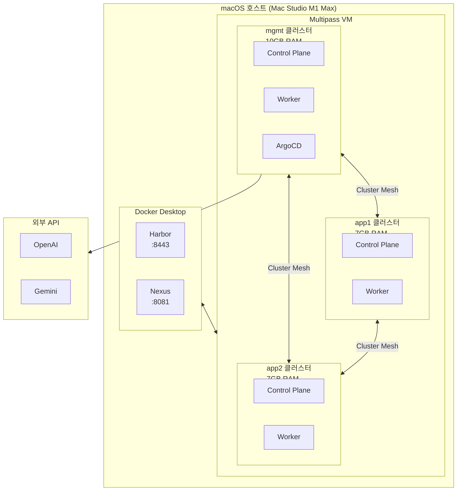
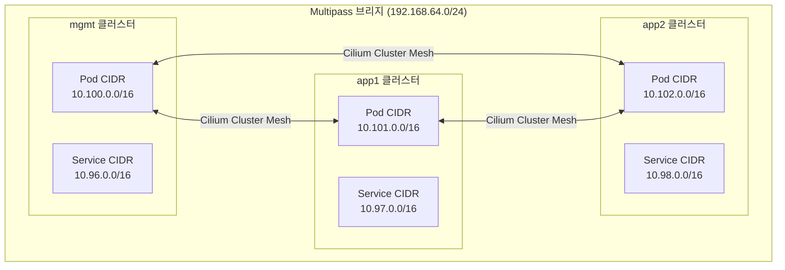
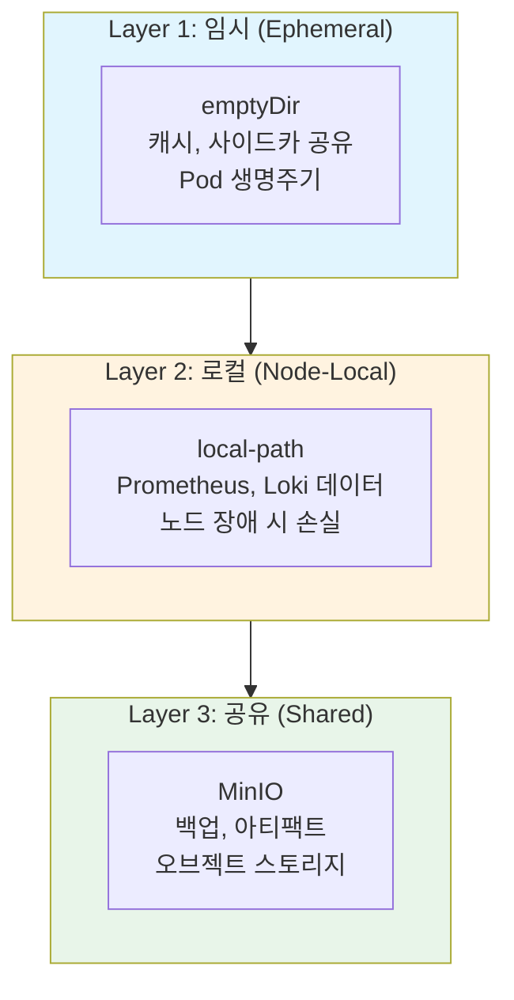
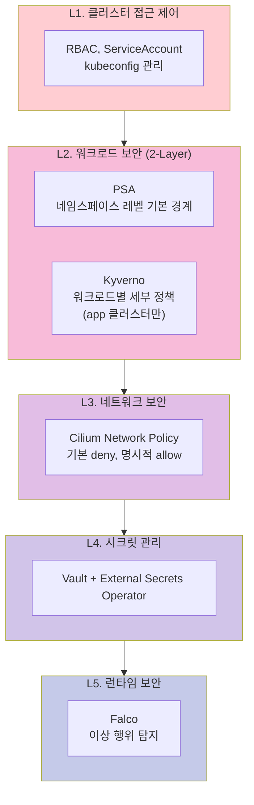
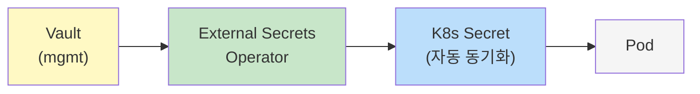
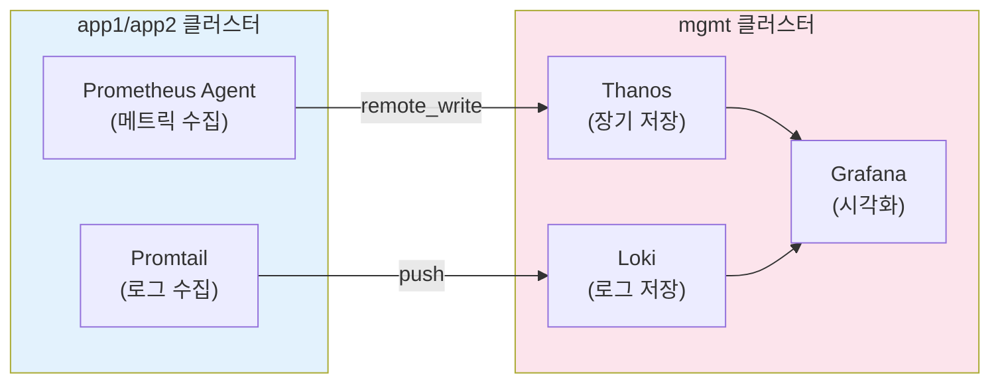
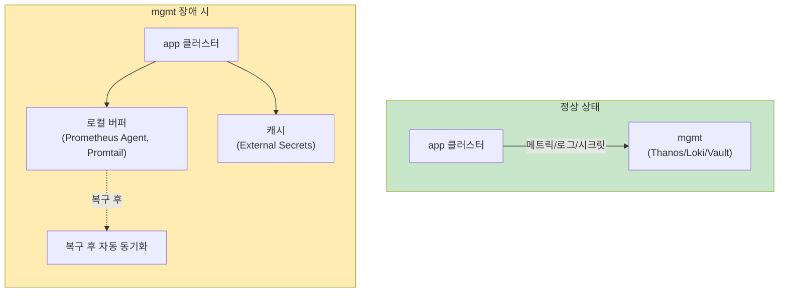
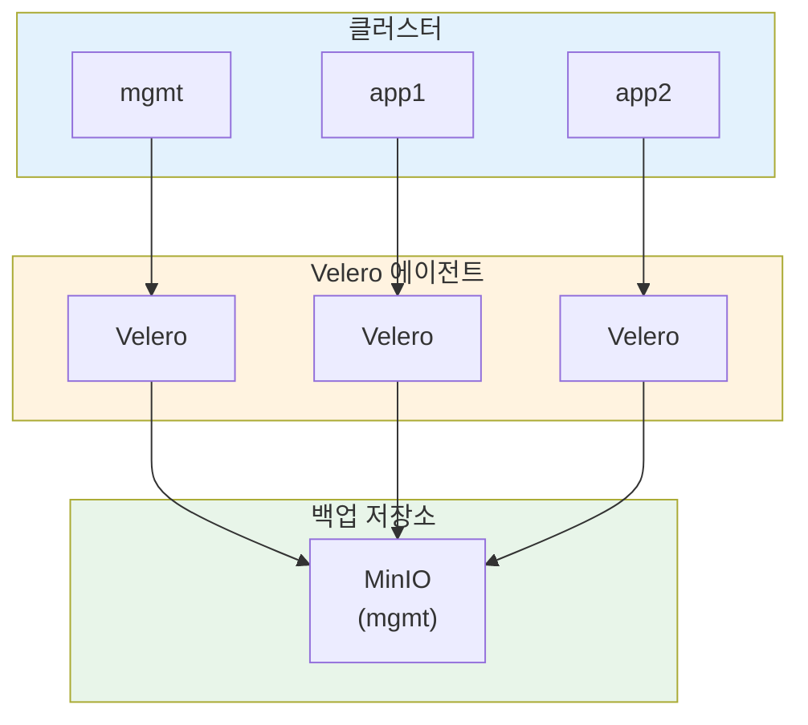

# Kubernetes 멀티클러스터 아키텍처

> **버전**: 2.0.0
> **Kubernetes**: v1.35 (Timbernetes)
> **최종 수정일**: 2026-02-05
> **관련 문서**: [구현 가이드](IMPLEMENTATION-GUIDE.md) | [운영 런북](OPERATIONS-RUNBOOK.md)

---

## 목차

1. [개요](#1-개요)
2. [아키텍처 결정 기록 (ADR)](#2-아키텍처-결정-기록-adr)
3. [시스템 요구사항](#3-시스템-요구사항)
4. [클러스터 토폴로지](#4-클러스터-토폴로지)
5. [네트워크 아키텍처](#5-네트워크-아키텍처)
6. [스토리지 아키텍처](#6-스토리지-아키텍처)
7. [보안 아키텍처](#7-보안-아키텍처)
8. [관찰성 아키텍처](#8-관찰성-아키텍처)
9. [장애 도메인 및 복원력](#9-장애-도메인-및-복원력)
10. [백업 및 DR 전략](#10-백업-및-dr-전략)
11. [리소스 계획](#11-리소스-계획)

---

## 1. 개요

### 1.1 프로젝트 목적

macOS(Apple Silicon) 환경에서 **Terraform과 Shell Script**를 사용하여 프로덕션급 Kubernetes 멀티클러스터 환경을 구축합니다.

### 1.2 대상 환경 및 SLO

| 항목 | 값 |
|-----|-----|
| **환경 유형** | 개발/학습/시연 (로컬) |
| **워크로드 유형** | Stateless (주), Stateful (보조) |
| **테넌시** | 단일 (개인 개발 환경) |

| SLO 지표 | 목표 | 비고 |
|---------|------|------|
| **가용성** | 99% | 월 ~7시간 다운타임 허용 |
| **RTO** | 1시간 | 클러스터 재생성 기준 |
| **RPO** | 24시간 | 일일 백업 기준 |

### 1.3 핵심 원칙

| 원칙 | 설명 |
|-----|------|
| **IaC** | Terraform으로 모든 인프라 정의 |
| **GitOps** | ArgoCD 기반 선언적 배포 |
| **제로 트러스트** | PSA + Kyverno 2-layer 보안 |
| **장애 격리** | mgmt 장애 시에도 app 클러스터 독립 운영 |
| **Graceful Degradation** | 의존 서비스 장애 시 제한된 기능으로 계속 동작 |

### 1.4 기술 스택 개요

| 영역 | 기술 |
|-----|------|
| **인프라** | Multipass, Terraform, cloud-init |
| **쿠버네티스** | kubeadm v1.35, containerd |
| **네트워크** | Cilium + Cluster Mesh + Gateway API |
| **GitOps** | ArgoCD (mgmt 클러스터) |
| **시크릿/PKI** | Vault + External Secrets + cert-manager |
| **관찰성** | Prometheus + Thanos + Loki + Grafana |
| **보안** | PSA + Kyverno + Falco |
| **백업** | Velero + MinIO |

### 1.5 제약 조건

- Ansible 미사용 (Shell Script로 대체)
- Helmfile 미사용 (Helm CLI 직접 사용)
- 로컬 환경 한정 (macOS + Multipass VM)

---

## 2. 아키텍처 결정 기록 (ADR)

### ADR-001: mgmt 클러스터 중심의 플랫폼 서비스 집중

| 항목 | 내용 |
|-----|------|
| **상태** | Accepted |
| **컨텍스트** | 로컬 리소스 제약(64GB RAM) 하에서 효율적인 플랫폼 운영 필요 |
| **결정** | Vault, 관찰성, 백업 등 플랫폼 서비스를 mgmt 클러스터에 집중 배치 |
| **결과** | 리소스 효율성 확보, 단 mgmt가 SPOF가 되므로 장애 도메인 명확화 필요 |
| **완화책** | app 클러스터는 로컬 캐시/버퍼로 독립 동작 (섹션 9 참조) |

> 📎 **구현**: [IMPLEMENTATION-GUIDE.md §4](IMPLEMENTATION-GUIDE.md#4-플랫폼-서비스-설치)

### ADR-002: Kubernetes Feature-gate 선택적 활성화

| 항목 | 내용 |
|-----|------|
| **상태** | Accepted |
| **컨텍스트** | K8s 1.35에서 InPlacePodVerticalScaling이 GA 졸업, 활용 여부 결정 필요 |
| **결정** | InPlacePodVerticalScaling GA 기능을 활용하되, 기본 아키텍처는 VPA만으로도 동작하도록 설계 |
| **결과** | VPA InPlaceOrRecreate 모드(Beta) 활용 가능, 미사용 시에도 기존 VPA Recreate로 동작 |

> 📎 **구현**: [IMPLEMENTATION-GUIDE.md §2.3](IMPLEMENTATION-GUIDE.md#23-kubeadm-설정)

### ADR-003: PSA + Kyverno 2-Layer 보안 모델

| 항목 | 내용 |
|-----|------|
| **상태** | Accepted |
| **컨텍스트** | PSA 예외가 늘어나면 보안 정책이 무력화되는 패턴 방지 필요 |
| **결정** | PSA는 기본 경계(baseline), Kyverno는 워크로드별 세부 정책 담당 |
| **역할 분담** | PSA: 네임스페이스 레벨 강제, Kyverno: 이미지/리소스/라벨 정책 |

**Kyverno 배치 범위**:

| 클러스터 | Kyverno | 이유 |
|---------|---------|------|
| **mgmt** | ❌ 미설치 | 플랫폼/운영자 영역, PSA baseline만 적용 (유연성 확보) |
| **app1/app2** | ✅ 설치 | 개발팀 워크로드 영역, 엄격한 정책 enforce |

> 📎 **구현**: [IMPLEMENTATION-GUIDE.md §4.4](IMPLEMENTATION-GUIDE.md#44-kyverno)

### ADR-004: 2-Phase PKI 부트스트랩

| 항목 | 내용 |
|-----|------|
| **상태** | Accepted |
| **컨텍스트** | cert-manager ↔ Vault 간 순환 의존성 (닭-달걀 문제) |
| **결정** | Phase 1: Self-signed Issuer로 부트스트랩 → Phase 2: Vault Issuer로 전환 |
| **결과** | 설치 순서 명확화, 운영 중 인증서 자동 갱신 보장 |

> 📎 **구현**: [IMPLEMENTATION-GUIDE.md §4.2](IMPLEMENTATION-GUIDE.md#42-cert-manager)

### ADR-005: Cilium Tunneling(VXLAN) 모드 선택

| 항목 | 내용 |
|-----|------|
| **상태** | Accepted |
| **컨텍스트** | Multipass 브리지 네트워크에서 Native Routing 복잡도 높음 |
| **결정** | Cilium Tunneling(VXLAN) 모드로 네트워크 추상화 |
| **트레이드오프** | 약간의 오버헤드 (로컬 환경에서는 무시 가능) |

> 📎 **구현**: [IMPLEMENTATION-GUIDE.md §3.1](IMPLEMENTATION-GUIDE.md#31-cilium-설치)

### ADR-006: 관찰성 에이전트 모드 아키텍처

| 항목 | 내용 |
|-----|------|
| **상태** | Accepted |
| **컨텍스트** | 각 클러스터에 전체 Prometheus 스택 배치 시 I/O 병목 |
| **결정** | app 클러스터는 Prometheus Agent Mode + Promtail, mgmt가 중앙 집계 |
| **결과** | 로컬 디스크 사용량 최소화, mgmt 장애 시에도 로컬 수집 지속 |

> 📎 **구현**: [IMPLEMENTATION-GUIDE.md §4.5](IMPLEMENTATION-GUIDE.md#45-관찰성-스택)

### 아키텍처 불변 조건 (Architecture Contract)

> 아래 조건은 구현이 변경되더라도 **반드시 유지**되어야 하는 아키텍처 보장 사항입니다.

| # | 불변 조건 | 근거 ADR |
|---|----------|----------|
| **C1** | mgmt 클러스터 장애 시에도 app 클러스터 워크로드는 **독립 실행** 지속 | ADR-001 |
| **C2** | app 클러스터의 Prometheus Agent는 WAL 로컬 버퍼링 유지 (내 환경 기준 **~2.7시간**, 수집량/디스크에 따라 변동) | ADR-006 |
| **C3** | External Secrets는 **refreshInterval 1h** 캐시로 Vault 장애 시에도 동작 | ADR-001 |
| **C4** | Kyverno는 **app 클러스터에만** enforce 모드로 배치 (mgmt 제외) | ADR-003 |
| **C5** | PKI 부트스트랩은 **2-Phase** (Self-signed → Vault Issuer) 순서 준수 | ADR-004 |
| **C6** | Cilium은 **Tunneling(VXLAN)** 모드로 동작 (Multipass 환경에서 Native Routing 구성 복잡도가 높아 선택) | ADR-005 |

---

## 3. 시스템 요구사항

### 3.1 호스트 머신 스펙

| 리소스 | 최소 | 권장 | 현재 |
|-------|------|------|------|
| **CPU** | 8코어 | 10코어 이상 | Apple M1 Max (10코어) |
| **RAM** | 32GB | 64GB | 64GB |
| **디스크** | 256GB SSD | 512GB 이상 | 540GB 가용 |
| **OS** | macOS 13+ | macOS 14+ | Darwin 25.2.0 |

### 3.2 리소스 할당

**RAM 할당 (총 가용: 56GB)**:

| 구성요소 | RAM | 용도 |
|---------|-----|------|
| 외부 서비스 (Docker) | 6GB | Harbor, Nexus |
| mgmt 클러스터 | 10GB | 플랫폼 서비스 |
| app1 클러스터 | 7GB | 워크로드 |
| app2 클러스터 | 7GB | 워크로드 |
| 예비 (버퍼) | 24GB | 시스템 + 여유 |

---

## 4. 클러스터 토폴로지

### 4.1 상위 레벨 아키텍처

### 4.2 클러스터 역할 및 책임

| 클러스터 | 역할 | 컴포넌트 |
|---------|------|---------|
| **mgmt** | 플랫폼 서비스 | Vault, Prometheus, Thanos, Loki, Grafana, Velero, MinIO, k8sgpt, ArgoCD |
| **app1** | 워크로드 A | 애플리케이션, Prometheus Agent, Promtail, Kyverno, Falco |
| **app2** | 워크로드 B | 애플리케이션, Prometheus Agent, Promtail, Kyverno, Falco |

### 4.3 클러스터 스펙

| 클러스터 | Control Plane | Workers | 총 RAM | 총 CPU |
|---------|---------------|---------|--------|--------|
| **mgmt** | 1 (4GB/2C) | 1 (6GB/2C) | 10GB | 4 vCPU |
| **app1** | 1 (3GB/2C) | 1 (4GB/2C) | 7GB | 4 vCPU |
| **app2** | 1 (3GB/2C) | 1 (4GB/2C) | 7GB | 4 vCPU |

### 4.4 노드 IP 할당

| 클러스터 | 노드 | IP |
|---------|------|-----|
| mgmt | mgmt-cp | 192.168.64.10 |
| mgmt | mgmt-worker-0 | 192.168.64.11 |
| app1 | app1-cp | 192.168.64.20 |
| app1 | app1-worker-0 | 192.168.64.21 |
| app2 | app2-cp | 192.168.64.30 |
| app2 | app2-worker-0 | 192.168.64.31 |

---

## 5. 네트워크 아키텍처

### 5.1 네트워크 토폴로지

### 5.2 CIDR 할당

| 클러스터 | 노드 네트워크 | Pod CIDR | Service CIDR | MetalLB 풀 |
|---------|--------------|----------|--------------|-----------|
| **mgmt** | 192.168.64.10-19 | 10.100.0.0/16 | 10.96.0.0/16 | 192.168.64.200-210 |
| **app1** | 192.168.64.20-29 | 10.101.0.0/16 | 10.97.0.0/16 | 192.168.64.211-220 |
| **app2** | 192.168.64.30-39 | 10.102.0.0/16 | 10.98.0.0/16 | 192.168.64.221-230 |

### 5.3 CNI 선택: Cilium

| 기능 | 설명 |
|-----|------|
| **Cluster Mesh** | 멀티클러스터 서비스 디스커버리 |
| **Tunneling (VXLAN)** | Multipass 환경에서 안정적 동작 |
| **Hubble** | 네트워크 관찰성 (UI + CLI) |
| **Network Policy** | L3/L4/L7 정책 지원 |

### 5.4 Ingress: Gateway API

| 구분 | 선택 | 이유 |
|-----|------|------|
| **API** | Gateway API v1.4 | Ingress 후속, 멀티클러스터 지원 |
| **구현체** | Cilium Gateway | CNI와 통합, 추가 컴포넌트 불필요 |

### 5.5 외부 로드밸런서: MetalLB

- **모드**: L2 (ARP 기반)
- **이유**: Multipass 브리지 네트워크에서 BGP 불가
- **풀 할당**: 클러스터별 10개 IP

---

## 6. 스토리지 아키텍처

### 6.1 스토리지 계층

### 6.2 StorageClass 설계

| StorageClass | Provisioner | ReclaimPolicy | 용도 |
|-------------|-------------|---------------|------|
| **local-path** (기본) | rancher.io/local-path | Delete | 일반 워크로드 |
| **local-path-retain** | rancher.io/local-path | Retain | 중요 데이터 (Vault) |

### 6.3 워크로드별 스토리지 매핑

| 워크로드 | StorageClass | 크기 | 비고 |
|---------|-------------|------|------|
| Prometheus | local-path | 20Gi | TSDB, 15일 보존 |
| Loki | local-path | 30Gi | 로그, 7일 보존 |
| Vault | local-path-retain | 10Gi | 시크릿 데이터 |
| MinIO | local-path-retain | 50Gi | 백업 저장소 |

> **⚠️ 제약**: local-path는 노드 로컬 디스크 사용. 노드 장애 시 데이터 손실 가능. 중요 데이터는 MinIO로 백업 필수.

---

## 7. 보안 아키텍처

### 7.1 보안 계층 모델

### 7.2 PSA 정책 매핑

| 네임스페이스 | enforce | audit | warn | 비고 |
|------------|---------|-------|------|------|
| **기본값** | baseline | restricted | restricted | |
| kube-system | 예외 | - | - | 시스템 컴포넌트 |
| cilium-system | 예외 | - | - | CNI 권한 필요 |
| monitoring | 예외 | - | - | Node Exporter |
| vault | 예외 | - | - | IPC Lock 필요 |

### 7.3 Kyverno 정책 범위 (app 클러스터)

| 정책 | 모드 | 설명 |
|-----|------|------|
| 이미지 레지스트리 제한 | enforce | Harbor만 허용 |
| 리소스 제한 필수 | enforce | requests/limits 필수 |
| 권한 있는 컨테이너 금지 | enforce | privileged: false |
| 라벨 필수 | audit | app, version 라벨 |

### 7.4 시크릿 관리 흐름

---

## 8. 관찰성 아키텍처

### 8.1 관찰성 스택

| 영역 | 도구 | 배치 |
|-----|------|------|
| **Metrics** | Prometheus Agent → Thanos | Agent: 각 클러스터, Thanos: mgmt |
| **Logs** | Promtail → Loki | Promtail: 각 클러스터, Loki: mgmt |
| **Traces** | OpenTelemetry → Tempo | 선택적 |
| **Dashboard** | Grafana | mgmt |
| **Alerting** | Alertmanager | mgmt |

### 8.2 데이터 흐름

### 8.3 mgmt 장애 시 동작

| 컴포넌트 | 동작 | 버퍼 시간 |
|---------|------|----------|
| **Prometheus Agent** | 로컬 버퍼링, 복구 후 재전송 | ~2.7시간 (내 환경 기준, 변동 가능) |
| **Promtail** | positions 파일 + 버퍼 | 디스크 용량만큼 |
| **External Secrets** | 캐시된 시크릿 유지 | refreshInterval (1h) |

---

## 9. 장애 도메인 및 복원력

### 9.1 장애 영향 매트릭스

| 장애 컴포넌트 | 영향 범위 |
|-------------|----------|
| **mgmt 클러스터 전체 다운** | ❌ 시크릿 갱신 불가 (캐시로 동작) |
| | ❌ 중앙 메트릭/로그 조회 불가 (로컬 수집 지속) |
| | ❌ 새 인증서 발급 불가 (기존 인증서로 동작) |
| | ❌ GitOps 배포 중단 (기존 워크로드는 정상 실행) |
| | ✅ app1/app2 워크로드 정상 실행 |
| **Vault 다운** | ❌ 새 시크릿 발급 불가 |
| | ✅ External Secrets 캐시로 동작 |
| **ArgoCD 다운** | ❌ GitOps 배포 중단 |
| | ✅ 기존 워크로드 정상 실행 |
| **Harbor (외부) 다운** | ❌ 새 이미지 Pull 불가 |
| | ✅ 캐시된 이미지로 Pod 실행 |

### 9.2 Graceful Degradation 설계

### 9.3 복구 우선순위

| 우선순위 | 컴포넌트 | RTO |
|---------|---------|-----|
| **P0** | Harbor | 15분 |
| **P1** | Vault, mgmt Control Plane, ArgoCD | 30분 |
| **P2** | Thanos, Loki, Grafana | 1시간 |

---

## 10. 백업 및 DR 전략

### 10.1 상태 계층 및 복구 전략

| 계층 | 내용 | 백업 방법 | 복구 방법 | RPO |
|-----|------|----------|----------|-----|
| **L1: 클러스터 상태** | etcd | etcdctl 스냅샷 | etcd 복원 | 24h |
| **L2: 워크로드 상태** | PV 데이터 | Velero + Restic | Velero restore | 24h |
| **L3: 플랫폼 상태** | MinIO 데이터 | 버전관리/복제 | MinIO 복원 | 실시간 |
| **L4: 설정 상태** | Git 매니페스트 | Git 원격 저장소 | ArgoCD 동기화 | 커밋 시 |

### 10.2 백업 아키텍처

### 10.3 복구 시나리오

| 시나리오 | 복구 방법 | 예상 RTO |
|---------|----------|---------|
| 특정 리소스 삭제 | ArgoCD 동기화 | 5분 |
| etcd 데이터 손상 | etcd 스냅샷 복원 | 30분 |
| Control Plane 노드 장애 | 노드 재생성 + etcd 복원 | 1시간 |
| 전체 클러스터 장애 | Terraform 재배포 + Velero 복원 | 2시간 |

---

## 11. 리소스 계획

### 11.1 클러스터별 리소스 할당

| 클러스터 | 노드 | RAM | CPU | 디스크 |
|---------|------|-----|-----|--------|
| mgmt | mgmt-cp | 4GB | 2 | 40GB |
| mgmt | mgmt-worker-0 | 6GB | 2 | 60GB |
| app1 | app1-cp | 3GB | 2 | 30GB |
| app1 | app1-worker-0 | 4GB | 2 | 40GB |
| app2 | app2-cp | 3GB | 2 | 30GB |
| app2 | app2-worker-0 | 4GB | 2 | 40GB |
| **합계** | | **24GB** | **12** | **240GB** |

### 11.2 주요 워크로드 리소스

| 워크로드 | requests (CPU/Mem) | limits (CPU/Mem) | 클러스터 |
|---------|-------------------|-----------------|---------|
| Vault | 100m / 256Mi | 500m / 512Mi | mgmt |
| Prometheus | 200m / 512Mi | 1000m / 2Gi | mgmt |
| Thanos | 100m / 256Mi | 500m / 1Gi | mgmt |
| Loki | 100m / 256Mi | 500m / 1Gi | mgmt |
| Grafana | 100m / 128Mi | 500m / 512Mi | mgmt |
| Prometheus Agent | 50m / 128Mi | 200m / 256Mi | app |
| Promtail | 50m / 64Mi | 100m / 128Mi | app |

---

## 부록: 관련 문서

| 문서 | 설명 |
|-----|------|
| [IMPLEMENTATION-GUIDE.md](IMPLEMENTATION-GUIDE.md) | Terraform, Helm, 설치 코드 |
| [OPERATIONS-RUNBOOK.md](OPERATIONS-RUNBOOK.md) | 백업/복구/업그레이드 절차 |
