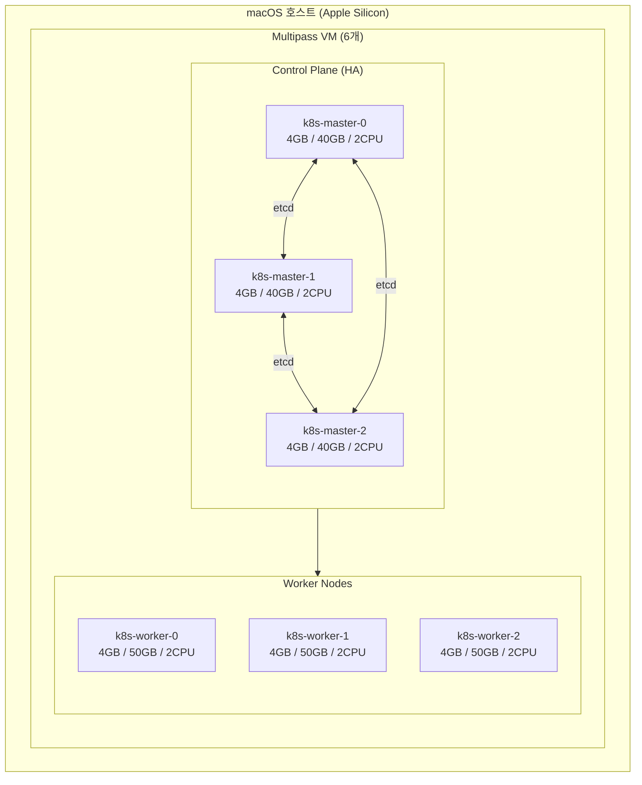
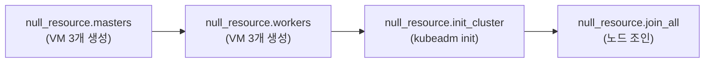
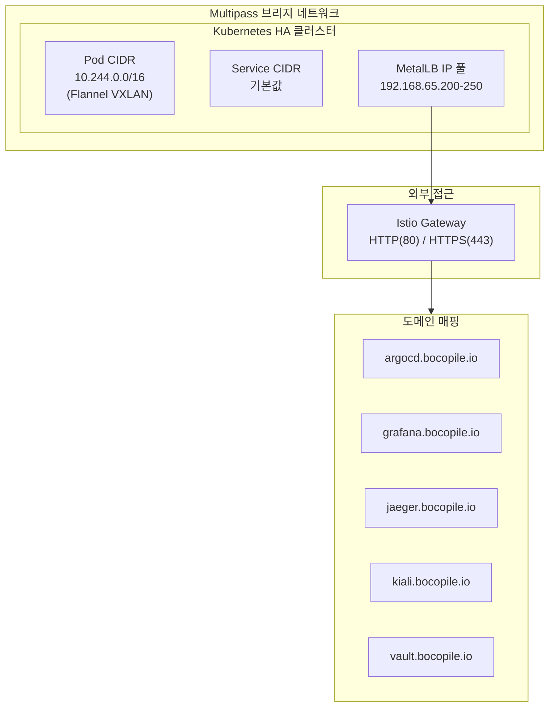
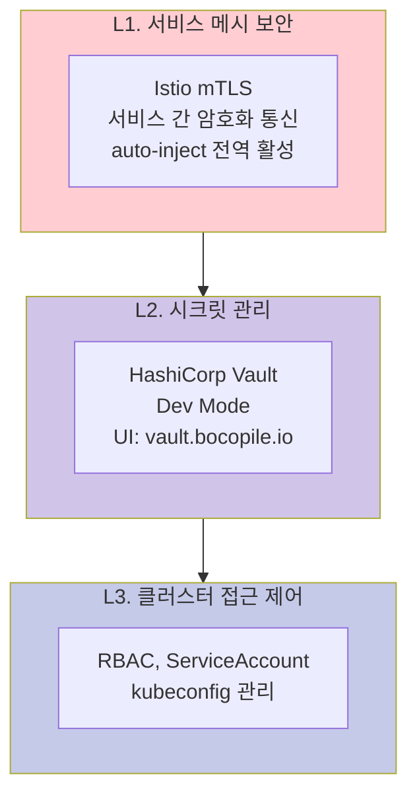
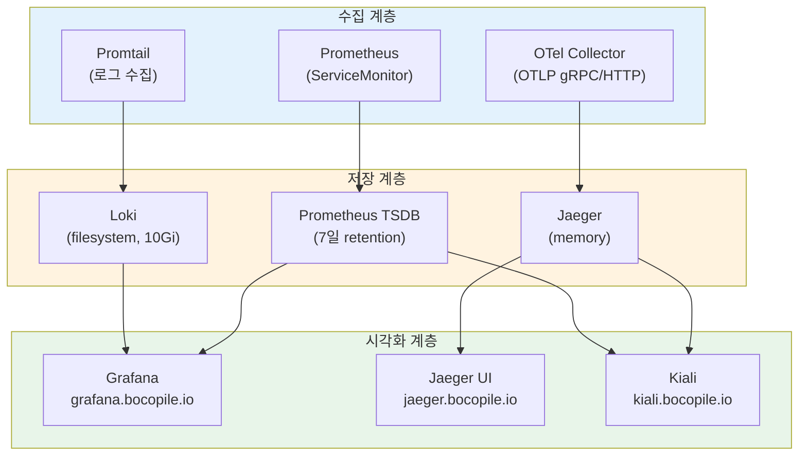

# Kubernetes HA 클러스터 아키텍처

> **버전**: 3.0.0
> **Kubernetes**: v1.35 (Timbernetes)
> **최종 수정일**: 2026-02-14
> **IaC 소스**: 본 문서의 모든 내용은 실제 Terraform / Shell Script / Helm Values 코드에서 도출
> **관련 문서**: [SMARTER-PROMPT.md](SMARTER-PROMPT.md)

---

## 목차

1. [개요](#1-개요)
2. [아키텍처 결정 기록 (ADR)](#2-아키텍처-결정-기록-adr)
3. [시스템 요구사항](#3-시스템-요구사항)
4. [클러스터 토폴로지](#4-클러스터-토폴로지)
5. [네트워크 아키텍처](#5-네트워크-아키텍처)
6. [스토리지 아키텍처](#6-스토리지-아키텍처)
7. [보안 아키텍처](#7-보안-아키텍처)
8. [관찰성 아키텍처](#8-관찰성-아키텍처)
9. [GitOps 및 시크릿 관리](#9-gitops-및-시크릿-관리)
10. [장애 도메인 및 복원력](#10-장애-도메인-및-복원력)
11. [리소스 계획](#11-리소스-계획)

---

## 1. 개요

### 1.1 프로젝트 목적

macOS(Apple Silicon) 환경에서 Kubernetes HA 클러스터를 프로비저닝하는 **Terraform 모듈 + Shell Script + Helm Values**를 작성한다.

### 1.2 대상 환경

| 항목 | 값 |
|-----|-----|
| **환경 유형** | 개발/학습/시연 (로컬) |
| **워크로드 유형** | Stateless (주), Stateful (보조) |
| **테넌시** | 단일 (개인 개발 환경) |

### 1.3 핵심 원칙

| 원칙 | 설명 | 코드 참조 |
|-----|------|----------|
| **IaC** | Terraform으로 VM 인프라 정의 | `main.tf`, `variables.tf` |
| **GitOps** | ArgoCD 기반 선언적 배포 | `addons/values/argocd/` |
| **서비스 메시** | Istio mTLS로 제로 트러스트 네트워크 | `addons/values/istio/` |
| **3-Pillar 관찰성** | 메트릭 + 로그 + 트레이스 통합 | `addons/values/monitoring/`, `logging/`, `tracing/` |
| **자동화** | `terraform apply` + `bash install.sh` 2-Step 완전 자동화 | `main.tf`, `addons/install.sh` |

### 1.4 기술 스택 개요

| 영역 | 기술 | 코드 참조 |
|-----|------|----------|
| **인프라** | Multipass, Terraform (null provider), cloud-init | `main.tf`, `init/k8s.yaml` |
| **쿠버네티스** | kubeadm v1.35, containerd | `init/k8s.yaml`, `shell/cluster-init.sh` |
| **CNI** | Flannel (VXLAN) | `shell/cluster-init.sh` |
| **서비스 메시** | Istio (mTLS, auto-inject, Gateway) | `addons/values/istio/istio-values.yaml` |
| **로드밸런서** | MetalLB (L2 모드) | `addons/values/metallb/metallb-config.yaml` |
| **GitOps** | ArgoCD | `addons/values/argocd/argocd-values.yaml` |
| **모니터링** | kube-prometheus-stack (Prometheus + Grafana) | `addons/values/monitoring/monitoring-values.yaml` |
| **로깅** | Loki + Promtail | `addons/values/logging/` |
| **트레이싱** | Jaeger + OpenTelemetry Collector + Kiali | `addons/values/tracing/` |
| **시크릿** | HashiCorp Vault (Dev Mode) | `addons/values/vault/vault-values.yaml` |
| **스토리지** | Local Path Provisioner (Rancher) | `addons/values/rancher/local-path.yaml` |

### 1.5 제약 조건

- Ansible 미사용 (Shell Script로 대체)
- Helmfile 미사용 (Helm CLI 직접 사용)
- 로컬 환경 한정 (macOS + Multipass VM)
- 단일 클러스터 구성 (멀티클러스터 미사용)

---

## 2. 아키텍처 결정 기록 (ADR)

### ADR-001: 단일 HA 클러스터 구성

| 항목 | 내용 |
|-----|------|
| **상태** | Accepted |
| **컨텍스트** | 로컬 개발 환경에서 리소스 효율성과 운영 단순성 필요 |
| **결정** | Control Plane 3노드 + Worker 3노드의 단일 HA 클러스터 구성 |
| **근거** | 멀티클러스터 대비 리소스 절약, kubeadm HA(stacked etcd)로 CP 가용성 확보 |
| **트레이드오프** | 워크로드 격리가 네임스페이스 수준으로 제한됨 |

> 📎 **구현**: `main.tf` - `null_resource.masters` (count=3), `null_resource.workers` (count=3)

### ADR-002: Flannel CNI 선택

| 항목 | 내용 |
|-----|------|
| **상태** | Accepted |
| **컨텍스트** | Multipass VM 환경에서 안정적이고 간단한 CNI 필요 |
| **결정** | Flannel (VXLAN 모드) |
| **근거** | 설정 단순, Multipass 브리지 네트워크에서 안정 동작, kubeadm과 호환성 우수 |
| **트레이드오프** | L7 Network Policy 미지원 (Istio mTLS로 보완) |

> 📎 **구현**: `shell/cluster-init.sh` - `kubectl apply -f kube-flannel.yml`

### ADR-003: Istio 서비스 메시 도입

| 항목 | 내용 |
|-----|------|
| **상태** | Accepted |
| **컨텍스트** | 마이크로서비스 간 보안 통신 및 트래픽 관리 필요 |
| **결정** | Istio (base + istiod + gateway) 3-컴포넌트 배포, 전역 mTLS + auto-inject |
| **근거** | 서비스 간 mTLS 자동화, 트래픽 관찰성(Kiali 연동), Gateway API 지원 |
| **트레이드오프** | 사이드카 프록시에 의한 리소스 오버헤드 |

> 📎 **구현**: `addons/values/istio/istio-values.yaml` - `global.mtls.enabled: true`, `proxy.autoInject: enabled`

### ADR-004: kube-prometheus-stack 통합 모니터링

| 항목 | 내용 |
|-----|------|
| **상태** | Accepted |
| **컨텍스트** | 단일 클러스터에서 메트릭 수집/저장/시각화/알림을 일체형으로 구성 |
| **결정** | kube-prometheus-stack (Prometheus + Grafana + Alertmanager 번들) |
| **근거** | 단일 Helm Chart로 전체 모니터링 스택 배포, ServiceMonitor 자동 수집 |
| **설정** | retention 7일, ServiceMonitor 전체 네임스페이스 수집 |

> 📎 **구현**: `addons/values/monitoring/monitoring-values.yaml`

### ADR-005: Jaeger + OpenTelemetry 분산 트레이싱

| 항목 | 내용 |
|-----|------|
| **상태** | Accepted |
| **컨텍스트** | Istio 서비스 메시 환경에서 요청 흐름 추적 필요 |
| **결정** | OTel Collector(OTLP 수신) → Jaeger(저장/조회), Kiali(서비스 메시 시각화) |
| **근거** | OTel 표준 프로토콜 사용으로 벤더 중립, Kiali-Jaeger-Prometheus 통합 |
| **트레이드오프** | Jaeger 메모리 스토리지 사용 (재시작 시 데이터 손실) |

> 📎 **구현**: `addons/values/tracing/otel-values.yaml`, `jaeger-values.yaml`, `kiali-values.yaml`

### ADR-006: Vault Dev Mode 운영

| 항목 | 내용 |
|-----|------|
| **상태** | Accepted |
| **컨텍스트** | 로컬 개발 환경에서 시크릿 관리 기반 마련 |
| **결정** | Vault Dev Mode로 배포 (자동 unseal, UI 활성, Root Token 사용) |
| **근거** | 운영 복잡도 최소화, 개발/학습 목적에 적합 |
| **트레이드오프** | In-memory 스토리지로 재시작 시 데이터 손실, 프로덕션 사용 불가 |

> 📎 **구현**: `addons/values/vault/vault-values.yaml` - `server.dev.enabled: true`

### 아키텍처 불변 조건 (Architecture Contract)

> 아래 조건은 구현이 변경되더라도 **반드시 유지**되어야 하는 아키텍처 보장 사항입니다.

| # | 불변 조건 | 근거 ADR | 코드 참조 |
|---|----------|----------|----------|
| **C1** | VM 스펙은 `main.tf`의 `multipass launch` 파라미터에서 정의 | ADR-001 | `main.tf` |
| **C2** | Pod CIDR은 `10.244.0.0/16`이며 Flannel이 관리 | ADR-002 | `shell/cluster-init.sh` |
| **C3** | Istio는 전역 mTLS + auto-inject 모드로 동작 | ADR-003 | `istio-values.yaml` |
| **C4** | 모든 Helm 설정은 `addons/values/` 디렉터리의 YAML에서 도출 | - | `addons/values/` |
| **C5** | 애드온 설치 순서는 `addons/install.sh`의 실행 순서를 따름 | - | `addons/install.sh` |
| **C6** | 검증 항목은 `addons/verify.sh`의 ADDONS 배열과 일치 | - | `addons/verify.sh` |

---

## 3. 시스템 요구사항

### 3.1 호스트 머신 스펙

| 리소스 | 최소 | 권장 | 비고 |
|-------|------|------|------|
| **CPU** | 8코어 | 10코어 이상 | VM 총 12 vCPU 할당 |
| **RAM** | 32GB | 64GB | VM 총 24GB 할당 |
| **디스크** | 300GB SSD | 512GB 이상 | VM 총 270GB 할당 |
| **OS** | macOS 13+ | macOS 14+ | Apple Silicon 지원 |

### 3.2 필수 도구

| 도구 | 버전 | 용도 | 검증 |
|-----|------|------|------|
| **Terraform** | >= 1.11.3 | VM 프로비저닝 | `versions.tf` |
| **Multipass** | 최신 | Ubuntu VM 관리 | `main.tf` |
| **Helm** | v3+ | 애드온 설치 | `addons/install.sh` |
| **kubectl** | v1.35 | 클러스터 관리 | `init/k8s.yaml` |
| **jq** | 최신 | JSON 파싱 | `shell/delete-vm.sh` |

---

## 4. 클러스터 토폴로지

### 4.1 상위 레벨 아키텍처



### 4.2 노드 스펙

> 📎 **코드 참조**: `main.tf` - `multipass launch` 명령 파라미터

| 역할 | 노드명 | RAM | Disk | CPU | OS |
|-----|--------|-----|------|-----|-----|
| Control Plane | k8s-master-0 | 4GB | 40GB | 2 | Ubuntu 24.04 |
| Control Plane | k8s-master-1 | 4GB | 40GB | 2 | Ubuntu 24.04 |
| Control Plane | k8s-master-2 | 4GB | 40GB | 2 | Ubuntu 24.04 |
| Worker | k8s-worker-0 | 4GB | 50GB | 2 | Ubuntu 24.04 |
| Worker | k8s-worker-1 | 4GB | 50GB | 2 | Ubuntu 24.04 |
| Worker | k8s-worker-2 | 4GB | 50GB | 2 | Ubuntu 24.04 |

### 4.3 Terraform 리소스 의존성 체인

> 📎 **코드 참조**: `main.tf` - `depends_on` 체인



### 4.4 cloud-init 자동 구성 항목

> 📎 **코드 참조**: `init/k8s.yaml`

| 단계 | 내용 |
|-----|------|
| 패키지 설치 | containerd, kubeadm, kubelet, kubectl (v1.35) |
| 커널 모듈 | `overlay`, `br_netfilter` |
| sysctl | `bridge-nf-call-iptables=1`, `ip_forward=1`, `bridge-nf-call-ip6tables=1` |
| containerd | `SystemdCgroup = true` 설정 |
| 패키지 고정 | `apt-mark hold kubelet kubeadm kubectl` |

---

## 5. 네트워크 아키텍처

### 5.1 네트워크 토폴로지



### 5.2 CIDR 할당

> 📎 **코드 참조**: `shell/cluster-init.sh` - `kubeadm init --pod-network-cidr`

| 항목 | 값 | 설정 위치 |
|-----|-----|----------|
| **Pod CIDR** | `10.244.0.0/16` | `shell/cluster-init.sh` |
| **CNI** | Flannel (VXLAN) | `shell/cluster-init.sh` |
| **Control Plane Endpoint** | `${MASTER_IP}:6443` | `shell/cluster-init.sh` |

### 5.3 CNI: Flannel

> 📎 **코드 참조**: `shell/cluster-init.sh` - `kubectl apply -f kube-flannel.yml`

| 항목 | 설명 |
|-----|------|
| **모드** | VXLAN (overlay) |
| **설치 방식** | kubeadm init 직후 kubectl apply |
| **Pod CIDR** | `10.244.0.0/16` (kubeadm 파라미터와 일치) |
| **장점** | 설정 단순, Multipass 환경 호환성 우수 |

### 5.4 로드밸런서: MetalLB

> 📎 **코드 참조**: `addons/values/metallb/metallb-config.yaml`

| 항목 | 값 |
|-----|-----|
| **모드** | L2 (Layer 2 Advertisement) |
| **IP 풀** | `192.168.65.200` - `192.168.65.250` (51개) |
| **풀 이름** | `default-address-pool` |
| **설치 대기** | `sleep 40` (CRD 준비 대기) |

### 5.5 Ingress: Istio Gateway

> 📎 **코드 참조**: `addons/values/istio/istio-values.yaml`

| 항목 | 값 |
|-----|-----|
| **서비스 타입** | LoadBalancer (MetalLB에서 IP 할당) |
| **HTTP 포트** | 80 → 8080 |
| **HTTPS 포트** | 443 → 8443 |

### 5.6 DNS 매핑

> 📎 **코드 참조**: `addons/install.sh` - SERVICE_MAP 변수

| 도메인 | 서비스.네임스페이스 | 접근 방식 |
|-------|-------------------|----------|
| `argocd.bocopile.io` | `argocd-server.argocd` | LoadBalancer IP |
| `grafana.bocopile.io` | `kube-prometheus-stack-grafana.monitoring` | LoadBalancer IP |
| `jaeger.bocopile.io` | `jaeger-query.tracing` | LoadBalancer IP |
| `kiali.bocopile.io` | `kiali.istio-system` | LoadBalancer IP |
| `vault.bocopile.io` | `vault.vault` | LoadBalancer IP |

설치 스크립트가 `hosts.generated` 파일을 자동 생성하며, `sudo cp hosts.generated /etc/hosts`로 적용합니다.

---

## 6. 스토리지 아키텍처

### 6.1 StorageClass

> 📎 **코드 참조**: `addons/values/rancher/local-path.yaml`

| StorageClass | Provisioner | ReclaimPolicy | VolumeBindingMode | 기본 SC |
|-------------|-------------|---------------|-------------------|---------|
| **local-path** | rancher.io/local-path | Delete | WaitForFirstConsumer | Yes |

```yaml
# addons/values/rancher/local-path.yaml
storageClass:
  create: true
  defaultClass: true
  name: local-path
  reclaimPolicy: Delete
  volumeBindingMode: WaitForFirstConsumer
  provisioner: rancher.io/local-path

nodePathMap:
  - node: DEFAULT_PATH_FOR_NON_LISTED_NODES
    paths:
      - /opt/local-path-provisioner
```

### 6.2 워크로드별 스토리지 매핑

| 워크로드 | PV 사용 | 크기 | 비고 |
|---------|---------|------|------|
| Loki | `local-path` SC | 10Gi | filesystem 백엔드, `loki-values.yaml` |
| Jaeger | 미사용 | - | memory 스토리지 (재시작 시 손실) |
| Vault | 미사용 | - | Dev Mode (in-memory, 재시작 시 손실) |
| Prometheus | 미사용 | - | kube-prometheus-stack 기본 (emptyDir) |

> **참고**: 로컬 개발 환경 특성상 대부분의 워크로드가 비영구 스토리지를 사용합니다. 프로덕션 전환 시 PersistentVolume 설정이 필요합니다.

---

## 7. 보안 아키텍처

### 7.1 보안 계층 모델



### 7.2 Istio mTLS (L1)

> 📎 **코드 참조**: `addons/values/istio/istio-values.yaml`

| 설정 | 값 | 효과 |
|-----|-----|------|
| `global.mtls.enabled` | `true` | 모든 서비스 간 mTLS 강제 |
| `global.proxy.autoInject` | `enabled` | 모든 Pod에 Envoy 사이드카 자동 주입 |
| `pilot.autoscaleEnabled` | `false` | 리소스 절약 (로컬 환경) |

### 7.3 Vault (L2)

> 📎 **코드 참조**: `addons/values/vault/vault-values.yaml`

| 설정 | 값 | 비고 |
|-----|-----|------|
| `server.dev.enabled` | `true` | 자동 unseal, Root Token |
| `ui.enabled` | `true` | 웹 UI 활성화 |
| `server.service.type` | `LoadBalancer` | MetalLB IP 할당 |

> **참고 (프로덕션 전환 시)**: Dev Mode는 프로덕션에 부적합합니다. HA 모드 + Raft 스토리지 + Auto-unseal(KMS) + TLS 활성화가 필요합니다.

---

## 8. 관찰성 아키텍처

### 8.1 3-Pillar 관찰성 스택



### 8.2 메트릭 (Prometheus + Grafana)

> 📎 **코드 참조**: `addons/values/monitoring/monitoring-values.yaml`

| 설정 | 값 | 설명 |
|-----|-----|------|
| Helm Chart | `prometheus-community/kube-prometheus-stack` | Prometheus + Grafana + Alertmanager 번들 |
| `prometheus.prometheusSpec.retention` | `7d` | 7일 보존 |
| `prometheus.prometheusSpec.serviceMonitorSelectorNilUsesHelmValues` | `false` | 모든 ServiceMonitor 수집 |
| `grafana.adminPassword` | `admin` | 기본 관리자 비밀번호 |
| `grafana.service.type` | `LoadBalancer` | MetalLB IP 할당 |

### 8.3 로그 (Loki + Promtail)

> 📎 **코드 참조**: `addons/values/logging/loki-values.yaml`, `promtail-values.yaml`

**Loki**:

| 설정 | 값 |
|-----|-----|
| `auth_enabled` | `false` |
| `commonConfig.replication_factor` | `1` |
| `storage.type` | `filesystem` |
| PV | 10Gi, `local-path` SC |

**Promtail**:

| 설정 | 값 |
|-----|-----|
| Push 엔드포인트 | `http://loki.logging.svc.cluster.local:3100/loki/api/v1/push` |
| Positions 파일 | `/tmp/positions.yaml` |

### 8.4 트레이스 (OTel Collector + Jaeger + Kiali)

> 📎 **코드 참조**: `addons/values/tracing/otel-values.yaml`, `jaeger-values.yaml`, `kiali-values.yaml`

**OpenTelemetry Collector**:

| 설정 | 값 |
|-----|-----|
| Image | `otel/opentelemetry-collector-contrib:0.91.0` |
| Mode | `deployment` |
| OTLP Receivers | gRPC (`:4317`), HTTP (`:4318`) |
| Exporter | Jaeger OTLP (`jaeger-collector.tracing:14250`) |
| Resources | requests: 200m/256Mi, limits: 500m/512Mi |

**Jaeger**:

| 설정 | 값 |
|-----|-----|
| Storage | `memory` (재시작 시 손실) |
| Query 서비스 | LoadBalancer |

**Kiali**:

| 설정 | 값 |
|-----|-----|
| Auth | `anonymous` |
| Prometheus 연동 | `kube-prometheus-stack-prometheus.monitoring:9090` |
| Jaeger 연동 | `jaeger-query.tracing:16686` |
| 서비스 타입 | LoadBalancer |

### 8.5 데이터 흐름 요약

| Pillar | 수집 | 저장 | 시각화 | 보존 |
|--------|------|------|--------|------|
| **메트릭** | Prometheus (ServiceMonitor) | Prometheus TSDB | Grafana, Kiali | 7일 |
| **로그** | Promtail → Loki push API | Loki filesystem (10Gi) | Grafana | 디스크 용량 |
| **트레이스** | OTel Collector (OTLP) | Jaeger (memory) | Jaeger UI, Kiali | 재시작까지 |

---

## 9. GitOps 및 시크릿 관리

### 9.1 ArgoCD

> 📎 **코드 참조**: `addons/values/argocd/argocd-values.yaml`

| 설정 | 값 |
|-----|-----|
| Helm Chart | `argo/argo-cd` |
| 네임스페이스 | `argocd` |
| 서비스 타입 | LoadBalancer |
| Admin 비밀번호 | bcrypt 해시 설정 |
| Ingress | 비활성 (LB 직접 접근) |
| 접근 URL | `argocd.bocopile.io` |

### 9.2 Vault

> 📎 **코드 참조**: `addons/values/vault/vault-values.yaml`

| 설정 | 값 |
|-----|-----|
| Helm Chart | `hashicorp/vault` |
| 네임스페이스 | `vault` |
| 모드 | Dev (자동 unseal, in-memory) |
| UI | 활성 |
| 접근 URL | `vault.bocopile.io` |

---

## 10. 장애 도메인 및 복원력

### 10.1 HA 구성

| 계층 | 구성 | 장애 허용 |
|-----|------|----------|
| **Control Plane** | 3노드 (stacked etcd) | 1노드 장애 허용 |
| **Worker** | 3노드 | 1~2노드 장애 시 워크로드 재스케줄링 |
| **etcd** | 3인스턴스 (Raft 합의) | 1인스턴스 장애 허용 (과반수 유지) |

### 10.2 장애 영향 매트릭스

| 장애 컴포넌트 | 영향 | 완화 |
|-------------|------|------|
| **CP 1노드 다운** | etcd 클러스터 유지 (2/3 과반수) | 자동 failover, kubectl 정상 |
| **Worker 1노드 다운** | Pod 재스케줄링 | Scheduler가 나머지 Worker에 배치 |
| **Vault 재시작** | 모든 시크릿 데이터 손실 (Dev Mode) | 재설정 필요 |
| **Jaeger 재시작** | 트레이스 데이터 손실 (memory) | 새 트레이스부터 수집 재개 |
| **Prometheus 재시작** | 메트릭 데이터 손실 가능 | 재시작 후 수집 재개 |
| **Istio istiod 다운** | 새 사이드카 주입 불가 | 기존 Envoy 프록시는 정상 동작 |

### 10.3 복구 시나리오

| 시나리오 | 복구 방법 | 예상 RTO |
|---------|----------|---------|
| 특정 워크로드 삭제 | ArgoCD 동기화 또는 Helm 재설치 | 5분 |
| Worker 노드 장애 | `multipass launch` + `kubeadm join` | 15분 |
| CP 노드 장애 (1/3) | 자동 failover, 노드 재생성 | 30분 |
| 전체 클러스터 장애 | `terraform destroy && terraform apply` + `bash install.sh` | 1시간 |

---

## 11. 리소스 계획

### 11.1 VM 리소스 할당

> 📎 **코드 참조**: `main.tf`, `variables.tf`

| 역할 | 노드 수 | RAM (단위) | RAM (합계) | Disk (단위) | Disk (합계) | CPU (단위) | CPU (합계) |
|-----|---------|-----------|-----------|------------|------------|-----------|-----------|
| Control Plane | 3 | 4GB | 12GB | 40GB | 120GB | 2 | 6 |
| Worker | 3 | 4GB | 12GB | 50GB | 150GB | 2 | 6 |
| **합계** | **6** | | **24GB** | | **270GB** | | **12 vCPU** |

### 11.2 네임스페이스별 워크로드 분포

> 📎 **코드 참조**: `addons/install.sh`, `addons/verify.sh`

| 네임스페이스 | 컴포넌트 | Helm 릴리스 |
|------------|---------|------------|
| `metallb-system` | MetalLB | `metallb` |
| `local-path-storage` | Local Path Provisioner | `my-local-path-provisioner` |
| `istio-system` | Istio Base, Istiod, Kiali | `istio-base`, `istiod`, `kiali` |
| `istio-ingress` | Istio Gateway | `istio-ingress` |
| `argocd` | ArgoCD | `argocd` |
| `monitoring` | Prometheus + Grafana | `kube-prometheus-stack` |
| `logging` | Loki, Promtail | `loki`, `promtail` |
| `tracing` | Jaeger, OTel Collector | `jaeger`, `otel` |
| `vault` | Vault | `vault` |

### 11.3 OTel Collector 리소스 명세

> 📎 **코드 참조**: `addons/values/tracing/otel-values.yaml`

| 리소스 | requests | limits |
|--------|----------|--------|
| CPU | 200m | 500m |
| Memory | 256Mi | 512Mi |

> **참고**: 다른 워크로드는 Helm Chart 기본값을 사용합니다. 리소스 제약이 발생하면 각 values 파일에서 `resources` 블록을 추가/조정합니다.

---

## 부록: 실행 명령어 참조

```bash
# Phase 1-3: 인프라 + 클러스터 생성
terraform init && terraform apply -auto-approve

# Phase 4: 플랫폼 애드온 설치
cd addons && bash install.sh

# Phase 5: 검증
bash verify.sh

# DNS 적용
sudo cp hosts.generated /etc/hosts

# 전체 애드온 삭제
bash uninstall.sh

# 전체 인프라 삭제
terraform destroy -auto-approve
```

## 부록: 프로덕션 전환 시 고려사항

| 영역 | 현재 (로컬) | 프로덕션 권장 |
|-----|-----------|-------------|
| **클러스터** | 단일 HA | 멀티클러스터 (mgmt + app) |
| **CNI** | Flannel | Cilium (Network Policy, Hubble) |
| **Vault** | Dev Mode (in-memory) | HA Mode + Raft + Auto-unseal |
| **Jaeger** | memory 스토리지 | Elasticsearch/Cassandra 백엔드 |
| **Prometheus** | 로컬 7일 | Thanos/Mimir 장기 저장 |
| **백업** | 없음 | Velero + 오브젝트 스토리지 |
| **보안** | Istio mTLS | + PSA + Kyverno + Falco |
| **시크릿** | Vault 단독 | + External Secrets Operator + cert-manager |
| **스토리지** | local-path (Delete) | CSI 드라이버 + Retain 정책 |
