# [K8s 아키텍처] 멀티클러스터 설계: Multipass 로컬 환경

## 0. 개념 요약

**멀티클러스터 아키텍처**란 단일 Kubernetes 클러스터 대신 **역할별로 분리된 여러 클러스터**를 운영하는 패턴입니다.

이 글에서는 다음 내용을 다룹니다:
- **mgmt + app 분리 구조**의 설계 이유
- **Graceful Degradation**을 통한 장애 격리
- Multipass 로컬 환경에서의 멀티클러스터 구현
- **ADR(Architecture Decision Record)**로 설계 의도 보존

| 용어 | 설명 |
|-----|------|
| **mgmt 클러스터** | 플랫폼 서비스(Vault, Prometheus, ArgoCD) 집중 배치 |
| **app 클러스터** | 애플리케이션 워크로드 전용, 경량 에이전트만 배치 |
| **Graceful Degradation** | 의존 서비스 장애 시 제한된 기능으로 계속 동작 |
| **ADR** | 아키텍처 결정과 그 이유를 기록하는 문서 |

---

## 1. 왜 멀티클러스터인가

### 1.1 단일 클러스터의 한계

단일 클러스터에서 플랫폼 서비스와 애플리케이션을 함께 운영하면 다음 문제가 발생합니다:

| 문제 | 설명 |
|-----|------|
| **장애 전파** | Prometheus OOM → API Server 부하 → 전체 워크로드 영향 |
| **리소스 경합** | 플랫폼 서비스와 애플리케이션이 같은 노드에서 경쟁 |
| **보안 경계 모호** | 개발팀 워크로드와 인프라 컴포넌트가 같은 RBAC 범위 |
| **업그레이드 리스크** | 클러스터 업그레이드 시 모든 워크로드에 영향 |

> 💡 **경험담**: 처음엔 단일 클러스터로 시작했습니다. Prometheus가 메트릭 수집을 시작하자마자 맥북 팬이 돌기 시작하고, API Server 응답이 느려지는 걸 보고 분리를 결심했습니다.

### 1.2 역할 기반 분리

이 문제를 해결하기 위해 **역할 기반 클러스터 분리**를 적용합니다:

```mermaid
flowchart TB
    subgraph mgmt["mgmt 클러스터"]
        Vault["Vault"]
        Prom["Prometheus/Thanos"]
        Loki["Loki"]
        Grafana["Grafana"]
    end

    subgraph app1["app1 클러스터"]
        App1["애플리케이션"]
        Agent1["Prom Agent"]
    end

    subgraph app2["app2 클러스터"]
        App2["애플리케이션"]
        Agent2["Prom Agent"]
    end

    Agent1 -->|"remote_write"| Prom
    Agent2 -->|"remote_write"| Prom
    mgmt <-->|"Cluster Mesh"| app1
    mgmt <-->|"Cluster Mesh"| app2
    app1 <-->|"Cluster Mesh"| app2
```



| 클러스터 | 역할 | 주요 컴포넌트 |
|---------|------|-------------|
| **mgmt** | 플랫폼 서비스 | Vault, Prometheus, Thanos, Loki, Grafana, Velero |
| **app1/app2** | 워크로드 | 애플리케이션, Prometheus Agent, Promtail, Kyverno |

✅ **결론**: 플랫폼 서비스와 워크로드를 분리하여 **장애 전파를 차단**합니다.

---

## 2. 네트워크 아키텍처 핵심

멀티클러스터에서 가장 중요한 건 **클러스터 간 통신**입니다. 이 아키텍처의 네트워크 핵심을 3줄로 요약하면:

> 📌 **네트워크 핵심 3줄 요약**
> 1. **[Cilium Cluster Mesh](https://docs.cilium.io/en/stable/network/clustermesh/)**: 클러스터 간 서비스 디스커버리 및 Pod-to-Pod 통신
> 2. **VXLAN Tunneling**: Multipass 브리지 네트워크 제약으로 Native Routing 대신 선택
> 3. **[Gateway API](https://gateway-api.sigs.k8s.io/)**: Ingress 후속 표준, Cilium과 통합

```mermaid
flowchart LR
    subgraph Local["Multipass 네트워크 (192.168.64.0/24)"]
        subgraph mgmt["mgmt"]
            pod1["Pod 10.100.x.x"]
        end
        subgraph app1["app1"]
            pod2["Pod 10.101.x.x"]
        end
        subgraph app2["app2"]
            pod3["Pod 10.102.x.x"]
        end
    end

    pod1 <-->|"VXLAN"| pod2
    pod2 <-->|"VXLAN"| pod3
    pod1 <-->|"VXLAN"| pod3
```



| 클러스터 | Pod CIDR | Service CIDR |
|---------|----------|--------------|
| mgmt | 10.100.0.0/16 | 10.96.0.0/12 |
| app1 | 10.101.0.0/16 | 10.97.0.0/12 |
| app2 | 10.102.0.0/16 | 10.98.0.0/12 |

---

## 3. 핵심 설계 결정 (ADR)

설계 과정의 주요 결정을 **ADR(Architecture Decision Record)** 형태로 기록했습니다.

### 3.1 ADR-001: mgmt 집중 배치 + Graceful Degradation

| 항목 | 내용 |
|-----|------|
| **컨텍스트** | 로컬 리소스 제약(**64GB RAM, Mac Studio M1 Max**)에서 효율적 운영 필요 |
| **결정** | 플랫폼 서비스를 mgmt에 집중, app은 독립 동작 보장 |
| **결과** | mgmt가 SPOF가 되지만, Graceful Degradation으로 완화 |

> 💡 **설계 포인트: "클러스터가 죽어도 서비스는 살아야 한다"**
>
> 멀티클러스터 설계에서 가장 흔히 하는 실수는 mgmt 클러스터가 죽었을 때 모든 app 클러스터가 먹통이 되는 것입니다. 이를 방지하기 위해 다음 장치를 마련했습니다.

**Graceful Degradation 구현**:

mgmt 장애 시에도 app 클러스터가 동작하도록 **버퍼/캐시**를 설계합니다:

| 컴포넌트 | 정상 상태 | mgmt 장애 시 | 버퍼 시간 |
|---------|----------|-------------|----------|
| **Prometheus Agent** | remote_write로 전송 | WAL 로컬 버퍼링 | **~2.7시간** (설계 보장치) |
| **External Secrets** | Vault에서 동기화 | 캐시된 시크릿 유지 | **1시간** (refreshInterval) |
| **Promtail** | Loki로 push | positions 파일 보존 | 디스크 용량만큼 |
| **ArgoCD** | Git 동기화 | 기존 배포 상태 유지 | 무제한 |

```yaml
# Prometheus Agent 설정 예시 (개념 설명용)
# 실제 값/주소는 구현 가이드 참조
remoteWrite:
  - url: http://thanos-receive.mgmt:19291/api/v1/receive
# WAL 버퍼: 기본값 2시간, 설계 보장치는 ~2.7시간 (리소스 기준 산정)
```

⚠️ **참고**: 위 코드는 개념 설명용 예시입니다. 실제 구성은 [Prometheus Remote Write 공식 문서](https://prometheus.io/docs/prometheus/latest/configuration/configuration/#remote_write)를 참조하세요.

### 3.2 ADR-003: PSA + Kyverno 2-Layer 보안

| 항목 | 내용 |
|-----|------|
| **컨텍스트** | PSA 예외가 늘어나면 보안 정책이 무력화됨 |
| **결정** | PSA는 기본 경계, Kyverno는 app 클러스터에서만 세부 정책 |
| **역할 분담** | PSA: 네임스페이스 레벨, Kyverno: 이미지/리소스 정책 |

**배치 범위**:

| 클러스터 | PSA | Kyverno | 이유 |
|---------|-----|---------|------|
| **mgmt** | baseline | ❌ 미설치 | 플랫폼 운영 유연성 확보 |
| **app1/app2** | baseline | ✅ enforce | 워크로드 보안 강제 |

✅ **핵심**: mgmt는 운영자 영역이라 유연하게, app은 개발자 영역이라 엄격하게.

### 3.3 ADR-006: 관찰성 에이전트 모드

| 항목 | 내용 |
|-----|------|
| **컨텍스트** | 각 클러스터에 전체 Prometheus 스택 배치 시 I/O 병목 |
| **결정** | app 클러스터는 Agent Mode, mgmt가 Thanos로 중앙 집계 |
| **이점** | 로컬 디스크 사용 최소화, 메모리 **1/3 수준** |

```mermaid
flowchart LR
    subgraph app["app 클러스터"]
        Agent["Prometheus Agent<br/>(128Mi)"]
        Promtail["Promtail<br/>(64Mi)"]
    end

    subgraph mgmt["mgmt 클러스터"]
        Thanos["Thanos Receive<br/>(1Gi)"]
        Loki["Loki<br/>(256Mi)"]
        Grafana["Grafana"]
    end

    Agent -->|"remote_write"| Thanos
    Promtail -->|"push"| Loki
    Thanos --> Grafana
    Loki --> Grafana
```



---

## 4. 로컬 환경 구성

### 4.1 내 환경과 제약

| 항목 | 값 |
|-----|-----|
| **머신** | Mac Studio M1 Max |
| **RAM** | 64GB (실제 가용 ~56GB) |
| **목표** | 프로덕션과 유사한 구조를 로컬에서 검증 |
| **제약** | Ansible 미사용, Helmfile 미사용 |

> 💡 **왜 로컬에서 먼저?** 클라우드에 바로 올리면 비용도 비용이지만, **빠른 피드백 루프**를 얻기 어렵습니다. 네트워크 설정 실수, Helm values 튜닝을 수십 번 반복해야 하는데, 로컬이면 비용 없이 가능합니다.

### 4.2 기술 스택

| 영역 | 선택 | 이유 |
|-----|------|------|
| **VM** | Multipass | Apple Silicon 네이티브, 경량 |
| **K8s 설치** | kubeadm v1.35 | 클러스터 내부 구조 학습에 적합 |
| **CNI** | Cilium | Cluster Mesh, eBPF 성능 |
| **네트워크 모드** | VXLAN Tunneling | Multipass 브리지에서 Native Routing 불가 |

### 4.3 리소스 배분

| 구성요소 | RAM | 용도 |
|---------|-----|------|
| Docker (외부 서비스) | 6GB | ArgoCD, Harbor, Nexus |
| mgmt 클러스터 | 10GB | 플랫폼 서비스 |
| app1 클러스터 | 7GB | 워크로드 |
| app2 클러스터 | 7GB | 워크로드 |
| 시스템 + 버퍼 | 26GB | macOS, 여유 |

✅ **포인트**: mgmt에 가장 많은 리소스 할당. Prometheus, Loki 같은 상태 저장 워크로드가 있기 때문.

---

## 5. 아키텍처 불변 조건 (Architecture Contract)

구현이 변경되더라도 **반드시 유지**되어야 하는 조건을 명시합니다:

| # | 불변 조건 | 근거 |
|---|----------|------|
| **C1** | mgmt 장애 시 app 워크로드 독립 실행 | ADR-001 |
| **C2** | Prometheus Agent 최소 2.7시간 버퍼링 | ADR-006 |
| **C3** | External Secrets 1시간 캐시 유지 | ADR-001 |
| **C4** | Kyverno는 app 클러스터에만 배치 | ADR-003 |
| **C5** | Cilium VXLAN 모드 사용 (Native Routing 금지) | ADR-005 |

---

## 결론

> 📌 **이 글의 핵심 3줄**
> 1. **멀티클러스터 = 장애 격리**. mgmt와 app을 분리하면 플랫폼 장애가 워크로드에 전파되지 않음
> 2. **Graceful Degradation**으로 mgmt가 죽어도 app은 캐시/버퍼로 독립 동작
> 3. **Multipass 로컬 환경**에서 프로덕션과 유사한 멀티클러스터 구조를 비용 없이 검증

| 환경 | 주요 특징 |
|-----|----------|
| **Multipass 로컬** | 빠른 피드백 루프, 비용 없음, 64GB Mac이면 충분 |

**내가 이 구조를 선택한 이유**:
- **64GB 제약** → mgmt에 플랫폼 집중 (분산 불가)
- **Multipass 브리지** → Cilium VXLAN (Native Routing 불가)
- **빠른 반복** → 로컬에서 먼저 검증 후 클라우드 전환

다음 단계로는 **Crossplane**을 활용한 리소스 GitOps화, **Argo Rollouts**를 통한 카나리 배포 추가를 고려하고 있습니다.

---

## 참고 자료

- [Cilium Cluster Mesh 공식 문서](https://docs.cilium.io/en/stable/network/clustermesh/)
- [Gateway API](https://gateway-api.sigs.k8s.io/)
- [ADR GitHub Template](https://github.com/joelparkerhenderson/architecture-decision-record)
- [Prometheus Remote Write](https://prometheus.io/docs/prometheus/latest/configuration/configuration/#remote_write)

---

**태그**: `#Kubernetes` `#MultiCluster` `#PlatformEngineering` `#SRE` `#Cilium` `#Terraform` `#Multipass`
